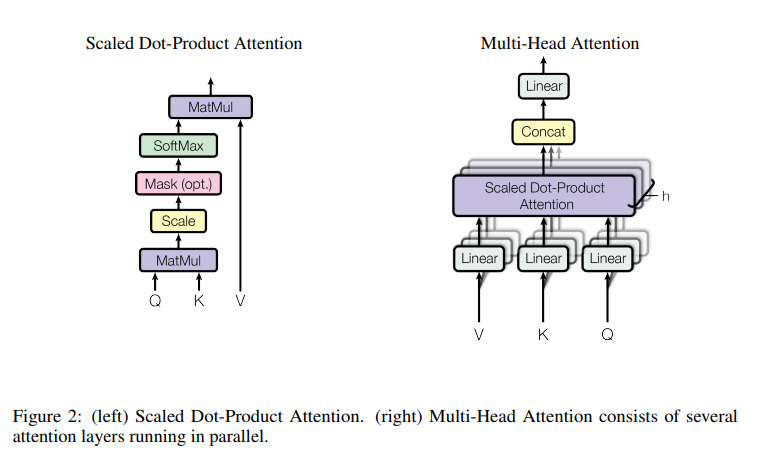

논문 및 이미지 출처 : <https://arxiv.org/pdf/1706.03762.pdf>

# Abstract

우세한 sequence transduction 은 encoder 및 decoder 를 포함한 RNN, CNN 기반으로 한다. 

이를 **attention mechanism** 만 사용하는 **Transformer** 를 제안

- 두 기계번역 task 에서 뛰어난 퀄리티를 보여주는데, 더욱 병렬적이면서도 훈련 시간을 크게 줄임
- WMT 2014 에서 SOTA (ensemble) 보다 2 points 높은 28.4 BLEU 달성 (single model)
- Transformer 가 다른 task 에서도 잘 일반화되는 것을 보여줌

# 1. Introduction

RNN 은 LSTM 및 Gated RNN 등 많은 노력으로 encoder-decoder 아키텍쳐의 경계로 계속 넓혀져 왔다.

- 일반적으로 input 및 output sequences 의 symbol positions 에 따라 계산을 분해
- hidden state $h_t$ 는 이전 $h_{t-1}$ 및 position $t$ 의 input 으로 생성
  - 순차적인 특성으로 인해 병렬화 불가능
  - sequence 길이가 길어질수록 메모리 제약으로 배치 제한

Attention mechanism 은 input 및 output 거리를 고려하지 않고 종속성을 모델링할 수 있게 해주어 다양한 task 에서 필수적이게 되었지만, 대부분 RNN 과 함께 사용한다.

본 연구에서는 RNN 을 배제하고 완전히 attention mechanism 에만 의존하여 input 과 output 사이의 global dependencies 를 도출하는 **Transformer** 제안

- 병렬화를 허용
- 8개 P100 GPU 에서 12시간 훈련만으로 SOTA

# 2. Background

순차 계산을 줄이기 위해 CNN 을 사용한 연구 [Extended Neural GPU, ByteNet, ConvS2S]가 있었으며, input 및 output position 에 대해 병렬로 hidden representation 을 계산하지만, 필요한 연산 수가 위치 간의 거리에 따라 증가한다.

- ConvS2S 의 경우 선형적으로, ByteNet 의 경우 로그함수적으로 증가
- Transformer 는 이를 일정 수 감소시키지만, averaging attention-weighted positions 로 인해 resolution 이 감소하는 효과가 있는데, 이는 Multi-head Attention 으로 상쇄시킨다.

Self-attention 은 서로 다른 위치를 관련시켜 sequence 의 representation 을 계산하는 attention mechanism

- reading comprehension, abstractive summarization, textual entailment 및 tkas-independent sentence representation 등 다양한 task 에서 성공

End-to-End memory networks 는 sequence-aligned recurrence 대신 recurrent attention mechanism 을 기반으로하며, simple-language question answering 과 language modeling task 에서 잘 수행한다.

하지만 Transformer 는 sequence-aligned RNN 및 CNN 을 사용하지 않고 input 및 output representation 계산을 완전히 self-attention 에만 의존하는 최초의 transduction model

# 3. Model Architecture

경쟁력 있는 sequence transduction model 은 encoder-decoder 구조를 갖고 있다.

- encoder : symbol representations input sequence $(x_1, \dots, x_n)$ 을 continuous representations sequence $z = (z_1, \dots, z_n)$ 로 매핑
- decoder : 각 단계에 하나씩 symbol output sequence $(y_1, \dots, y_m)$ 생성
- 각 단계에서 model 은 auto-regressive 하며, 다음 생성 때 이전에 생성된 symbols 를 추가 입력으로 사용
- Transformer 는 위 아키텍처를 따르며, encoder 및 decoder 에 stacked self-attention 및 point-wise, fully connected layer 를 사용

# 3.1 Encoder and Decoder Stacks

### Encoder

encoder 는 $N = 6$ 의 동일한 layer stack 으로 구성된다.

- 각 layer 는 두 개의 sub-layers 로 구성
  1. **multi-head self-attention**
  2. **position-wise fully connected feed-forward network**
- 각 sub-layer 에 **residual connection** 사용하고, 그 다음 **layer normalization** 수행
- 각 sub-layer 의 출력은 $\text{LayerNorm}(x + \text{Sublayer}(x))$
  - $\text{Sublayer}(x)$ : sub-layer
- residual connection 을 용이하게 하기 위해 모델 내의 all sub-layers 및 embedding layers 는 output dimension $d_{\text{model}} = 512$ 생성

### Decoder

decoder 또한 $N = 6$ 의 동일한 layer stack 으로 구성된다.

- encoder layer 와 같은 two sub-layers 에 추가 third sub-layer 삽입
  - 이는 encoder stack 의 output 에 대해 **multi-head attention** 수행
  - encoder 와 유사하게, 각 sub-layer 에 residual connection 및 layer normalization 사용
  - decoder stack 의 self-attention 을 수정하여 position 이 subsequent position 에 attending 하는 것을 방지
    - 이 masking 은 output embedding 이 한 위치 만큼만 offset 되어, position $i$ 에 대한 예측을 $i$ 보다 적은 이전 position 정보만 사용할 수 있도록 보장

## 3.2 Attention

Attention function 은 query 및 key-value 쌍들을 output 으로 mapping 하는 함수다.

- query, key, value : 모두 vector
- output : weighted sum of values
- 각 value 에 할당된 weight 는 상응하는 key 와의 호환성 함수 (compatibility function)에 의해 계산됨

### 3.2.1 Scaled Dot-Product Attention

저자는 이 특정 attention 을 **Scaled Dot-Product Attention** 이라 한다. (Fig. 2)

- input 은 dimension $d_k$ 의 queries 및 keys, dimension $d_v$ 의 values 로 이루어짐
- all keys 와 query 에 dot product 를 계산하고, 각각 $\sqrt{d_k}$ 로 나누고 softmax 함수를 적용하여 values 에 대한 weight 를 얻는다.

저자는 queries 를 하나의 matrix $Q$ 로 묶어 attention function 계산한다.

keys 및 values 또한 matrix $K$ 및 $V$ 로 묶어서 계산한다.

다음 output matrix 를 계산한다.

$$
\begin{equation}
  \text{Attention}(Q, K, V) = \text{softmax}(\frac{QK^T}{\sqrt{d_k}})V
\end{equation}
$$

일반적으로 사용되는 attention functions 은 additive attention 과 dot-product (multi-plicative) attention 이다.

- Dot-product attention : 저자의 알고리즘과 동일하지만, scailing 인자 $\frac{1}{\sqrt{d_k}}$ 가 다르다
- Additive attention : single hidden layer 인 feed-forward network 를 사용하여 compatibility function 계산

위 두 메커니즘은 이론적 복잡성은 비슷하지만, dot-product attention 은 고도로 최적화된 matrix multiuplication code 를 사용하여 구현되기 때문에 훨씬 더 빠르고 공간 효율적이다.

small values $d_k$ 에 대한 두 메커니즘은 유사한 성능을 발휘하지만, larger valuyes $d_k$ 에 대한 scaling 없이 사용하는 additive attention 은 dot-product 보다 우월하다.

저자는 large values $d_k$ 에 대해 dot-product 가 매우 큰값을 갖게되어, softmax function 을 extremely small gradients 를 갖도록 하기 위해 dot-product 를 $\frac{1}{\sqrt{d_k}}$ 로 scaling 한다.

### 3.2.2 Multi-Head Attention

$d_{\text{model}}$ dimensional keys, values, queries 로 single attension function 을 수행하는 대신, 저자는 learned linear projections 을 사용하여 $d_k$, $d_k$ 및 $d_v$ dimensions 으로 queries, keys 및 values 를 $h$ 번 linearly project 하는 것이 유익한 것을 발견

이러한 projected queries, keys 및 values 각각에 대해 병렬로 attention function 을 수행하여 $d_v$ dimensional output values 를 얻는다.

이후 이들을 연결(concatenated)하고 다시 한 번 project 하여 Fig. 2 처럼 최종값을 얻는다.

Multi-head attention 은  