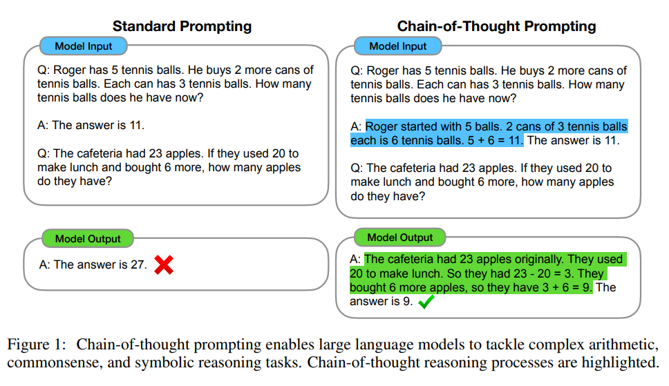
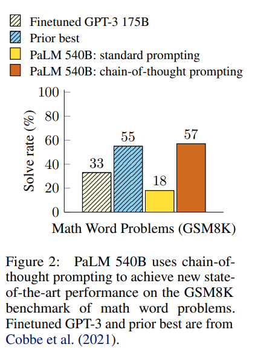
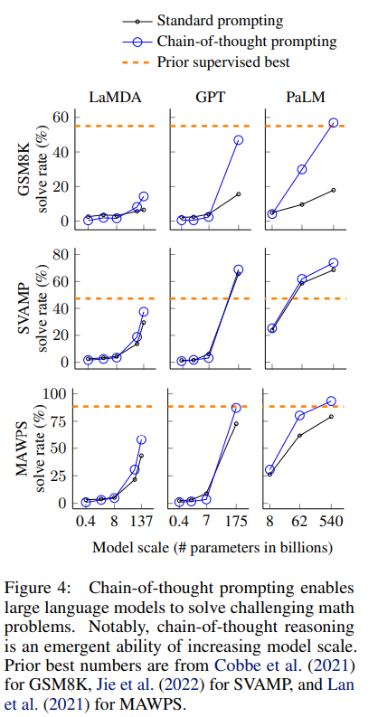
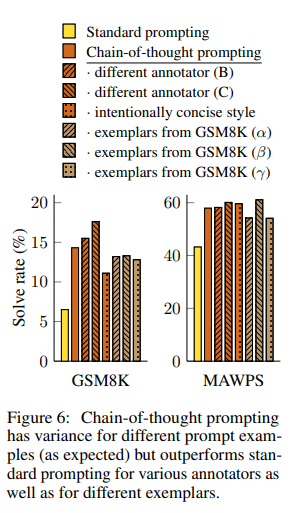
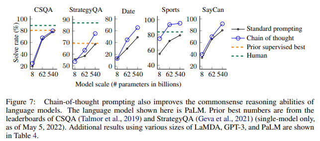
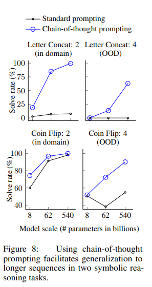

논문 및 이미지 출처 : <https://proceedings.neurips.cc/paper_files/paper/2022/file/9d5609613524ecf4f15af0f7b31abca4-Paper-Conference.pdf>

# Abstract

**_chain-of-thought_** 로 intermediate reasoning step 의 series 를 생성하여 LLM 의 complex reasoning 능력을 크게 향상하는 방법 탐구

**_chain-of-thought prompting_** 이란 간단한 방법을 통해 reasoning 능력이 자연스럽게 나타나는 것을 보임

3개의 LLM 에 실험
- arithmetic, commonsense 및 symbolic reasoning task 에 성능 향상
- empirical gain 이 현저할 수 있음
  - 8개의 CoT exemplar 로 PaLM 540B 를 prompting 할 경우, math word problem 의 GSM8K 벤치마크에서 SOTA 달성 -> finetuned GPT-3 능가

# 1. Introduction

최근, LM 의 크기 확장이 성능 및 샘플 효율성이 향상되는 여러 이점을 준다는 사실을 입증

하지만, 크기 확장만으론 arithmetic, commonsense 및 symbolic reasoning 같은 어려운 task 에서 높은 성능은 부족

본 논문은 두 가지 아이디어에 기반한 방법으로 LLM 의 reasoning 능력을 탐구

1. arithmetic reasoning 기술은 final answer 로 이어지는 근거를 생성하여 이득을 얻을 수 있음
   - 처음부터 훈련 또는 pretrained model 을 finetuning 하여 intermediate steps 에 자연어 생성 능력 부여
   - 언어 대신 neuro-symbolic 방법도 존재
2. LLM 은 prompting 을 통해 in-context few-shot learning 의 흥미로운 가능성 제공
   - new task 마다 별도의 LM checkpoint 를 finetuning 하는 대신, few input-output exemplar 를 사용하여 간단한 "prompt" 가능

위 두 아이디어는 각각 주요 제한 사항 존재

- rationale-augmented training 및 finetuning 의 경우
  - 고품질의 근거셋을 생성하는 것은 간단한 input-output 보다 훨씬 복잡하며 비용이 큼
- few-shot prompting 의 경우, 추론 능력을 필요로하는 작업에 대해 성능이 나쁘고 모델 크기가 증가함에 따라 크게 향상되지 않음

구체적으로 <input, _chain of thought_, output> 세 가지를 포함한 few-shot prompting 의 reasoning task 의 수행 능력을 탐구 

approach : **_chain-of-thought prompting_**

저자의 접근법은 arithmetic, commonsense 및 symbolic reasoning 벤치마크에 평가하여 standard prompting 을 능가

math word problem 인 GSM8K 의 경우, CoT 를 사용한 PaLM 540B 이 standard prompting 을 큰 폭으로 능가하여 SOTA 달성

prompt-only approach 는 대규모 훈련셋을 필요로 하지 않으며 single model checkpoint 가 일반성을 잃지 않고 많은 task 를 수행하므로 이 또한 중요한 특성이지만

본 논문은 어떻게 LLM 이 few examples 로 task 를 학습할 수 있는지 관한 연구인지 강조한다.

# 2. Chain-of-Thought Prompting

복잡한 추론 task 인 multi-step math word problem 을 고려해보자.

일반적으로 문제를 intermediate steps 로 분해하고 각각 해결 후 final answer 를 제시한다.

저자는 충분히 큰 언어 모델이 CoT 의 few-shot prompting exemplar 가 제공되면 CoT 를 생성할 수 있다는 것을 보여준다. (Fig 1 참고)

1. CoT 는 multi-step 을 intermediate step 으로 분해할 수 있으며, 더 많은 추론 단계가 필요한 문제에 추가적인 계산 할당
2. CoT 는 모델의 동작을 해석 가능하게 하여 답변에 도달하는 방식을 시사 및 잘못된 추론 경로를 찾는 기회 제공
3. CoT 추론은 arithmetic, commonsense 및 symbolic reasoning 같은 task 에 사용 가능
4. CoT 추론은 CoT 에 few-shot prompting 예제로 간단히 포함하여 off-the-shelf LM 에 쉽게 유도 가능

# 3. Arithmetic Reasoning

LM 의 arithmetic reasoning 능력을 측정

540B parameter LM 에 CoT prompting 을 사용하여 여러 task 에서, task-specific finetuning 모델들과 비교 (GSM8K 에서 SOTA)

## 3.1. Experimental Steup

### Benchmarks

1. GSM8K : math word problems
2. SVAMP : 다양한 구조의 math word problems
3. ASDiv : 다양한 math word problems
4. AQuA : algebraic word problems
5. MAWPS : algebraic word problems

### Standard prompting

Fig 1 의 왼쪽. input-output pair 의 in-context 예제에 맞춘 standard few-shot prompting

### Chain-of-thought prompting

저자의 approach : few-shot prompting 의 각 exemplars 와 관련된 답변에 CoT 로 보강하는 것

기존 데이터셋은 evaluation 으로만 분리되어, 저자는 8개의 few-shot exemplars 를 직접 작성

Fig 1 오른쪽. CoT exemplar, AQUA 를 제외한 벤치마크는 각각 8개 CoT 를 사용. AQuA 는 mutiple choice 형태이므로 4개의 exemplar 와 solution 을 사용

### Language models

5가지 LLM 평가

1. GPT-3 (350M, 1.3B, 6.7B, 175B)
2. LaMDA (422M, 2B, 8B, 68B, 137B)
3. PaLM (8B, 62B, 540B)
4. UL2 (20B)
5. Codex

각 모델은 greedy decoding 으로 샘플링

LaMDA 의 경우, 각 seed 가 서로 다른 무작위로 섞인 exemplar 순서를 가진 5개의 seed 에서 평균 : 다른 seed 간의 큰 분산이 보이지 않아 연산량을 줄이기 위해 single exemplar 사용

## 3.2. Results

1. CoT prompting 은 model scale 의 새로운 능력
   - 작은 모델 대신, 약 100B 정도의 모델과 함께 사용할 때만 성능 향상
   - 작은 모델에선 유창하지만 논리적으로 부적절한 CoT 생성
2. CoT prompting 은 더 복잡한 문제에서 더 큰 성능 향상
   - GSM8K (baseline 성능이 가장 낮은 데이터셋)에서, GPT 및 PaLM 같은 LLM 에서 성능이 두 배 이상 향상
   - 해결을 위한 단계가 하나만 필요한 MAWPS 의 경우, 성능 향상이 부정적이거나 매우 작음
3. LLM 을 통한 CoT prompting 은 task-specific model 을 finetuning 한 것과 비교
   - PaLM 540B 에 CoT 를 사용하여 여러 task 에 SOTA 달성

CoT prompting 의 동작을 더 잘 이해하기 위해 GSM8K 에 대한 LaMDA 137B 에서 생성한 CoT 를 수동으로 검토
- 50개 무작위 예제를 생성한 CoT 는 2개를 제외하고 모두 논리적 및 수학적으로 올바른 것을 나타냄

또한 모델이 잘못된 답변을 반환한 50개의 무작위 예제도 조사
- PaLM 62B 에서 발행한 오류가 PaLM 540B 에서도 발생하는 지 조사.
- 62B 의 one step 누락 및 의미 이해 오류의 큰 부분이 수정

## 3.3. Ablation Study

CoT prompting 의 이점이 다른 유형의 prompting 으로도 얻을 수 있는지, ablation 연구 진행

### Equation only

CoT prompting 이 도움되는 이유 중 하나는 평가에 수학적 수식을 생성하기 때문. 그래서 답변 제공 전 수학적 수식만 유도하여 테스트.

Fig 5 를 보면 equation only prompting 은 GSM8K 에 큰 도움이 되지 않는 것을 확인
- 의미론이 CoT 의 추론 단계에 직접 수식으로 번역하기 어렵기 때문
- one-step / two-step problem dataset 의 경우, 질문에서 수식을 도출할 수 있어 equation only prompting 이 도움이 됨

### Variable compute only

CoT model 이 어려운 문제에 더 많은 계산 (i.e. intermediate tokens)을 사용하도록 허용하는 것

→ 변수 계산의 영향을 CoT 의 이론적 추론과 격리하여, 문제 해결에 필요한 수식의 문자 수와 동일한 점(.) 개수만을 출력하도록 유도

baseline 과 비슷한 성능을 보이며, variable compute only 만으로는 CoT 의 성공 원인이 아니며, intermediate steps 로 표현하는 데 유용성이 있는 것으로 보임

### Chain of thought after answer

CoT prompting 의 다른 잠재적 이점은 pre-training 중 얻은 지식을 더 잘 활용한다는 것.

→ 답변 이후에만 CoT prompting 을 제공하는 설정으로 테스트

위 설정으로 모델이 최종 답변을 내기 위해 CoT 에 의존하는 것을 격리함

이는 baseline 과 비슷한 성능을 보이며, CoT 내의 순차적 추론이 knowledge 활성화 이상으로 유용하다는 것 시사

## 3.4. Robustness of Chain of Thought

서로 다른 annotators 가 작성한 CoT 에 대한 Robustness 를 평가

- CoT prompting 을 위해 동일한 few-shot exemplars 에 annotator A, B 및 C 등 독립적으로 CoT 작성.
- A 는 원래 CoT 보다 더 간결히 CoT 를 작성 ([Training Verifiers to Solve Math Word Problems] 의 설정을 따른 것)

Fig 6 은 LaMDA 137B 의 GSM8K 및 MAWPS 결과

- 다양한 CoT annotators 사이에 분산이 있지만, baseline 보다 높은 성능
- CoT 의 성공적인 사용이 특정 스타일에 의존하지 않음을 시사 

CoT prompting 이 다양한 exemplars 에도 잘 작동하는지 확인을 위해 GSM8K 훈련셋에 8개 샘플 3 셋에 실험

- Fig 6 은 CoT prompting 이 수동으로 작성한 exemplar 와 비슷한 결과를 보여줌
- standard prompting 보다 훨씬 높은 성능

annotator, 독립적으로 작성된 CoT, 다양한 LM 에 대한 robustness 외에도, arithmetic reasoning 을 위한 CoT prompting 이 다른 exemplars 에 대해서도 robust 하다는 것을 발견

# 4. Commonsense Reasoning

## Benchmarks

1. CSQA
   - 사전 지식이 필요한 복잡한 의미를 가진 상식적 질문
2. StrategyQA
   - multi-hop 전략 추론을 요구
3. BIG-bench 의 두 가지 특정 평가셋
   - Date Understanding : 주어진 문맥으로 날짜 추론 
   - Sports Understanding : 스포츠 관련 문장이 타당한지 불가능한지 판단
4. SayCan
   - 로봇 동작 순서로 매핑

## Prompts

CSQA 및 StrategyQA 경우
- 무작위 예제를 선택하고 few-shot CoT example 을 사용하기 위해 수동으로 구성

BIG-bench task 두 개의 경우
- 훈련셋이 없어, 10개 예제를 few-shot CoT example 로 선택

SayCan 경우
- 훈련셋에서 6개 example 을 사용하고 수동으로 CoT 구성

## Results

모든 task 에 대해, 모델 크기를 스케일 업하면 standard prompting 성능 향상되지만 CoT prompting 은 더 큰 향상을 이끌어 냄 (특히 PaLM 540B)

위 결과로 CoT prompting 이 상식적 추론 능력의 다양한 범위를 필요로 하는 task 에 대해서도 성능 향상을 시킬 수 있음을 시사

# 5. Symbolic Reasoning

CoT prompting 이 challenging symbolic reasoning 을 수행할 뿐만 아니라, 미리 본 적 없는 입력에 대한 추론에도 일반화하는데 용이한 다는 것을 보여줌

## Tasks

다음 두 toy task 를 사용

### Last letter concatenation

모델에게 이름에서 단어의 마지막 글자를 연결하도록 요청하는 task. (e.g. "_Amy Brown_" → "_yn_")
- 첫 글자 연결보다 어려운 버전
- 인구 조사 데이터 (https://namecensus.com/) 에서 상위 1000개 이름을 임의로 연결하여 전체 이름 생성

### Coin flip

모델에게 동전을 던지거나 던지지 않은 후에도 동전이 여전히 앞면인지 아닌지 대답 요청. (e.g. "동전이 앞면입니다. Phoebe 가 동전을 던졌습니다. Osvaldo 가 동전을 동전을 던지지 않았습니다. 동전은 여전히 앞면입니까?" → "아니오")

last letter concatenation 의 경우, 모델이 2개 단어로된 이름만 보고, 3개 및 4개 단어의 이름에 대해 수행한다. 이는 Coin flip 에서도 동일한 방식을 적용한다. (Fig 3 참고)

- Fig 8 결과, PaLM 540B 의 CoT prompting 은 거의 100% 해결.
- 적은 수의 CoT exemplar 로 완벽한 solution structure 가 제공되어 "toy task" 라 부름

Out-of-Domain (OOD) 에서는 standard prompting 이 두 task 모두에서 실패.

하지만 CoT 는 상승하는 curves 를 보이며, 충분한 규모의 LM 에서의 CoT prompting 은 일반화에 용이함을 시사

# 6. Discussion

저자는 multi-step 을 유도하는 간단한 메커니즘인 CoT prompting 을 탐구

- arithmetic reasoning 에서 큰 폭의 성능 향상
- 다양한 annotators, exemplar, LM 에 robust 한 개선
- commonsense 실험에서, CoT reasoning 의 특성이 일반적으로 적용되는 것 강조
- symbolic 실험에서, OOD 일반화를 긴 시퀀스로 용이하게 하는 것 보여줌

model scaling 결과

- standard prompting 은 flat scaling curves 를 갖는 reasoning task 에서, CoT prompting 은 upward scaling curves
- CoT prompting 은 LLM 이 잘 수행할 수 있는 task 범위를 확장

여전히 많은 의문점이 존재

- CoT 는 실제로 "reasoning" 을 하는지?
- few-shot exemplar 에 CoT 수동 추가의 비용은 미미하지만, finetuning 의 비용은 매우 클 수 있음
- 올바른 reasoning path 를 보장할 수 없어, 올바른 답변/부정확한 답변 모두 발생 가능
- LLM 에서만 CoT reasoning 이 발생하여, 실제 응용에서는 비용이 클 수 있음 → 작은 모델에서도 CoT 를 유도하는 연구 필요

# 7. Related Work

이 연구는 가장 관련성 높은 두 가지 방향의 논문에서 영감을 받음

1. reasoning 해결을 위해 intermediate step 을 사용 [Program Induction by Rationale Generation: Learning to Solve and Explain Algebraic Word Problems]
   - 최종 출력보다 step-by-step 으로 예측하는 것이 성능이 우수
2. prompting [The power of scale for parameter-efficient
prompt tuning] 을 자동으로 학습하거나 지침을 제공하여 prompting 입력을 개선/보완
   - 반면, 저자는 언어 모델의 출력을 CoT 로 보강하는 상반된 방향

# 8. Conclusions

CoT prompting 은 LM 에서 reasoning 향상을 간단하고 일반적으로 적용 가능한 방법에 탐구

arithmaric, commonsense 및 symbolic 등으로 CoT reasoning 이 모델 규모에 결과를 보여주며, 

CoT reasoning 은 충분히 큰 LM 이 reasoning task (다른 이들은 flat scaling curves 를 가짐) 에서 잘 수행하도록 하는 새로운 model scaling 속성을 가지는 것을 발견