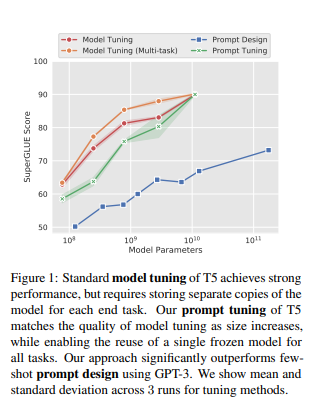
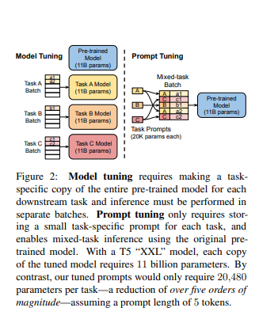
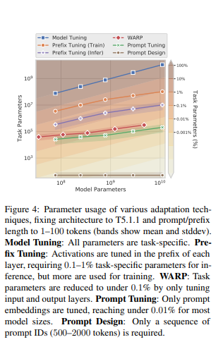
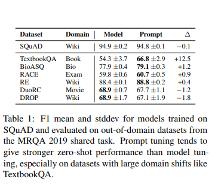
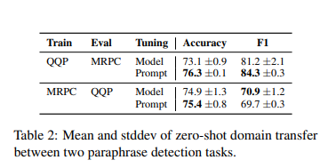
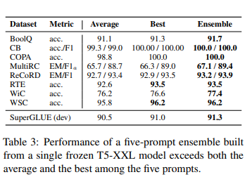

논문 및 이미지 출처 : <https://arxiv.org/pdf/2104.08691.pdf>

# Abstract

본 연구는 **_Prompt Tuning_** 탐구

- downstream task 수행을 위해 frozen language model (LM) 으로 **_soft prompt_** 를 학습하기 위한 간단하면서 효과적인 매커니즘
- GPT-3 의 discrete prompt 와 달리, soft prompt 는 backpropagation 으로 학습되며, 여러 labeled examples 의 signals 를 통합하기 위해 tuning 가능
- 저자의 end-to-end learned appoach 는 GPT-3 의 few-shot learning 을 큰 폭으로 능가
- T5 로 model size 에 대한 실험으로, 수십 억 이상의 parameter 를 가지면 prompt tuning 이 comparable 한 것을 보여줌
  - 이 결과는 큰 모델은 sharing 및 serve 가 어려워 특히 중요하며, one frozen model 을 여러 downstream 에 재사용 가능한 능력은 이 부담을 줄여줌
  - 

저자의 방법은 _prefix tuning_ 을 단순화한 것이며, 유사한 접근 방식과 비교한다.

soft prompt 를 사용한 frozen model 을 설정하는 것이 domain transfer 에 대한 robustness 를 제공하고 효율적인 _prompt ensembling_ 가능하게 함

# 1. Introduction

LLM 의 성공으로 downstream task 에 맞게 tuning 하는 것이 등장.

- ELMo 는 frozen pre-trained model 로 per-layer representation 의 task-specific weight 를 학습하는 것 제안
- GPT 및 BERT 이후엔 우세한 adaptation 기술이 _model tuning_ (fine-tuning) 이며 adaptating 중 all model parameter 가 tuning 됨
- [Universal language model fine-tuning for text classification. Howard, Ruder] 의 제안대로 model tuning 이루어짐
- 이후 [Language models are few-shot learners. Brown] 에서 _prompt design_ (priming) 이 frozen GPT-3 의 동작을 text prompt 를 통해 효과적인 tuning 이 가능하단 것을 보여줌

prompt 는 일밥적으로 task description 및 여러 examples 로 구성된다. model size 가 증가함에 따라 pre-trained model 을 _freezing_ 하는 것은 매력적이며, downstream task 마다 별도의 model copy 를 요구하지 않고, 하나의 모델이 동시에 많은 task 를 수행할 수 있다.

하지만 prompt-based adaptation 에는 주요 단점이 있다.

- task description 은 오류 발생이 쉽고 인간 개입이 필요
- prompt 의 효과는 model input 에 얼마나 많은 conditioning text 가 fit 될 수 있는지 제한
- downstream task quality 는 여전히 tuned model 의 quality 를 뒤쳐지게 함
  - 예로 GPT-3 175B 의 few-shot 성능은 Fine-tuned T5-XXL 보다 낮다. (parameter 는 16배 큰데 낮음)

prompt design 자동화를 위해 여러 연구가 진행됐다. 

- [AutoPrompt. Shin] 은 downstream application program training data 에 의해 가이드되는 word discrete space 에서의 search algorithm 제안
  - manual prompt design 을 능가하지만 model tuning 과 비교하면 여전히 차이남
- [Prefix-tuning. Li and Liang] 은 generation task 에 강력한 결과를 보여줌
  - frozen model parameter 로 tuning 중 각 layer 의 prepended activations 로 prefix 훈련
- [WARP. Hambardzumyan] 는 masked LM 의 input 및 output subnetwork 로 제한된 trainable parameter 제안
  - classification 에 합리적인 결과 보여줌

본 논문은 adapting LM 에 대한 더 간단한 **_prompt tuning_** 제안

- frozen entire pre-trained LM 으로 각 downstream task 마다 input text 에 additional $k$ tunable tokens 만 prepend
  - 이 **_soft prompt_** 는 end-to-end 로 training 되며 full labeled dataset 의 signals 압축하여 few-shot prompt 를 능가하고 model tuning 과의 quality gap 좁힐 수 있음 (Fig. 1)
  - 동시에 single pre-trained model 이 all downstream task 에 재활용되므로 frozen model 의 efficient serving 이점 유지 (Fig. 2) 

---

저자의 method 는 [Prefix-tuning. Li and Liang, WARP. Hambardzumyan] 와 달리, prompt tuning 만으로도 model tuning 과 comparable (with no intermediate-layer prefixes 또는 task-specific output layers)

Section [2](#2-prompt-tuning)-[3](#3-results) 에서, 자세한 실험으로 LM capacity 가 이러한 approach 를 통해 성공하기 중요한 요소임을 입증

Section [4](#4-comparison-to-similar-approaches) 에서, 유사한 approach 와 비교

task-specific parameters 를 NLU 에 필요한 "generalist" parameters 로부터 명시적으로 분리하여 추가적인 혜택을 얻을 수 있음

Section [5](#5-resilience-to-domain-shift) 에서, prompt 에서의 task definition 를 capture 하면서 generalist parameters 를 고정시키면, domain shifts 에 대한 resilience (내구성) 향상시키며 classic model ensembling 보다 효율적임을 보여줌

Section [7](#7-interpretability) 에서 learned soft prompt 의 해석 조사

주요 기여는 다음과 같다.

1. prompt tuning 제안 및 LLM 영역에서의 model tuning 과 comparable
2. 여러 design choices ablating 및 quality 와 robustness with scale 로 향상 보여줌
3. prompt tuning 이 domain shift problems 을 위한 model tuning 을 능가
4. prompt ensembling 제안으로 효과적임을 보여줌

# 2. Prompt Tuning

T5 의 text-to-text approach 를 따라 all task 를 text generation 처리

some input 에 대한 output class 의 probability 같은 classification modeling $\Pr (y|X)$ 대신에, 저자는 conditional generation 으로 모델링

- $X$ : 일련의 토큰
- $y$ : single class label

T5 는 classfication 을 $\Pr_\theta (Y|X)$ 로 모델링한다.

- $Y$ : class label 을 나타내는 token sequence
- encoder-decoder 로 구성된 Transformer 의 weight $\theta$ 로 parameterize

---

Prompting 은 generation 중 condition 을 위해 extra information 을 추가하는 approach

- 일련의 tokens $P$ 를 input $X$ 에 prepend 하여 수행
- correct $Y$ 의 likelihood $\Pr_\theta (Y|[P;X])$ 를 최대화
- parameter $\theta$ 는 고정

---

GPT-3 에서는 

- prompt token $P = \{ p_1, p_2, \dots, , p_n \}$ 의 representations 는 model 의 embedding table 일부로 구성
- frozen $\theta$ 로 parameterize

따라서 최적의 prompt 를 찾으려면 prompt token 을 선택해야 하며, 이는 manual search 또는 non-differentiable search method 로 이루어진다.

prompt tuning 은 prompt $P$ 가 $\theta$ 로 parameterize 되어야 한다는 제한을 제거하고, 대신 prompt 에 자체적인 parameters $\theta_P$ 가 있어, update 할 수 있는 방식이다.

prompt design 은 frozen embeddings 의 fixed vocabulary 에서 prompt tokens 를 선택하는 것을 포함한 반면, prompt tuning 은 special tokens 의 fixed prompt 를 사용하는 것으로 생각할 수 있으며, 이때 special tokens 의 embeddings 만 update

이제 새로운 conditional generation 은 $\Pr_{\theta;\theta_P}(Y|[P;X])$ 이며, $Y$ 의 likelihood 를 최대화하기 위해 backpropagation 으로 훈련된다.

반면, $\theta_P$ 에는 gradient update 만 적용된다.

---

$n$ 개의 tokens $\{x_1, x_2, \dots , x_n\}$ 이 주어지면, T5 는 먼저 이러한 token 을 embedding 하여 embedding space 의 dimension 이 $e$ 인 행렬 $X_e \in \mathbb{R}^{n \times e}$ 를 형성한다. 

저자의 soft prompt 는 parameter $P_e \in \mathbb{R}^{p \times e}$ 로 표시,  $p$ : prompt length 

이후 prompt 가 embedded input 에 연결되어 single matrix $[P_e; X_e] \in \mathbb{R}^{(p + n) \times e}$ 를 형성하고 encoder-decoder 를 통과한다.

저자의 모델은 $Y$ 의 probability 를 최대화하기 위해 훈련되지만, prompt parameters $P_e$ 만 update 된다.

## 2.1 Design Decisions

prompt representation 을 initialize 에 여러 방법이 있다.

1. random initialization 으로 scratch training
2. each prompt token 을 model vocabulary 에서 추출한 embedding 으로 initialization

개념적으론 저자의 soft prompt 는 frozen network 의 행동을 input 앞의 text 와 동일한 방식으로 조절하므로, word-like representation 이 좋은 initialization spot 으로 작용한다,

classification task 의 경우, 

3. [Exploiting cloze-questions for few-shot text classification and natural language inference. Schick and Schütze] 의 "verbalizers" 와 유사하게, prompt 를 output classes 로 나열한 embedding 으로 초기화하는 것
    - 저자는 모델이 output 에서 이러한 token 을 생성하기를 원하므로, prompt 를 유효한 target tokens 의 embedding 으로 초기화하면, 모델이 output 을 legal output classes 로 제한하도록 유도한다.

또 다른 design 고려 사항은 prompt length 다.

저자의 방법의 parameter cost 는 $EP$ 이다.

- $E$ : token embedding dimension
- $P$ : prompt length

prompt 가 짧을수록 tuning 해야할 new parameters 가 적기 때문에 성능이 여전히 우수할 최소한의 길이를 찾아야 한다.

## 2.2 Unlearning Span Corruption

autoregressive 인 GPT-3 와 달리 저자가 실험한 T5 모델은 encoder-decoder 로, span corruption objective 로 pre-training 한다.

- T5 는 input text 에서 unique sentinel tokens 로 표시된 masked span 을 reconstructing 하는 task 수행
- all masked content 로 구성된 target output text 는 sentinel 로 분리되어, final sentinel 에 추가된다.
  - 예로, text "Thank you for inviting me to your party last week" 에서 pre-training example 구성 가능
  - input : "Thank you $\langle X \rangle$ me to your party $\langle Y \rangle$ week"
  - target output : "$\langle X \rangle$ for inviting $\langle Y \rangle$ last $\langle Z \rangle$"

[Exploring the limits of transfer learning with a unified text-totext transformer. Raffel] 은 이런 아키텍처와 pre-training objective 가 traditional language modeling 보다 효과적임을 발견했지만, 이 설정이 prompt tuning 을 통해 쉽게 제어 가능한 frozen model 을 생성하기엔 적합하지 않음을 가정

- span corruption 만 pre-training 한 T5 를 사용할 경우, 실제 natural input text (free of sentinel tokens) 을 본 적이 없어 실제 natural target 을 예측하지 못한다.
- 사실 T5 의 span corruption preprocessing 의 details 때문에, 모든 pre-training target 은 sentinel 로 시작한다.
  - 이런 "unnatural" sentinel output 경향은 fine-tuning 으로 쉽게 극복할 수 있지만, prompt 만 사용하면 이런 경향을 덮어쓰기가 어려울 것으로 예상된다. decoder priors 를 조정할 수 없기 때문이다.

위 고려사항으로 T5 model 에 세 가지 설정으로 실험한다.

1. Span Corruption
   - frozen pre-trained T5 그대로 사용하고 downstream task 에 대한 expected text output 능력을 테스트
2. Span Corruption + Sentinel
   - 동일한 모델을 사용하지만 all downstream target 에 sentinel 을 prepend 하여 pre-training 에서 관찰된 target 과 유사하게 만듦
3. LM Adaptation
   - T5 의 self-supervised training 을 적은 수 추가
   - 이때 LM objective 는 input 으로 natural text prefix 를 받고 output 으로 natural text continuation 생성
   - 이 adaptation 은 한 번만 일어나며, downstream task 전역에 prompt tuning 을 하기 위해 재사용할 수 있는 frozen model 생성

LM adaptation 으로 저자는 T5 를 GPT-3 와 유사한 모델로 "빠르게" 변환하고, 항상 현실적인 text 를 출력하고 prompt 에 few-shot learner 가 잘 반응하기를 희망.

이 late-stage transformation 이 처음부터 pre-training 한 것과 비교하여 얼마나 성공적일진 모르지만, 다양한 adaptation length 를 실험하며 최대 100K steps 가지 실험한다.

# 3. Results

frozen model 은 pre-trained T5 checkpoints 모든 사이즈에서 구축 (Small, Base, XL, XXL)

public T5.1.1 checkpoints 를 활용

- green $\times$ 로 표시된 default configuration 는 T5 를 추가 100K steps 를 학습한 LM-adapted version
- class labels 초기화
- 100 tokens 의 prompt length
  - Prefix-tuning 보다 default 10-token 보다 길지만 저자의 방법은 input layer 만 tuning 하기 때문에 여전히 훨씬 적은 task-specific parameter 사용
- 자세한 비교를 위해 Fig. 4 참조. 또한 model size 증가에 따라 훨씬 짧은 prompt 가 사용 가능한 것도 확인 가능 

저자는 SuperGLUE 에서 성능 측정

- 8개의 어려운 NLU task 를 모아놓은 것
- 각 데이터셋과 관련된 dev set 에서 메트릭 보고
- 각 prompt 는 하나의 SuperGLUE task 에 대해 훈련 (no multi-task, mixing)
- 각 SuperGLUE dataset 에 따라 text-to-text 형식으로 변환, task example 에 task names 을 추가하진 않음

---

- standard cross-entropy loss 를 사용하여 30,000 steps 동안 prompt 훈련
- 0.3 learning rate
- 32 batch size
- early stopping 으로 checkpoint 선택
- 모든 실험은 JAX 를 사용
- Adafactor optimizer
- 1e-5 weight decay
- 0.8 $\beta_2$ decay
- parameter scaling off
- 모델은 Flax 로 구현

## 3.1 Closing the Gap

standard model tuning 비교를 위해, T5 에서 지정한 default hyperparameter (learning rate 0.001, Adafactor optimizer) 사용

두 가지 기준 고려

1. Model Tuning : apples-to-apples 비교를 위해, 각 task 별로 tuning
2. Model Tuning (Multi-task) : competitive baseline 을 얻기 위해 T5 의 multi-task tuning 설정 사용.
   - 이 경우 모델이 all task 를 함께 tuning 하며 task name 을 나타내는 text prefix 가 있음

- Fig. 1 에서 scale 이 커짐에 따라 prompt tuning 이 model tuning 과 comparable
  - XXL size (11B) 에서 prompt tuning 은 task-specific parameter 가 2만 배 이상 적음에도 불구하고 stronger multi-task model tuning 과 일치

prompt design 비교를 위해 SuperGLUE dev set 에 GPT-3 의 few-shot 성능 포함.

- Fig. 1 에서 prompt tuning 이 GPT-3 prompt design 을 큰 차이로 이김
- prompt tuned T5-Small 은 GPT-3 XL (16배 큼)과 일치, prompt tuned T5-Large 는 GPT-3 175B (220배 큼)를 이김

## 3.2 Ablation Study

### Prompt Length

- $\{1, 5, 20, 100, 150 \}$ 의 다양한 prompt length 로 다른 설정은 고정한 채로 각 모델 크기에 대해 prompt 를 훈련
- Fig. 3(a) 에서 대부분의 모델 크기에서 prompt length 를 single token 이상으로 늘리는 것이 좋은 성능을 위한 요소임을 보여줌
- XXL 모델은 single token prompt 로 여전히 강력한 결과 제공
- 모든 모델에서 20 token 이상 늘린 경우엔 미미한 이득만 얻음

### Prompt Initialization

모델 크기별로 다른 default value 로 hyperparameter 를 고정시켜 prompt initialization 의 효과를 ablating

- random initialization 의 경우, $[-0.5, 0.5]$ 에서 균등하게 샘플링
- sampled vocabulary 로부터 initializing 하는 경우, T5 의 SentencePiece vocabulary 의 "common" token 5,000 개로 제한
  - 이 vocabulary 는 pre-training corpus 의 likelihood 로 정렬
- class label initialization 의 경우, downstream task 의 각 class string representation 에 대한 embedding 을 가져와 prompt 의 one token 을 초기화하는데 사용
  - class label 이 multi-token 일 땐 token embedding 을 평균
  - longer prompt lengths 에서는 모든 prompt token 초기화하기 전에 class label 이 부족하여, prompt 를 채우기 위해 sampled vocab 전략으로 돌아감

Fig. 3(b) 에서 모델 크기별 initialization 전략의 실험 결과 보여줌

- class based initialization 이 best
- smaller model size 에선 initialization 간의 큰 차이는 없지만, XXL 크기에선 차이가 두드러짐
- class label initialization 에선, class label 이 일반적으로 learned prompt 에 유지되어 가장 가까운 token embedding (in cosine distance)이 초기화에 사용된 token 과 일치하는 경우가 많음

### Pre-training Objective

Fig. 3(c, d) 에서 pre-training object 가 prompt tuning quality 에 영향을 미치는 것을 볼 수 있음

- T5 의 span corruption objective 는 prompt condition 에 적합하지 않음
  - sentinel token 을 읽고 쓰도록 pre-traing 된 model 은 sentinel 이 없는 데엔 직접 적용하기 어려움
  - Fig. 3(c) 에서 target downstream 에 sentinel 을 추가한 "workaround" 조차 거의 이익이 없었다.
- LM adaptation 은 모든 모델 크기에서 가치를 더함
  - XXL 모델은 가장 관용적이고 span corruption 조차 강력한 결과 제공
  - LM adaptation 의 이점을 고려하려, 얼마나 오랫동안 adapting 이 도움이 되는지 탐색
    - Fig. 3(d) 에서 long adaptation 이 추가 이득 제공
    - 최대 100K steps 까지 확장
  - span corruption 에서 LM objective 로의 전환이 간단하지 않으며, 효과적인 전환에는 training resources (original T5 pre-training 의 10% steps)가 필요하다는 것 시사
  - 다른 실험과 마찬가지로 XXL 모델은 non-ideal 설정에도 robust 하며 adapting 이득은 미미
- non-optimal span corruption 에선 모델 크기별로 불안정성 관찰
  - Small model 이 더 큰 Base, Large 및 XL 모델을 능가하는 경우가 많이 발생
  - 중간 크기 모델은 많은 task 에 대해 legal class label 을 출력하는 방법을 학습하지 못하여 0% score 를 받게됨
  - 두 가지 common error 는 input 에서 subspan 을 복사하는 것과 empty string 을 예측하는 것. 이러한 부정적인 성능은 prompt tuning 의 random variance 때문이 아닌 각 크기별로 3회 실행하여 low variance 를 관찰하기 때문이란 점 

위 결과는 span corruption objective 로 pre-training 된 모델을 사용하는 것은 불안정하며, LM adaptation 은 신뢰성 있게 작동한다는 것

# 4. Comparison to Similar Approaches

continuous prompts learning 연구 검토 및 저자의 방법과 비교

비교의 중요한 측면 중 하나는 각 방법이 필요로 하는 task-specific parameter 의 수 있으며 Fig. 4 에서 볼 수 있다.

learnable parameter method 중 prompt tuning 은 모델 크기가 1B 이상의 모델의 0.01% 미만의 task-specific parameter 만 필요로 하여 가장 parameter-efficient

- prefix-tuning 은 all transformer layer 마다 여러 additional prepended prefix sequence 학습
  - 모든 layer 에서 examples 간에 고정된 activation 을 학습하는 것과 유사
  - 반면 prompt tuning 은 embedded input 에 prepend 된 single prompt representation 을 사용하여 더 적은 parameter 만 필요
  - 저자의 방법은 input example 로 contextualize 된 intermediate-layer task representations 을 update 할 수 있도록 transformer 에 허용
- prefix-tuning 은 GPT-2 및 BART 에 기반
  - 저자는 T5 에 focus 하고 model size 증가에 따른 성능 및 robustness 에 대한 design 선택 사항의 변화 검토
  - BART 사용하면 prefix-tuning 은 encoder-decoder network 에 모두 prefix 를 추가
  - prompt tuning 은 encoder 에만 prompt 필요
- prefix-tuning 은 학습 안정성을 위해 prefix reparameterize 필요하여 학습 중 많은 parameter 필요
  - 저자는 reparameterize 필요하지 않으며 SuperGLUE task 및 모델 크기 전반에 robust

---

WARP 는 prompt parameter 를 input layer 에 추가

- masked LM 과 함께 작동하며 [MASK] token 및 learnable output layer 를 사용하여 mask 를 class logit 으로 project
- model 을 single output 을 생성하도록 제한하여 classification 으로 제한됨
  - prompt tuning 은 input 또는 task-specific head 에 대한 어떠한 변경도 필요하지 않음
  - prompt tuning 의 성능도 model tuning 의 강력한 성능과 유사

---

P-tuning 은 learnable coninuous prompt 를 input 내에 교차로 삽입

- 저자는 이러한 복잡성을 제거하고 간단하게 input 에 prompt 를 놓은 것
- 강력한 SuperGLUE 결과를 위해선, P-tuning 은 model tuning 과 함께 사용해야 함
  - 모델은 prompt 와 주요 parameter 를 업데이트하는 반면 저자는 original model 을 유지하면서 continuous prompt 만 추가

---

soft prompt 는 soft words 를 사용하여 pre-trained LM 에서 knowledge distillation 을 위해 prompt 를 학습하는 방법

- prompt 는 hand-designed prompt prototype 를 기반으로 input 과 관련하여 위치시킴
- 각 layer 에는 learnable paramter $\triangle^e_i$ 를 포함하여 model depth 에 따라 parameter cost 발생

---

few-shot sequence learning 은 learnable prepended token 으로 transformer 를 다양한 task 에 adapting  하지만, 큰 데이터셋 대신 task representation 수용을 위해 설계된 작은 mixing dataset 에 중점을 둔다.

- base model 이 small trasnformer 이며 task representation 과 함께 훈련
- 반면 저자는 base model 을 유지하며 큰 transformer 로 크기를 확장하여 조사

---

task prompt 에 대한 작업은 "adapters" 와 밀접한 관련이 있다.

adapter 는 LM 의 small bottleneck layers 를 의미하며 frozen pre-trained netwrok layer 사이에 삽입된다.

task-specific parameter 를 줄이는 또 다른 수단으로서, BERT-Large 를 freezing 하고 2-4$ 의 추가 parameter 만으로 GLUE 성능을 model tuning 과 근접하게 달성하기도 했다.

multiple adapter 을 사용하여 task specification 에서 language understanding 으로 분리하는 방식이 저자의 model behavior 을 변경하는 방법과 핵심적인 차이가 있다.

adapter 는 실제로 input representation 에 작용하는 실제 함수를 수정하여 model behavior 을 변경하는 반면, prompt tuning 는 그대로 유지하며 새로운 input representation 을 추가함으로써 후속 input 처리에 영향을 미치게 한다.

# 5. Resilience to Domain Shift

frozen LM 으로, prompt tuning 은 모델이 언어에 대한 일반적인 이해도를 수정하지 못하게 한다. 대신 prompt representation 을 간접적으로 input representation 을 변형한다.

- 이는 모델이 특정 vocab 와 잘못된 상관관계를 기억하여 데이터셋에 overfitting 되는 것을 줄임
- prompt tuning 이 domain shift 에 대한 robustness 를 향상을 시사

---

저자는 두 가지 task, QA 및 Paraphrase Detection 에 대한 zero-shot domain transfer 조사

- QA 의 경우 MRQA 2019 사용
  - 통합된 형식의 추출형 QA dataset 을 수집하고 in-domain dataset 에서 훈련된 모델이 out-of-domain dataset 에 어떻게 수행되는지 테스트
  - SQuAD 에서 훈련하고 각 out-of-domain 에 평가
- Table 1 은 prompt tuning 이 out-of-domain 대부분의 데이터셋에 model tuning 보다 우수한 성능 보여줌
- TextbookQA 의 경우 두 approach 간의 12.5% F1 차이를 보여줌
- larger domain shift 의 경우 (BioASQ → Biomedical, TextbookQA → Textbooks)에는 prompt tuning 이 더 큰 이점 관찰

---

domain shift 에 대한 robustness 테스트를 위해 GLUE 의 두 paraphrase detection tasks 간의 transfer 탐구

1. QQP task 로, Q&A 사이트에서 가져온 두 개의 질문이 중복인지 물음
2. MPRC task 로, 뉴스 기사에서 추출한 두 문장이 부분적으로 동일한지 물음

both direictions (QQP ↔ MRPC) transfer 을 테스트하고 이전과 같이 "in-domain" task 에서 훈련하고 "out-of-domain" task 에서 zero-shot 평가

Table 2 는 QQP dataset 에서 lightweight prompt 를 훈련하고 MRPC 에서 평가

- full model tuning 보다 훨씬 나은 성능 제공
- other direction 에서의 결과도 유사하며, 정확도에서 작은 향상과 F1 에서의 작은 감소가 나타났다.

위 결과는 model tuning 이 training 을 과도하게 parameterize 하고 다른 domain 의 유사한 task 에 미치는 악영향을 고려하는 관점으로 볼 수 있다.

# 6. Prompt Ensembling

model ensembling 은 동일한 데이터셋에 다른 initialization 으로 훈련된 여러 모델을 결합하여 task 성능을 향상시키는 것

하지만 모델 크기 증가에 따라, 앙상블은 어려워진다. 모델 저장에 필요한 공간 외에도 $N$ 개의 모델을 실행하는 데 상당한 inference cost 가 들기 때문이다.

이를 해결하기 위해

- prompt tuning 은 pre-trained LM 의 multiple adaptation 을 앙상블하는 더 효율적인 방법 제공
- 동일 task 에 $N$ 개의 prompt 를 훈련하여 별도의 "model" 을 생성하면서도 LM parameter 를 모두 sharing
- prompt ensembling 은 inference 를 더 효율적으로 만든다.
  - 예로, 한 example 처리를 위해 $N$ 개의 다른 모델을 forward pass 를 실행하고 example 을 배치 내에서 복제하여 prompt 를 다양하게 설정 가능

위 이점은 Fig. 2 의 multi-tasking 에서 볼 수 있는 것과 유사

---

prompt ensembling 유효성을 보여주기 위해 각 SuperGLUE task 에 대해 다섯 개의 prompt 를 frozen T5-XXL 모델에서 사용하여 훈련

저자는 ensembling 에서 예측 계산을 위해 간단한 majority voting 을 사용

Table 3 은 all task 에서 앙상블이 single-prompt average 를 능가하며, 개별 best prompt 를 능가하거나 일치

# 7. Interpretability

해석 가능한 prompt 는 task 를 명확히 설명하는 natural language 로 구성되어 있어 모델에 어떤 결과 및 동작을 요청하고, 모델로부터 어떤 동작을 유발하는지 이해하기 쉽게 말들어야 한다.

prompt tuning 은 discrete token 이 아닌 continuous embedding space 에서 작동하여 해석이 더 어렵다.

저자의 learned soft prompt 해석 가능성을 테스트하기 위해 각 prompt token 에 대해 nearest neighbors 를 frozen model's vocabulary 에서 계산한다.

similarity metric 로 vocabulary embedding vector 와 prompt token representation 사이의 cosine distance 를 사용한다.

---

특정 learned prompt token 에 대해 top-5 nearest neighbors 가 tight semantic clusters 를 형성하는 것을 관찰했다.

- 예로, $\{ Technology \ /\  technology \ /\  Technologies \ /\  technological \ /\  technologies \}$ 와 같이 similar cluster 를 관찰
- $\{ entirely \ /\  completely \ /\  totally \ /\  altogether \ /\ 100\% \  \}$ 와 같이 더 다양한 related cluster 도 관찰

위와 같은 cluster 의 성격은 prompt 가 "word-like" representation 을 학습하고 있다는 것을 시사.

저자는 embedding space 에서 추출한 random vector 가 이런 유형의 semantic clustering 을 보여주지 않는 다는 것을 발견했다.

---

prompt 를 "class label" 전략으로 초기화할 때, 종종 class label 이 훈련 후에도 지속된다.

구체적으로,

- prompt token 이 given label 로 초기화된 경우, 해당 label 이 tuned token 의 nearest neighbors 중 하나가 되는 경우가 많다.
- Random Uniform 또는 Sampled Vocab 방법으로 초기화하는 경우에도 class label 이 prompt 의 nearest neighbors 에서 발견되는 경우가 많다.

이는 모델이 prompt 에 expected output classes 를 참조로 저장하고, prompt 를 output class 로 초기화하면 이를 더 쉽게 centralize 한다는 것을 시사한다.

---

longer prompt (e.g. 100) 을 조사할 때 종종 동일한 nearest neighbors 를 가진 여러 prompt tokens 를 찾을 수 있다.

이는 prompt 에 과도한 용량이 있거나 prompt representation 에 sequential structure 이 부족하여 모델이 특정 위치로 정보를 localize 하는 것이 어렵다는 것을 시사한다.

---

sequence 로 가져온 learned prompt 는 해석 가능성이 없지만, BoolQ dataset 에서 훈련된 prompt 에 대해, "science, technology 및 engineering" 같은 단어가 높은 빈도로 나타난다.

그리고 질문의 20% 가 "Nature/Science" 범주에 속한다.

이는 prompt 의 한 가지 역할이 model 에 specific domain 또는 context (e.g. scientific) 에서 입력을 해석하도록 준비하는 것일 수 있음을 시사

# 8. Conclusion

- prompt tuning 이 frozen pre-trained LM 을 downstream task 에 adapting 하는 comaprable 한 기술임을 증명
- SuperGLUE 에서 task performance 가 traditional model tuning 과 comparable
- model scale 증가에 따른 gap 줄임
- zero-shot domain transfer 에서 prompt tuning 이 generalization 향상
  - general-purpose 의 language understanding parameter 를 동결하고 downstream learning 을 lightweight parameter footprint 제한하여 specific domain 에 overfitting 되는 것 피함을 시사

task quality metric 외에도, storage 및 serving cost 측면의 frozen pre-trained model moving 의 매력에 대해 논의.

이 move 는 efficient multi-task serving 과 efficient high-performing prompt ensembling 모두 가능하게 함