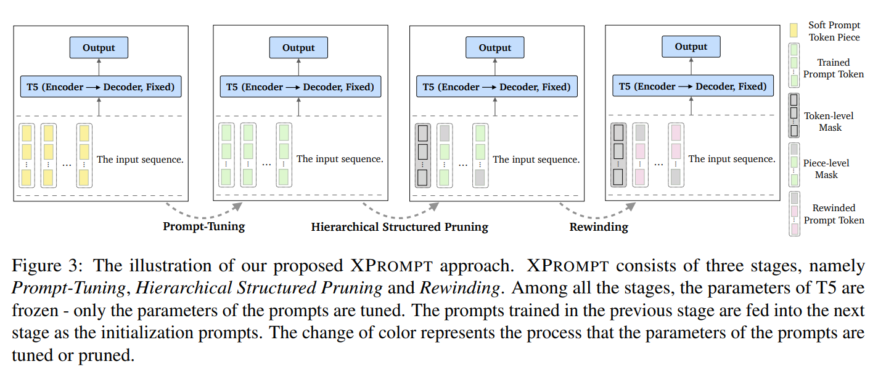
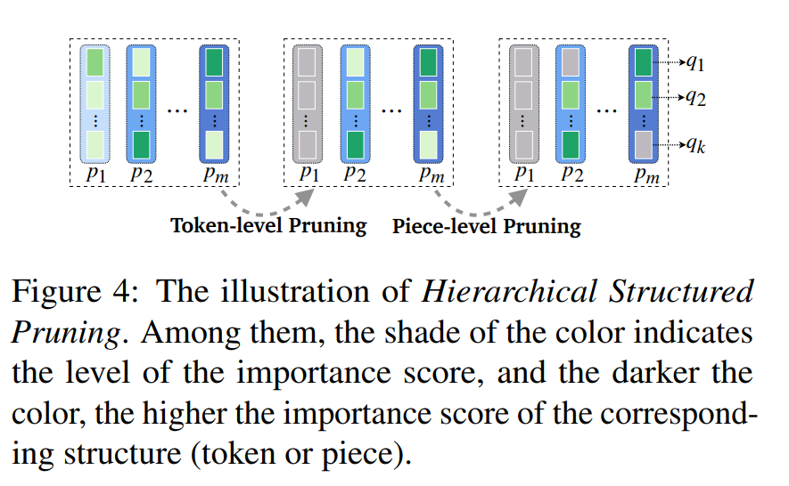
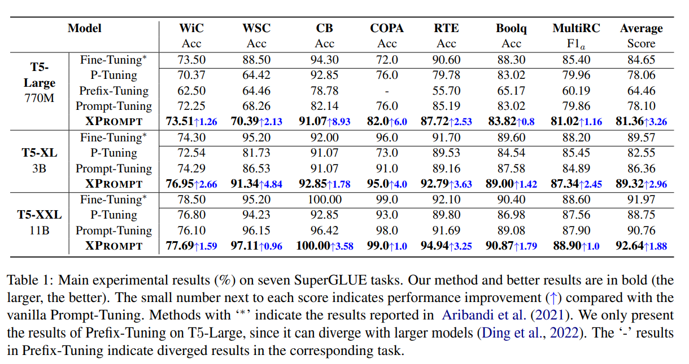
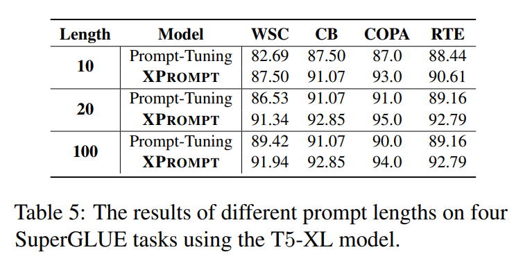
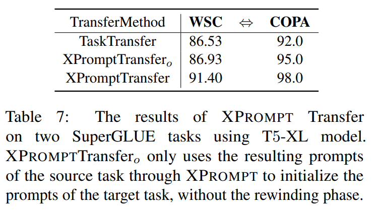
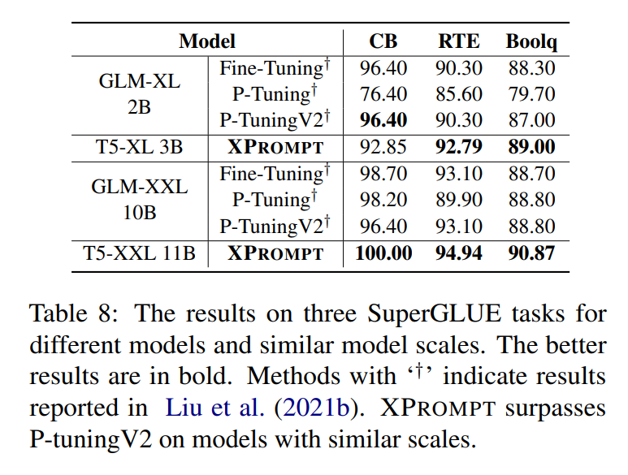
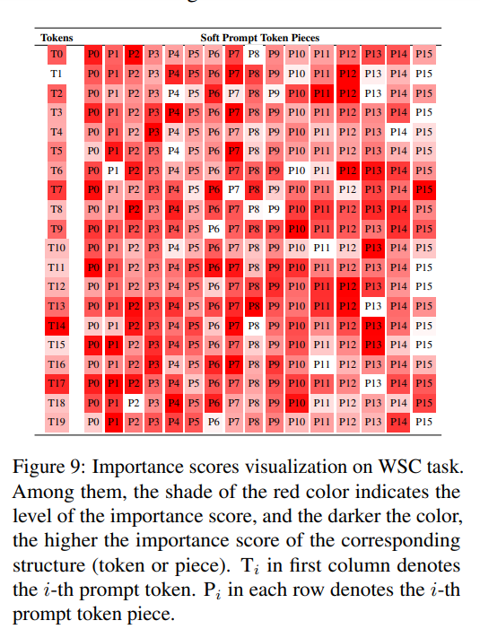
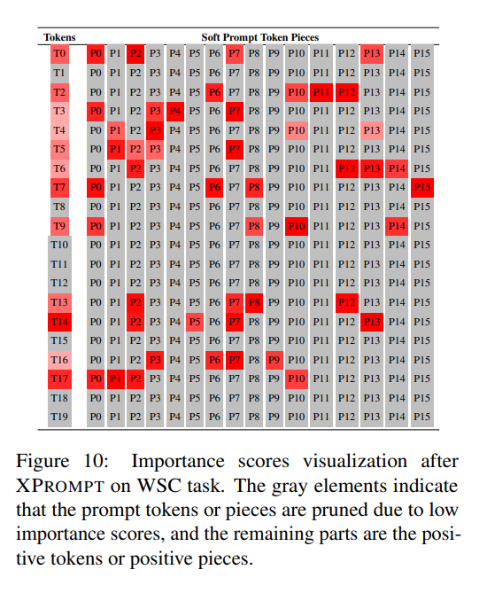
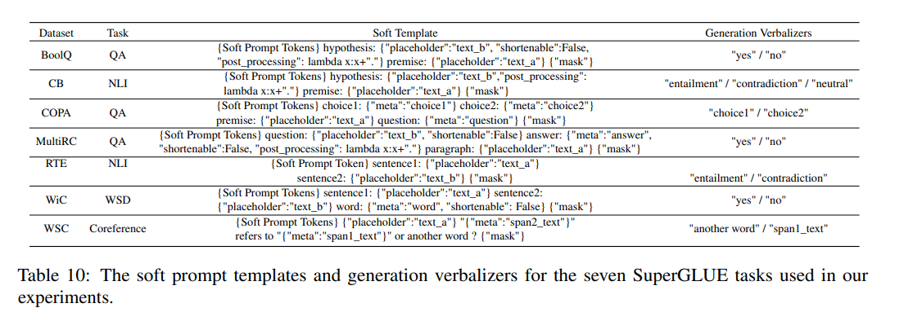

논문 및 이미지 출처 : <https://aclanthology.org/2022.emnlp-main.758.pdf>

# Abstract

Prompt tuning 은 frozen Pre-trained Language Models (PLMs) 를 conditioning 하기 위해 soft prompts 를 학습한다.

모델 규모가 커짐에 따라 prompt tuning 은 점차 fine-tuning 수준에 도달하지만, moderate 및 small scales (< 11B) 에선 여전히 성능 차이가 발생한다.

본 논문에서 저자는 trained prompt tokens 는 downstream task 에 negative 영향을 줄 수 있으며 성능 저하를 일으킬 것이라는 것을 경험적으로 보여준다.

- gap 을 줄이기 위해, 저자는 lottery tickets hypothesis 하에, **Prompt** tuning model with an e**X**tremely small scale (**XPrompt**) 를 제안
- 구체적으로, XPrompt 는 hierarchical structured pruning 을 통해 다양한 granularity levels 에서 negative prompt tokens 를 제거하여 더욱 parameter-efficient prompt 를 생성하여 competitive 성능 달성
- SuperGLUE task 에서 포괄적 실험으로, smaller model scales 에서 성능 gap 을 줄여줌

# 1. Introduction

PLMs 는 _pretrain-then-finetune_ 을 통해 널리 사용되어 큰 성공을 거두지만, memory 공간에 gradient 및 optimizer 저장을 위해 trainable parameter 가 크게 차지하고 있어 fine-tuning 이 parameter-inefficient 하다.

---

최근 Prompt-Tuning (Lester et al. 2021) 으로 input 에 _soft prompt_ 를 앞에 붙이고 훈련 중 prompt parameter 만 업데이트하여 위 이슈를 해결하는 것을 제안하였다.

- fine-tuning 대체제로, soft prompt scale 은 수만배 적음
- 더 간단하고 다른 peft (Adapter) 보다 유연하여 transformer layers 에 직관적으로 수정 가능
- 적은 tunable parameter 로 fine-tuning 성능과 competitive

---

위 gap 을 채우기 위해, 본 논문은 lottery tickets hypothesis (LTH) 관점에서 작성한다.

특정 task 에서 all prompt tokens 이 task 성능에 동등하게 기여하지 않는 관찰에 동기를 받아, 특정 prompt tokens 은 때론 negative 영향을 미칠 수 있다는 것이다.

Fig. 2 에서 관찰 결과를 보여준다.

- _negative prompt tokens_ 는 LTH 로 피할 수 있다.
  - LTH 는 sub-network 를 포함한 over-parameterized network 가 독립적으로 훈련 및 초기화되면 original network 의 정확도와 맞먹거나 능가
  - 이 sub-network 를 **Lottery Ticket** 이라 하며, PLMs 에서 이러한 ticket set 을 **winning tickets** 이라 한다.
- prompt tuning 에서 저자는 전체 prompt 사용의 성능과 동일하게 달성할 수 있는 **positive prompt tokens** 을 **winning tickets** 으로, **negative prompt tokens** 는 **losing tickets** 로 참조
  - 그래서 핵심은 winning tickets 은 식별하고 losing tickets 은 제거하는 것
- hierachical structed pruning 을 통해 losing tickets 을 제거하는 것 제안
  - **token-level** 에서 negative tokens 을 제거하고 **granularity level (i.e. piece-level)** 에서 남은 것들을 pruning
- LTH 와 일치하도록, 식별된 positive soft prompts 를 재훈련하기 위해 **weight rewinding** 채택

위 과정으로 negative prompt tokens 이 제거되어 parameter-efficient small scale prompt (XPrompt) 를 얻을 수 있다.

---

XPrompt 의 효과성 검증을 위해, high-resource 및 low-resource 상황의 SuperGLUE 에서 실험 진행

Fig. 1 및 Table. 1 에서 모든 task 및 model scale 에서 prompt-tuning 의 향상을 볼 수 있다.

- moderate scale 의 모델의 경우, XPrompt 로 fine-tuning 과 comparable 한 성능 달성 및 gap 줄임
- large scale 의 모델의 경우, XPrompt 가 Prompt-Tuning 을 넘은 성능을 얻었고, 대부분의 task 에서 fine-tuning 도 넘어섰다.

# 2. Related Work

## 2.1 Pre-trained Language Models

PLMs 는 NLP task 에서 큰 성공을 거두었다. 

- BERT 및 RoBERTa 는 masked language model (MLM) 으로 context representation 을 학습하는 것을 개척
- GPT-2, GPT-3 , ELECTRA, XLNet, BART 및 T5 같은 large PLMs 도 생겨남

하지만 parameter 수가 폭발적으로 커지며, fine-tuning model 은 parameter-inefficient 및 computationally expensive 하게 됨

게다가 다양한 task 에 대해 fine-tuning 하고 각각 저장하기까지 해야 한다.

## 2.2 Prompt Learning in NLP

GPT-3 의 개발과 함께, input 에 여러 _prompt tokens_ 를 추가하여 효율적인 학습을 하는 prompt tuning 이 관심을 받고 있다.

이는 다양한 downstream task 에서 효과적임을 입증했다.

- 최근 discrete tokens (token in the vocabularies) 에서 continuous tokens (trainable embedding) 으로 확장
  - 예로 (Lester et al. 2021), soft prompt 만 tuning 하고 PLMs 는 freezing 하는 효율적인 prompt tuning 제안
  - 하지만 여전히 moderate scale 에서는 fine-tuning 과의 gap 이 존재
- 더 최근 (Vu et al. 2021) prompt-based transfer learning 인 SPoT 은 source task 에 prompt 를 학습하여 target task prompt 에 초기화하여 적용해 성능을 향상시킴
- 가장 최근 (He et al. 2022) HyperPrompt 는 hyper-prompts 를 생성하기 위해 hypernetwork 를 사용하여 우수한 성능 얻음

위는 all parameter 를 조정해야 하며, task-conditioned parameter 만 튜닝하는 것이 multi-task learning 에 대한 fine-tuning 과 competitive 결과를 얻는데 충분치 않다는 것을 보여줌

## 2.3 Lottery Ticket Hypothesis

lottery ticket hypothesis 는 over-parameterized network 는, 초기화되어 독립적으로 학습하면 기존 network 의 정확도와 일치하거나 능가할 수 있는 subnetwork 를 가진 다는 것을 발견

- 이 subnetwork 를 **lottery ticket** 이라 함
- NLP 에서의 lottery ticket set 은 winning ticket 이라 함
- 이러한 winning ticket 은 task 및 dataset 간의 transerability 를 입증
- 최근 Chen et al. (2021) 에서 PLM 이 lottery ticket 의 존재를 보여줌
- Liang et al. (2021) 에선 winning ticket 의 일반화 성능이 full model 을 능가할 수 있음을 관찰

# 3. Preliminary

T5 의 text-to-text 기반으로 한 prompt tuning 은 all task 를 text generation 으로 고려하며 additional $l$ tunable soft prompt token 을 input 에 추가하고, inserted soft prompt token 의 parameter 만 업데이트 수행

구체적으로, $n$ 개의 input token $X = \{ x_1, x_2, \dots, x_n\}$ 이 있을 때, T5 는 먼저 token embeddings $X_e \in \mathbb{R}^{n \times e}$ 을 생성한다.

- $e$ : embedding space dimension

soft prompt embedding $P_e = \{ p_1, p_2, \dots, p_m \} \in \mathbb{R}^{m \times e}$ 생성

- $m$ : soft prompt length 

이후 soft prompts 는 $[P_e; X_e] \in \mathbb{R}^{(m+n) \times e}$ 형태로 input sequence 앞에 추가

prompt tuning 목표는 $P_e$ 를 optimizing 하여 label $Y$ 의 likelihood 를 최대화 하는 것

$$
\begin{equation}
    \underset{P_e}{\arg \max} \log p(Y|[P_e; X_e])
\end{equation}
$$

model scale 이 커짐에 따라 prompt tuning 은 더욱 효과적으로 작동한다.

하지만 small 및 moderate scale 에 대해서는 fine-tuning 과 성능 gap 이 존재한다.

저자의 가설은 target task 에 훈련 후 all soft prompt tokens 가 동등하게 성능에 기여하지 않을 것이라는 것이다.

특정 soft prompt tokens 은 task 에 negative impacts 를 줄 수 있다. 따라서 lottery ticket hypothesis 의 아이디어를 결합하여 저자는 XPrompt 를 제안한다.

이는 hierarchical structured pruning 을 사용하여 optimal soft prompts 를 식별하고 성능 차이를 줄인다.

# 4. XPrompt

Fig. 3 은 XPrompt 은 전체 과정이며 세 가지 main stages 를 포함한다.

- **_Prompt-Tuning_**
- **_Hierarchical Structured Pruning_**
- **_Rewinding_**

## 4.1 Prompt Tuning

input 에 soft prompt tokens 을 붙여 PLM 은 fixing 한 채 soft prompt 만 tuning

Prompt tuning 은 다양한 downstream task 에 효과적이다.

저자의 prompt tuning 은 Liang et al. (2021) 에 따르며, all soft prompt tokens 에 대한 embeddings 을 얻기 위해 target task 에 완전히 tuning

위의 trained soft prompts 는 hierarchical structured pruning 에 초기화되어 사용됨

## 4.2 Hierarchical Structured Pruning

Hierarchical Structured Pruning 은 trained prompt tokens 으로 부터 negative prompt tokens 을 분리하도록 설계하며 optimal soft prompt set 을 식별한다.

Fig. 4 에서 접근법을 보여준다.

- token-level pruning : negative prompt tokens 을 식별하기 위해 먼저 사용
  - 하지만, 남은 prompt tokens 에 nagative pieces 가 여전히 남아 있을 수 있다.
- piece-level pruning : 그래서, 각 prompt token 의 fine-grained negative prompt pieces 를 식별하기 위해 적용

두 pruning 을 통해 효과성과 효율성 간의 균형을 더욱 잡아 준다.

### 4.2.1 Token-level Pruning

trained prompt tokens 의 negative prompt token 을 식별하기 위해, soft prompt token vector $p_i$ 에 **mask variable $\gamma_i$** 을 연결

$$
\begin{equation}
    \hat{P}_e = \gamma \cdot P_e
\end{equation}
$$

- $\gamma = \{\gamma_1, \gamma_2, \dots, \gamma_m\}$
- $\gamma_i \in \{0,1\}$
- 0 value : soft prompt token 이 제거된 것을 나타냄

이후, negative prompt tokens 을 구별하기 위해 각 token 의 importance score 계산

importance score 는 mask variables 에 대한 model output 의 예상 민감도로 정의된다.

공식화 하면, soft prompt token $p_i$ 의 importance score $I_{p_i}$ 는 다음과 같이 계산된다.

$$
\begin{equation}
    I_{p_i} = \mathbb{E}_{x \sim D_x} \ |\frac{\partial \mathcal{L}(x)}{\partial \gamma_i}|
\end{equation}
$$

- $\mathcal{L}$ : loss function
- $D_x$ : training data distribution

본질적으로, 각 soft prompt token 의 importance score 는 해당 token 이 model performance 에 개별적으로 기여하는 정도를 나타낸다.

낮은 score 는 모델에 small 또는 negative 기여를 나타낸다. 다시 말해, 해당 soft prompt token 은 output 생성에 무시할 만한 prompt information 을 포함하는 것을 의미한다.

반대로, 높은 score 는 의미 있는 prompt information 을 가진 주요 기여를 나타낸다.

따라서 importance score 가 낮은 prompt 는 negative prompt token 일 수 있으므로, token-level pruning 에서 제거된다.

### 4.2.2 Piece-level Pruning

Token-level pruning 은 soft prompt token 을 찾지만, 각 soft prompt token 의 embedding 에 여전히 negative prompt pieces 가 남아 충분하지 않을 수 있다.

embedding pieces 는 downstream task 에 다른 영향을 미칠 수 있으므로, 각 token 내의 negative prompt pieces 를 제거하기 위해 Piece-level pruning 을 수행한다.

특히, 각 soft prompt token 의 embedding vector $p_{i_e}$ 를 $k$ pieces 로 나누어 $q_e = \{ q_{1_e}, q_{2_e}, \dots, q_{k_e}\}$ 로 만들고 각 piece 를 gradient updates 로 optimize 가능한 독립적인 단위로 취급

각 soft prompt token 의 piece 에는 negative prompt pieces 식별을 위한 mask variable $\zeta_i$ 가 연결된다

$$
\hat{q}_e = \zeta \cdot q_e
$$

- $\zeta = \{\zeta_1, \zeta_2, \dots, \zeta_k\}$
- $\zeta_i \in \{0,1\}$
- 0 value : soft prompt token 이 제거된 것을 나타냄

이후, low-imortance pieces 제거를 위해 모든 prompt token embedding 의 각 piece 의 importance score $I_{q_i}$ 를 계산한다.

$$
\begin{equation}
    I_{q_i} = \mathbb{E}_{x \sim D_x} \ |\frac{\partial \mathcal{L}(x)}{\partial \zeta_i}|
\end{equation}
$$

token-level importance score 와 유사하게, piece 가 모델 성능에 small 또는 negative 기여를 나타낸다.

저자는 서로 다른 compression ratio 로 sub-prompt tokens 와 pieces 를 얻기 위해 token-level 및 piece-level pruning 을 반복 수행한다.

## 4.3 Rewinding

LTH 에선 sparse subnetworks (unoruned prompts) 가 original network (all prompt) 와 동일한 정확도로 독립적으로 훈련될 수 있다 하며, pruning 후 unpruned weights 를 rewinding 하는 것을 제안

- LTH 에 따르면, 두 단계의 hierarchical structured pruning 후 soft prompt 를 재훈련하기 위해 weight rewinding 을 채택
- 구체적으로, optimal soft prompt 의 parameter 를 prompt tuning 후의 value 로 리셋
  - 다른 soft prompt 는 해당 mask values 를 0 으로 설정하여 pruning 된다.
- 마지막으로 prompt tuning 에서 사용된 original learning 전략을 사용하여 soft prompt 를 다시 훈련

# 5. Experiments

## 5.1 Datasets

저자는 NLP 에서 high-resource 및 low-resource 에서 SuperGLUE 의 다양한 데이터셋으로 평가

- 제한된 SuperGLUE testset 으로 인해 (Lester et al. 2-21; Ding et al 2021) 에 따라, training set 에서 고정된 steps 으로 prompt tuning 후 best checkpoint 를 사용하여 validation set 을 report

## 5.2 Baselines

#### Fine-Tuning

T5 의 standard fine-tuning (Raffel et al. 2020; Aribandi et al. 2021) 와 비교.

all pre-trained parameter 를 각각의 target task 에 개별적으로 fine-tuning

#### Prompt-Tuning

(Lester et al. 2021) 의 vanilla prompt tuning 는 frozen PLMs 를 downstream task 에 adapting 하기 위한 competitive 기술

#### P-Tuning

(Liu et al. 2021c) 의 P-tuning 은 target task 를 cloze problem 으로 변환하깅 위해 masked PLM 을 사용하는 prompt-based 방법이다.

이는 soft prompting 기술로 continuous space 에서 prompt 를 최적화. 또한 P-Tuning 의 두 번째 버전 P-TuningV2 와도 비교

#### Prefix-Tuning

(Li and Liang. 2021) 은 자연어 생성 작업에 대한 대안으로, small continuous task-specific vector (called prefix) 를 최적화

prefix 를 각 transformer layer 의 input 에 독립적으로 추가

## 5.3 Implementation

- 저자는 prompt learning을 위한 툴킷인 OnePrompt library 를 사용하여 구현
- 각 SuperGLUE dataset 을 text-to-text 형식으로 변환
  - 단, 어느 task 속했는지를 나타내는 task name 은 input
- XPrompt 는 pre-trained T5 checkpoint (Large, XL, XXL) 에서 구축
  - Lester et al. 2021; Ding et al. 2021. 에 따라 훈련 설정 
    - learning rate 0.3
    - batch size 16
    - epoch 100
    - token length 20
    - sampled vocabulary
  - token pieces 16
  - pruning frequencies $\{10\%, 20\%, 30\%, 40\%, 50\%, 60\%, 70\%, 80\%, 90\%\}$ 에서 linearly search
  - weight rewinding 은 한 번만적용되어 pruned soft prompt 를 re-train
  - best checkpoint 는 dev set 에서 early stopping 으로 선택
  - Adafactor optimizer 를 사용하여 weight decay $1e-5$ 훈

# 6. Results

## 6.1 Results on High-resource Scenarios

#### Xprompt 는 all model scales 에서 prompt tuning 성능을 향상시키고 fine-tuning 과의 gap 을 줄이는데 도움을 줌

Table 1 및 Table 8 (appendix) 는 SuperGLUE 의 main results

- XPRompt 는 Prompt-Tuning, Prefix-Tuning, P-Tuning 및 P-TuningV2 와 비교
  - vanilla Prompt-Tuning 을 all tasks 및 model scales 에서 능가
  - T5-Large, T5-XL 및 T5-XXL 의 average score 각각 3.26%, 2.96% 및 1.88% 의 개선을 보임
  - P-TuningV2 가 Prompt-Tuning 및 P-Tuning 을 능가하는데, XPrompt 는 P-TuningV2 보다 탁월한 성과를 거두어 효과적임을 입증
  - Prefix-Tuning 은 NLG task 를 위해 설계되어, 대부분의 NLU 에선 성능을 덜 발휘
- Table 1 에서 보이듯, XPrompt 는 T5-XL 의 all tasks 에서 fine-tuning 과 맞먹고, T5-XXL 에서의 대부분 task 에서 fine-tuning 을 능가
  - T5-XXL 의 경우 WSC, CB, RTE, Boolq, MultiRC 에서 각각 97.11%, 100.00%, 94.94%, 90.87% 및 88.90% 의 best score 달성하여 fine-tuning 대비 +1.91%, +0.0%, +2.84%, +0.47%, +0.30% 개선
  - prompt tuning 과 fine-tuning 사이에 small 및 moderate scales 모델에서 일부 gap 이 있는 것을 볼 수 있다. (Fig. 1) 하지만 XPrompt 는 all model scales 에서 이 gap 을 줄이고, downstream task adapting 에 도움을 주는 효율적인 것을 볼 수 있다.

## 6.2 Results on Low-resource Scenarios

#### XPrompt 는 low resource scenarios 에서 더 좋은 성능

각 task 에 대해 고정된 random seed 를 사용하여 새로운 training set 으로 32 개의 example 을 무작위로 선택

저자는 32-shot 에서 prompt model 을 tuning 하고 best checkpoint 를 사용하여 report

- Table 2 에서 보이듯, XPrompt 는 prompt tuning 의 성능을 더욱 향상시키고 Boolq, WiC 및 RTE 에서 동일한 규모의 baseline 을 능가
  - WiC 에서 62.85% 의 best score 달성하여 Prompt-Tuning 대비 +2.04% 개선
  - 이 k-shot 결과는 제한된 데이터로 훈련할 때 overfitting 이 심하더라도, XPrompt 가 일관되게 prompt tuning 의 성능을 향상시킨다는 것을 시사

# 7. Analysis and Discussion

XPrompt 효과성을 이해하고 다양한 요소의 영향을 탐구하기 위해, ablation 연구 및 분석

## 7.1 Do Positive Prompts and Negative Prompts Exist?

#### hierarchical structured pruning 을 통한 positive 및 negative prompts 을 식별

- positive prompt 에 대한 첫 번째 증거는 XPrompt 가 all task 및 model scales 에서 vanilla prompt tuning 에 비해 큰 성능 향상을 보여주어 효과를 입증
- 다른 증거는 pruning 의 high sparsities. appendix D 의 Fig. 9 와 Fig. 10 에서 WSC task 에 대한 importance score 의 original 과 pruned gradient saliency maps 를 보여준다.
  - 즉, Fig. 10 의 회색 요소는 low importance score 로 인해 prompt tokens 나 pieces 가 pruning 되었다는 것을 나타내며, 남은 부분이 winning ticket 이라 할 수 있다.
- 15% positive sub-prompt 를 사용한 XPrompt 의 성능은 full prompt tuning 보다 4.8% 높다.

#### negative prompts 는 Prompt Tuning 및 XPrompt 보다 낮은 성능

negative prompt 의 존재와 효과를 더 조사하기 위해 다른 구성으로 prompt tuning 성능과 비교

- vanilla Prompt-Tuning (all prompts) 와 XPrompt 외에도 세 가지 변형 소개
  - Reversed XPrompt : XPrompt 의 masked sub-prompt structures 를 반전시켜 low score prompt tokens 및 pieces 를 사용
  - Random Prompt : rewind stage 에서 tokens 및 pieces 를 무작위로 masking
  - Length Prompt : XPrompt results 와 동일한 promptl ength 로 re-train

- XPrompt 가 best performance 달성을 보여준다.
- Reversed XPrompt 가 Random Prompt 및 Length Prompt 를 포함한 all prompt tuning 변형보다 현저히 나쁜 성능을 보여줌
  - 이는 저자의 기대와 일치하며 negative prompt 의 존재를 더욱 확증
- Length Prompt 는 평균적으로 Random Prompt 및 Prompt Tuning 보다 성능이 떨어짐
  - 이는 저자의 hierarchical structured pruning 효과를 나타냄

## 7.2 Parameter Efficiency

#### XPrompt 는 Prompt-Tuning 보다 parameter-efficient

Table 3 에서 tunable parameter 수를 비교한다.

- Prompt-Tuning 은 이미 parameter-efficient 이며, full model fine-tuning 에 비해 0.0014% 의 parameter 만을 tuning
- XPrompt 는 hierarchical structured pruning 을 통해 Prompt-Tuning 의 tunable parameter 수를 더욱 감소 시킨다.
  - 예로, XPrompt 는 Prompt-Tuning 에 비해 parameter 의 15% 및 37.18% 만 tuning

## 7.3 Granularity of Pruning

#### Token-level pruning 및 fine-grained piece-level pruning 모두 중요

two-level pruning 의 효과 조사를 위해 Table 4 에 네 가지 SuperGLUE task 에서 포괄적인 pruning 실험 수행

- two level 의 pruning 은 vanilla Prompt-Tuning 보다 뛰어나며, toke-level 및 piece-level pruning 의 효과 입증
- 결과 최적화할 수 있는 trained prompts 의 sub-prompt structures 의 존재를 보여줌
- XPrompt 는 개별적인 pruning 보다 우수한 성능을 보이며, 이는 two-level 의 structured pruning 을 결합하는 것이 더 많은 이점을 준다는 것을 시사

## 7.4 Prompt Length

#### Prompt Length (20 초과) 늘리면 XPrompt  제한적인 이득만 얻는다.

Prompt Length 가 XPrompt 에 미치는 영향을 조사하기 위해 T5-XL 모델에 다양한 Prompt Length $\{10, 20, 100\}$ 으로 XPrompt 훈련

결과는 Table 5 에서 report 

- 결과에서 볼 수 있듯, Prompt Length 가 XPrompt 및 Prompt-Tuning 에 중요한 역할을 한다.
- 20 tokens 이상으로 늘리면 개선이 제한되는 것을 볼 수 있다.
- 이는 Lester et al. 2021 의 발견과 일치하며, 이는 모든 실험에서 20 tokens 으로 설정하는 이유

## 7.5 Prompt Initialization and Transfer

soft prompt transfer 접근법인 SPoT 에 영감을 받아 task transfer 및 다양한 prompt initialization 효과를 탐구하여, XPrompt Transer 을 도입

- 먼저 source task 에서 XPrompt 를 통해 prompt 훈련
- learned prompts 를 target task 의 prompt 로 초기화

#### Prompt initialization 은 XPrompt 에서 중요한 역할을 하며, XPrompt Transfer 은 성능 향상을 이끌어 냄

XPrompt 의 two sample initialization 을 비교하며, 이는 random uniform 및 sampled vocabulary 를 포함하여 Table 6 에 결과가 있다.

- sampled vocabulary 성능이 가장 좋은 것을 관찰
- XPrompt 는 random uniform initialization 에 대한 성능 향상을 이끌어냄

Task Transfer 과 XPrompt Transfer 을 비교하여, Task Transfer 은 source task prompt 만으로 target prompt 로 초기화하며 Table 7 에 결과가 있다.

- XPrompt Transfer 이 rewinding stage 없이 Task Transfer 보다 우수한 성능 보임
- pruning 과 rewinding 을 통해 큰 성능 향상 이끌어냄

# 8. Conclusions

본 논문은 small, moderate scales model 에 대한 prompt tuning 과 fine-tuning 간의 큰 성능 차이를 줄이는 것을 목표

- LTH 가설을 탐구하여, novel hierarchical structured pruning 방법인 XPrompt 제안
- 이 방법은 token-level 및 piece-level 에서의 positive prompt 와 negative prompt 분리
- SuperGLUE 실험에서 small parameter-efficient 를 제공하며 성능 유지

# Limitations

다양한 단계에서 negative prompt token 제거를 위해선 hierarchical structured pruning을 통해 pruned model 을 다양한 압축 비율로 rewinding 해야 한다.

다음 질문들에 대해선 아직 해결할 것들이 남아 있다.

- training 없이 optimal compression ratio 찾는 법
  - training process 를 자동화하고 효율성 향상시킬 수 있는 주요한 문제
- 다양한 시나리오를 추가하여 조사 필요
  - multitask learning 시나리오, out-of-domain (domain shift) 시나리오, 그리고 prompt ensembling 시나리오

# Appendix

## A. More Results of P-TuningV2

## B. Token and Piece Importance Score

위는 WSC task 에서의 prompt tokens 및 prompt token pieces 분포의 importance scores 를 보여준다.

대부분의 prompt token 이 importance score 를 가지고 있으며, 일부 prompt token 만이 높은 importance score 를 가지고 있는 것이 명확하다.

위 결과는 negative prompt 의 존재와 이들의 안정성에 대한 우리의 가설을 더욱 입증

## C. XPrompt Transfer

Fig. 8 처럼, source task 와 target task 가 주어지면 XPrompt Transfer 은 먼저 source task 에서 XPrompt 를 사용하여 prompt 훈련 후 얻은 prompt 를 target task 의 prompt 로 초기화하기 위해 사용하며, 이후 target task 에서 XPrompt 를 훈련

SPoT 와 달리, learned prompt 를 target task 의 prompt 초기화하는 데 사용하지 않고, 저자의 방법은 prompt 에 more cross tasks information 을 제공할 수 있다.

다양한 prompt initialization 결과는 Table 6 에 있으며, XPrompt Transfer 결과는 Table 7 에 있다.

## D. Importance Scores Visualization

Fig. 9 및 Fig. 10 에서 WSC task 에서의 importance scores original 및 pruned gradient saliency maps 을 보여준다.

Fig. 10 에서 회색 셀은 importance score 가 낮아 prompt token 및 piece 를 잘라내고 나머지는 winning ticket 을 의미한다.

## E. SuperGLUE Statistics, Metrics and Soft Prompt Templates

#### SuperGLUE benchmark

이전 연구에 따라 ReCoRD task 를 제외하고 7개 task 에 중점을 둔다.

ReCoRD 는 question answering 이기 때문이다.

