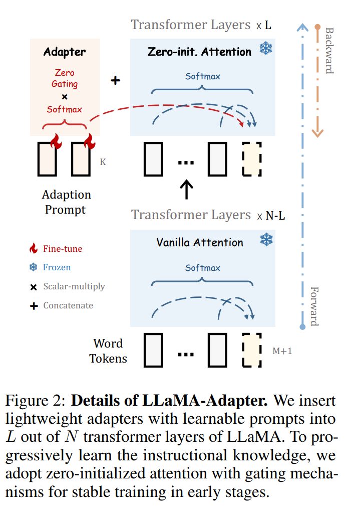

논문 및 이미지 출처 : <https://arxiv.org/pdf/2303.16199.pdf>

# Abstract

**LLaMA-Adapter** 는 LLaMA 를 instruction-following model 로 효율적으로 fine-tuning 하기 위한 경량 adaptation method

- 52K self-instruction 사용
- LLaMA 7B model 을 freezing 한 채, LLaMA-Adapter 를 사용하면 **1.2M** learnable parameter 만 추가됨
- 8대의 A100 GPU 에서 1시간 이하의 fine-tuning cost 발생

구체적으로,

1. learnable adaptation prompts 를 채택, 이를 상단의 Transformer layer 의 word token 앞에 추가
2. zero-initialized attention 메커니즘 및 zero gating 제안
    - new instruction 을 LLaMA 에 adaptively injects 하는 동시에 pre-trained knowledge 를 효과적으로 보존

LLaMA-Adapter 는 multi-model instruction 으로 확장 가능

ScienceQA 및 COCO caption 벤치마크에 우수한 reasoning 성능 달성

전통적인 비전 및 언어 task 에서 pre-trained model (ViT, RoBERTa)을 fine-tuning 하기 위해 zero-initialized attention 메커니즘을 평가하여 저자의 approach 의 우수한 일반화 능력 보여줌

# 1. Introduction

LLM 이 크게 발전하는데 비해 instruction model 은 높은 비용 및 시간이 든다.

이를 해결하려, Stanford Alpaca 는 LLaMA 를 instruction-following model 로 fine-tuning 하는 방법을 제안하여 저렴하고 복제 가능한 모델을 만들었지만 여전히 시간이 많이 소요된다.

본 논문은 **LLaMA-Adapter** 도입으로 LLaMA 를 instruction-following model 로 효율적으로 fine-tuning 하는 방법 제안

- training 을 목적으로 52K instruction-output data 활용
- LLaMA 를 freezing 하여 efficiency 보존 
- LLaMA 상단의 transformer layer 에 learnable adaptation prompts 를 input instruction token 앞에 붙임
- 초기 훈련 단계에서 adaptation prompt 의 noise 를 피하기 위해, layer 의 vanilla attention 메커니즘을 zero-initialized attention 으로 수정하고 learnable gating 추가

다음 LLaMA-Adapter 는 Fig 1 에서 네 가지 특징 가짐

- 1.2M Parameters
  - pre-trained LLaMA 7B 는 freezing 하고 1.2M parameter 인 adaptation prompt 만 학습
  - 7B Alpaca 와 comparable instruction-following
- One-hour Fine-tuning
  - zero-initialized gating 을 사용한 경량 adaptation module 덕에 8개의 A100 GPU 에서 1시간 미만으로 Alpaca 보다 3배 빠름
- Plug with Expertise
  - 여러 시나리오에 대한 여러 adapter 를 삽입하고 LLaMA 에 다양한 expert knowledge 를 부여하는 유연성 지님 
- Multi-model Instruction
  - text instruction 뿐 아니라 image input 으로 multi-model reasoning 수행 가능
  - image tokens 을 adaptation prompts 에 추가함으로써 ScienceQA 및 COCO caption 벤치마크에서 comparable 한 성능

instruction-following model 뿐 아니라, vision 및 language models 에 대해서도 _zero-initialized_ attention 이 parameter-efficient fine-tuning 으로 일반화 가능

pre-trained ViT 를 fine-tuning 하는데 저자의 approach 로 VTAB-1k 벤치마크에서 우수한 성능 달성

ReBERTa 의 경우 SQuAD v1.1 및 v2.0 에서 선도적인 결과 달성

# 2. Related Work

# 3. LLaMA-Adapter

# 3.1 Learnable Adaptation Prompts

52K instruction-output data 및 $N$-layer transformer 를 사용하는 pre-trained LLaMA 가 주어졌을 때, 저자는 instruction-following fine-tuning 을 위해 _learnable adaptation prompts_ 셋 채택

- $\{ P_l \}^L_{l=1}$ : $L$ transformer layer 에 대한 prompts
  - $P_l \in \mathbb{R}^{K \times C}$
  - $K$ : 각 layer 에 대한 prompt length
  - $C$ : LLaMA transformer 의 feature dimension

prompt 를 transformer 의 가장 상단 $L$ layer $(l \leq L)$ 에 삽입한 것을 주목하자.

이는 higher-level semantics 를 갖는 language representation 을 더 잘 tuning 하도록 해줌

예로 $l$-th inserted layer $(l \leq L)$ 를 보자.

- $T_i \in \mathbb{R}^{M \times C}$ : $M$-length word tokens
  - input instruction 및 이미 생성된 response 표시
- learnable adaptation prompt 는 token dimension 을 따라 $T_i$ 과 prefix 로 연결

$$
[P_l; T_l] \in \mathbb{R}^{(K+M) \times C} \tag{1}
$$

$P_l$ 에서 학습된 instruction knowledge 는 transformer block 의 attention layers 를 통해 subsequent contextual response 를 생성하도록 $T_i$ 에게 효율적으로 가이드함

## 3.2 Zero-initialized Attention

