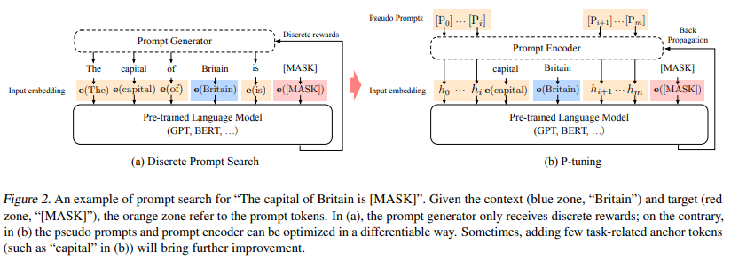

논문 및 이미지 출처 : <https://arxiv.org/pdf/2103.10385.pdf>

# Abstract

전통적인 fine-tuning 으로는 GPT model 의 natural language understanding (NLU) task 에 좋은 결과를 달성하지 못하는 반면,

저자는 trainable continuous prompt embeddings 를 사용한 **_P-tuning_** 을 통해 나은 결과를 얻을 수 있었다.

- knowledge probing (LAMA) 벤치마크에서 최고인 GPT 는 테스트할 때 additional text 없이 64% (P@1) 복구 (이전 best 의 +20%)
- SuperGlue 벤치마크에서 GPT 모델은 supervised learning 에서, 유사한 크기인 BERT 와 비슷하거나 더 나은 성능 달성
- P-tuning 이 prompt engineering 의 필요성을 줄여, BERT 모델의 성능도 향상시킨다는 것

결과적으로 P-tuning 이 few-shot SuperGlue 벤치마크에서 SOTA 능가

# 1. Introduction

이전 연구들은 pre-training 과정에 text 표현 뿐 아니라 문법, 구문, 상식 및 세계 지식 등의 요소를 학습한다는 증거를 제시하기도 한다.

training objectives 에 따라 pre-trained language model (LM) 은 세 가지 범주로 나눌 수 있다.

- **unidirectional language models** for natural language generation (NLG) (e.g. GPT)
- **bidirectional language models** for natural language understanding (NLU) (e.g. BERT)
- **hybrid language models** for combining the first two paradigms (e.g. XLNet, UniLM)

GPT 스타일의 모델이 fine-tuning 으로 NLU task 에 대한 성능이 좋지않아, language undetstanding 에 적합하지 않다고 가정해왔다.

하지만 manual prompt 사용으로 흥미로운 성능을 보여, large unidirectional model 와 manual prompt 가 NLU 에 적합하게 작용할 수 있음을 시사

그러나 best-performing prompt 란 사막에서 바늘찾기 이며, 현실적으로 불가능한 매우 큰 검증 데이터셋이 필요하다.

많은 케이스에서도, prompt engineering 은 테스트셋에 overfitting 하며, 큰 성능 하락을 일으키는 prompt 를 만들 가능성도 있다.

이러한 연구들을 통해 저자는 discrete prompts 를 자동으로 검색하고, 효과를 입증하는데 초점을 둔다. 하지만 neural networks 는 continuous 하므로 discrete prompts 는 sub-optimal 일 수 있다.

---

본 연구는 **_P-tuning_** 으로 GPT 와 NLU 간의 간격을 좁히기 위해 continuous space 에서 prompt 를 자동으로 검색하는 방법을 연구

- few continuous free parameters 를 활용하여 pre-trained LM 에 입력으로 제공되는 prompt 역할
- continuous prompt 를 discrete prompt searching 대신 gradient descent 를 활용하여 최적화

간단한 P-tuning 으로 GPT 에 상당한 개선을 가져왔다.

저자는 P-tuning 기반 GPT 을 두 가지 NLU 벤치마크에 검토

- LAMA knowledge probing
  - 64.2% 달성하여 이전 SOPTA prompt searching 방법인 45.2% 를 크게 능가
- SuperGLUE
  - few-shot 및 fine-tuning 을 함께 진행
  - 동일한 규모의 BERT 와 유사한 성능이거나 일부 데이터셋에선 능가
  - BERT 스타일 모델에도 P-tuning 이 이점을 얻을 수 있음을 관찰
  - ALBERT 의 P-tuning 은 성능 크게 능가하고 few-shot SuperGLUE 에서 SOTA

위 방법은 GPT 는 언어를 이해하지 못한다는 고정관념을 부쉈다.

P-tuning 은 pre-trained LM 을 downstream task 에 최상의 성능을 위해 fine-tuning 에도 작동한다.

본 논문의 기여는 다음과 같다.

- P-tuning 으로 GPT 의 NLU 가 BERT 와 comparable (때론 더 나음)하여, pre-trained LM 의 성능을 향상 시킴
- P-tuning 은 few-shot 및 fine-tuning 설정에서도 GPT 및 BERT 를 모두 개선
  - LAMA knowledge probing 및 few-shot SuperGLUE 에서 SOTA 능가
  - LM 이 pre-training 중 생각보다 더 많은 지식을 습득했음을 시사

# 2. Motivation

GPT-3 및 DALL-E 는 LLM 이 만병통치약임을 시사하지만, transferability 가 낮다는 것.

downstream task 의 fine-tuning 은 trillion-scale model 에는 거의 작동하지 않는다.

many-shot fine-tuning 에서도 빠르게 fine-tuning sample 을 메모리에 저장하기엔 너무 크다.

대안으로 GPT-3 와 DALL-E 는 downstream 을 위해 model fine-tuning 을 위해 manual prompt 를 활용하는 것이 보고 되었다.

그러나 manual prompt searching 은 큰 검증셋에 지나치게 의존하며 성능도 불안정하다.

최근 discrete prompts searching 을 자동으로 하는 것에 집중하며, 

- training corpus 를 mining
- gradient searching
- separate model 

저자의 목적은 미분하여 최적화될 수 있는 continuous prompt 를 찾는 것

# 3. Method: P-tuning

discrete prompt 와 유사하게 P-tuning 은 input 에 비침범적인 (noninvasive) 수정만 적용

pre-trained input embeddings 을 differential (미분계수) output embeddings 로 대체

## 3.1 Architecture

pre-trained LM $\mathcal{M}$ 이 주어졌을 경우

- discrete input token 의 sequence $\text{x}_{1:n} = \{ x_0, x_1, \dots, x_n \}$
  - pre-trained embedding layer $e \in \mathcal{M}$ 에 의해 input embeddings $\{ e(x_0), e(x_1), \dots, e(x_n) \}$ 으로 매핑
- 특정 시나리오에선 context $\text{x}$ 에 대해, downstream 처리를 위해 target token $\text{y}$ 의 output embeddings 사용이 일반적
  - pre-training 에선, $\text{x}$ 는 unmasked tokens 을 나타내며, $\text{y}$ 는 [MASK] 를 나타냄
  - sentence classification 에선, $\text{x}$ 는 sentence token 을 나타내며, $\text{y}$ 는 [CLS] 를 나타냄

prompt $\bold{p}$ 의 역할은 context $\text{x}$, target $\text{y}$ 및 template $T$ 로 구성하는 것

예로, 국가 수도를 예측하는 작업 (LAMA-TREx P36)

- template "The capital of Britain is [MASK]."
- prompt "The capital of ... is ... ."
- context "Britain"
- target "[MASK]"

prompt 는 context 또는 target 로 삽입할 수 있는 유연성을 지닐 수 있다.

LM $\mathcal{M}$ 의 vocabulary 를 $\mathcal{V}$, template $T$ 의 $i^{th}$ prompt token 을 $[\text{P}_i]$ 라 하자.

간단하게, $T = \{ [\text{P}_{0:i}], \text{x}, [\text{P}_{i+1:m}],\text{y} \}$ 가 주어졌다고 하자. 

traditional discrete prompts 와 비교하며, 이는 $[\text{P}_i] \in \mathcal{V}$ 를 만족시키고 $T$ 를 다음과 같이 매핑

$$
\begin{equation}
    \{ e([\text{P}_{0:i}]), e(\text{x}), e([\text{P}_{i+1:m}]), e(\text{y}) \}
\end{equation}
$$

반면, P-tuning 은 $[\text{P}_i]$ 를 pseudo tokens 로 간주하고 template 를 다음과 같이 매핑

$$
\begin{equation}
    \{ h_0, \dots h_i, e(\text{x}), h_{i+1}, \dots h_m, e(\text{y}) \}
\end{equation}
$$

- $h_i (0 \leq i \leq m)$ : trainable embedding tensors
  - 이를 통해 $\mathcal{M}$ 의 original vocabulary $\mathcal{V}$ 를 넘어 더 나은 continuous prompts 를 찾을 수 있게 됨

downstream loss function $\mathcal{L}$ 를 사용하여 continuous prompt $h_i (0 \leq i \leq m)$ 를 미분으로 최적화할 수 있다.

$$
\begin{equation}
    \hat{h}_{0:m} = \underset{h}{\text{arg} \min}\  \mathcal{L} (\mathcal{M}(\text{x}, \text{y}))
\end{equation}
$$

## 3.2 Optimization

continuous prompts 의 training idea 는 간단하지만 실제로 두 가지 최적화 문제를 직면

1. Discreteness
    - $\mathcal{M}$ 의 original word embedding $e$ 은 pre-training 후 높은 discrete 성질을 가짐
    - $h$ 가 random distribution 된 후, 
2. Association