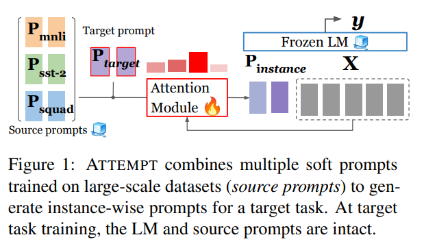
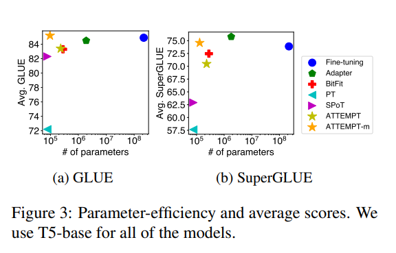
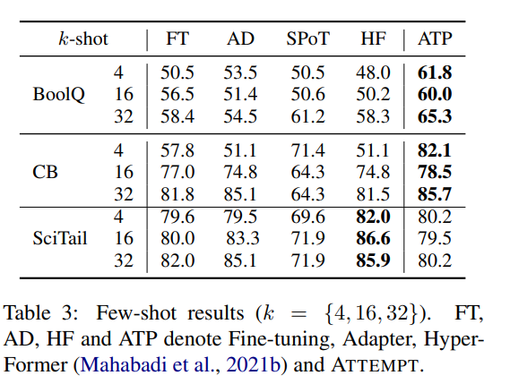
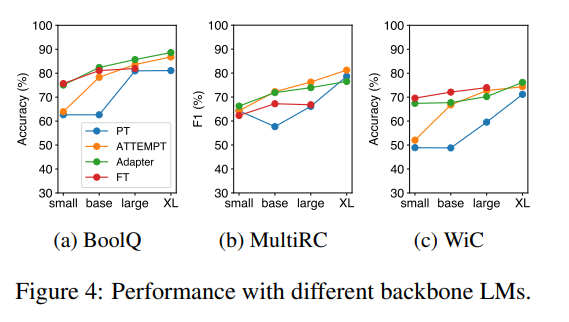
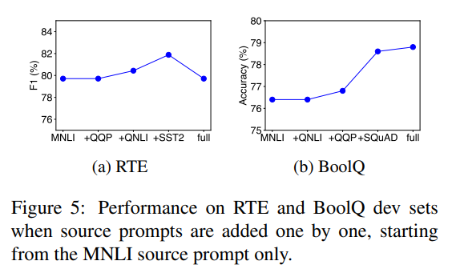

논문 및 이미지 출처 : <https://arxiv.org/pdf/2205.11961v2.pdf>

# Abstract

본 논문은 multi-task parameter-efficient language model tuning 방법을 소개

다양한 tasks 에 대한 pre-trained small prefix embedding vectors - soft prompts 의 mixture 를 통해 다양한 tasks 전역의 knowledge 를 transfer learning 하는 ATTEMPT (ATTEntional Mixture of Prompt Tuning) 소개

- large-scale source tasks 의 encoding 을 소수의 파라미터로 추출
- 각 instance 에서 target task 의 새로 초기화된 prompt 와 source prompt 를 interpolate 하기 위한 attention module 을 훈련하여 source prompt 를 얻음
- 훈련 중엔, target task prompt 와 attention weights 만 업데이트되며, 이 weights 는 multi-task training 에서 여러 tasks 간에 공유
- original LM 과 source prompts 는 그대로 유지
- ATTEMPT 는 높은 parameter-efficient (예: full fine-tuning 보다 2,300배 적은 parameter update), high-resource tasks 를 사용하는 task 에 대한 knowledge 를 활용하여 높은 성능 달성
- pre-trained soft prompt 를 사용하여 modular 이며, 효과적인 knowledge transfer 를 위해 source prompt 를 자유롭게 추가 및 제거 가능

21가지 NLP datasets 실험 결과, ATTEMPT 가 prompt tuning 을 크게 능가

# 1. Introduction

LLMs 의 full fine-tuning 은 target task 훈련에 맞추는 일반적인 방법이다. 최근 PEFT 가 등장하지만 효율성을 높이면 task 성능이 감소하게 된다.  게다가 훈련 데이터만 훈련하고 다른 NLP tasks 에 대한 이점이 없다.

저자는 PEFT methods 가 high-resource tasks 의 rich knowledge 를 활용하여 훈련 효율성 및 task 성능 모두 향상시킬 수 있다 주장한다.

---

본 연구는 새로운 parameter-efficient modular multi-task tuning 인 ATTEMPT(ATTentional Mixtures of Prompt Tuning, Fig. 1) 을 소개한다.

- 기존 LM 은 동결한 채, prepended trainable soft pomrpts 의 mixture 을 통해 multiple task 의 knowledge 를 효율적으로 통합
  - 먼저, large-scale source tasks 에 transferable soft embeddings 를 pre-train → **source prompts**
    - 이 source tasks 는 다른 tasks 에 이로운 지식을 포함할 가능성이 있다.
  - 이후, ATTEMPT 는 target task 에 대한 new _target prompt_ 를 초기화하고 source prompts 및 target prompt 의 attention-weighted combination 을 학습
    - attention module 은 여러 tasks 를 동시 학습 및 공유 가능한 가벼운 network

ATTEMPT 는 이전의 multi-task fine-tuning 및 PEFT 보다 세 가지 이점 제공

1. full fine-tuning (FFT) 의 0.4% parameter 만 업데이트하면서 **highly parameter-efficient** 및 competitive performance 달성
2. pre-trained soft prompts 를 사용하여 **modular multi-task learning** 가능하며, 다양한 tasks 의 knowledge 를 유연하게 결합, 재사용 또는 제거가 가능하고 new tasks 를 source 또는 target task list 에 추가할 수 있다.
3. 어떤 task 과 관련됐는지 미리 계산하는 것에 의존하는 이전 연구와 달리, ATTEMPT 는 많은 source task 에서 유용한 task 에 중점을 두도록 학습. 게다가 추론 시, single LM 에 여러 pre-loaded soft prompts 를 사용하여 multiple task 수행 가능
4. ATTEMPT 는 attention distributions 를 생성함으로써 multi-task learning 에서 underlying task similarities 에 대한 **interpretability 를 향상**

---

다양한 tasks, domains 및 output 형태에 대한 21 datasets 에서 수행

- ATTEMPT는 이전 prompt tuning 기반 접근법보다 큰 차이로 성능 능가
- 특히 smaller datasets 에서, SOTA transfer 또는 FFT 와 비슷하다.
- 또한 few-shot domain adaptations (i.e. 4-32 shots) 에 효과적

저자는 ATTEMPT 가 parameter-efficient 이며 backbone LLM 에 competitive 한 결과를 보여준다고 한다.

그리고 ablation studies 를 통해 learned attentions, multi-task learning 및 multiple tasks 에서의 modular transfer 가 주로 성능에 기여하는 것을 시사했다고 한다.

attention distributions 는 겉으로 보기엔 다른 tasks 사이의 underlying similarities (e.g. entailment 및 paraphrase detection) 를 보여주며, task 간에 효과적인 knowledge transfer 를 나타내는 signal 로 작용한다.

# 2. Background and Problem Setup

# 3. Method

ATTEMPT 는 source tasks 의 knowledge 를 small parameter 로 인코딩한 _source prompts_ 를 얻기 위해 parameter-efficient prompt tuning 을 활용한다.

그리고 모든 target task instance 에 대한 attention mechanism 을 통해 target task 를 새롭게 초기화된 _source prompt_ 와 _target prompt_ 을 통합함으로써 instance-level prompts 를 tuning

---

- ATTEMPT 는 source tasks 에 대한 source prompts $P_1, \cdots ,P_2$ (Fig. 2 왼쪽)을 pre-training
- target task 에 대한 target prompt $P_{target}$ 을 초기화
- 이후 attention module $\mathcal{G}$ 을 사용하여 각 instance $(x, y)$ 에 대한 embedded input $X$ 및 soft prompts 간에 attention 계산
- 그 다음, ATTEMPT 는 계산된 attentions 을 기반으로 source prompts 와 target-task prompt 을 interpolating 함으로써 instace-wise prompt $P_{instance}$ 을 제공
- $P_{instance}$ 은 frozen LM $\theta$ 의 final input 형태가 되기 위해 input 에 prepend 된다.

---

훈련 중엔, 주어진 $P_{instance}$ 와 $x$ 으로 $y$ 를 생성할 확률을 최대화하여 $P_{target}$ 및 $\mathcal{G}$ 의 weights 만 업데이트 한다. 중요한 점은 다양한 tasks 의 task-specific parameters $\phi_{target}$ 이 동일한 minibatch 에서 훈련될 수 있도록 prompt 또는 prefix tuning 의 특성을 활용한다 (Prompt Tuning, Prefix-tuning).

따라서 추가적인 parameter 및 inference efficiency 를 위해 shared attention $\mathcal{G}$ 와 multiple target task prompts 를 동시에 훈련시킬 수 있다.

## 3.1 Source Prompt Pre-training

먼저 MultiNLI, SQuAD 같은 $t$ 개의 high-resource datasets 을 prompt tuning 을 통해 source prompt $[P_1, \dots, P_{t}]$ 를 얻는다.

각 source prompt 는 해당 source task 에 한번 만 훈련되며, 다른 target tasks 로 transfer 될 수 있다.

- 공식으로는 input sequence $X$ 에 대한 source prompt 는 $P = [p_1, \dots, p_m] \in \mathbb{R}^{m \times d}$로 표현한다.
  - $m$ : prompt length
  - $d$ : LM dimension
- prompt 가 prepend 된 Input embedding $[P; X]$ 는 frozen LM $\theta$ 에게 주입된다.
- 훈련 중, 다음 목적함수를 최대화함으로서 target sequence $y$ 를 생성할 확률의 우도를 높이기 위해 prompt embeddings 만 업데이트 한다.

$$
\begin{equation}
  \underset{P}{\max}\  p_\theta (y\ |\ [P; X]).
\end{equation}
$$

## 3.2 Target Prompt Training

new target task 에 대한 soft prompt $P_{target}(=\ P_{t+1})$ 를 초기화한 후, 저자는 $\mathcal{G}$ 에 생성된 attention scores 로 source prompts 및 target task prompt 간에 interpolating 함으로써 target task 의 각 instance 에 대한 instance-wise soft prompts $P_{instance}$ 를 학습한다.

Eq. 1 과 유사하게, 저자는 제공된 instance-wise prompt 를 input 에 연결하고 우도를 최대화하여 ATTEMPT 를 훈련한다.

$$
\begin{equation}
  \underset{P_{target}, \mathcal{G}}{\max}\  p_\theta (y\ |\ [P_{instance}; X]).
\end{equation}
$$

훈련 중에는 new task prompt $P_{target}$ 및 $\mathcal{G}$ 는 $P_{instance}$ 를 통해 업데이트되지만, source prompts 및 original LM $\theta$ 는 이전 tasks 나 pre-training 로 학습된 knowledge 를 보존하기 위해 건드리진 않는다.

### 3.2.1 Input-prompt Attentions

ATTEMPT 는 input-prompt attentions 를 계산함으로써 source prompts set 이 instance-wise prompt 에 미치는 영향을 조절한다.

구체적으로, 

- attention module $\mathcal{G}$ 는 input $X$ 에서 source prompts 및 new target prompt 를 모두 포함하는 prompts 로의 attention weights $a_1, \dots, a_{t+1}$ 을 생성한다.
- input $X \in \mathbb{R}^{l \times d}$ 및 soft prompt $P_j \in \mathbb{R}^{m \times d}$ 는 각기 다른 sequence lengths 를 가지기 때문에, 먼저 $X$ 및 각 source prompt embedding 에 대한 각 dimension 에 대한 max-pool 연산을 수행하고 $\hat{X} \in \mathbb{R}^d$ 및 $\hat{P}_j \in \mathbb{R}^d$ 를 얻는다.
- 이후 $\hat{X}$ 를 $\mathcal{G}$ 에 주입하여 prompt space 로 project 한다.

Khashabi et al. (2022, PROMPT WAYWARDNESS) 는 soft prompts 가 embedding space 에서 의미있는 tokens 에 해당하지 않을 수 있기 때문에 $\hat{X}$ 와 $\hat{P}$ 간의 유사성을 계산하는 것만으로 신뢰있는 score 를 얻을 수 없다고 주장한다.

효율성을 위해, $\mathcal{G}$ 는 다음과 같이 down 및 up projection layer 로 구성한다.

$$
\begin{array}{ll}
H_{down} &=  W^\top_{down}(\hat{X}) \\ 
H_{up}  &= W^\top_{}up(NonLinear(H_{down})) \\
H_{out} &= LayerNorm(H_{up}),
\end{array}
$$

- $W_{down} \in \mathbb{R}^{d \times r} (r < d)$ 및 $W_{up} \in \mathbb{R}^{r \times d} (r < d)$ : projection parameter 이며 훈련 중에만 업데이트 된다.
- non-linear layer 에 SiLU 사용
- $H_{up}$ 에 Layer Norm 을 적용하는데, layer norm 을 적용하지 않으면 $H_{up}$ 은 빠르게 증가하고 gradients explode 를 관찰할 수 있었다.
- 마지막으로, attentions 계산을 위해 $\hat{P}_j$ 와 $H_{out}$ 간에 product 를 계산하고, 다음과 같이 prompt 에 softmax 를 적용했다.

$$
\begin{equation}
  a_j = \frac{e^{\hat{P}_j H_{out}}/T}{\sum^{t+1}_{k=1}e^{\hat{P}_k H_{out}}/T}
\end{equation}
$$

- $T$ : softmax temperature
- Eq. 3 의 logit 을 스케일링하여 attention module 이 over-confident 되지 않도록 함

### 3.2.2 Prompt Interpolation

instance $X$ 에 대한 final soft prompt 는 Eq. 3 에 의해 생성된 attention 을 기준으로 prompt 의 weighted sum 으로 계산된다.

$$
\begin{equation}
  P_{instance}(X) = P_{target} + \sum^{t+1}_{j = 1} a_j P_j.
\end{equation}
$$

- 오른쪽의 두 번째 항은 같은 task 의 인스턴스마다 다른 반면, $P_{target}$ 항은 task-specific 이다.
- 이 attentions 는 다양한 prompts 의 영향을 제어하고 여러 tasks 의 knowledge 를 유연하게 구성하도록 하는 gate 역할을 한다.
- Eq. 4 에 보이듯, target-task-specific prompt $P_{target} (=P_{t+1})$ 의 $1+a_{t+1}$ weights 선택은 sources tasks 의 어떠한 knowledge 도 instance $X$ 에 유용하지 않을 경우, ATTEMPT 에게 source prompt 의 역할을 _down-play_ (줄이도록) 허용해주면서 $P_{target}$ 의 영향을 유지하여 훈련 중에 적절히 업데이트되도록 한다.

## 3.3 Multi-task Training and Inference

#### Training

ATTEMPT 는 attention module $\mathcal{G}$ 및 mutliple target taks prompts 를 동시에 훈련 가능하다.
여기서 저자는 $\mathcal{G}$ 를 공유하여 target tasks 그룹에 대한 multi-task learning 접근법을 설명한다.

- 먼저 각 task ID 정보를 유지하며 훈련 데이터셋에 연결
- 훈련 중, task ID 에 따라 instance 에 해당하는 target task prompt 를 검색하고 prompt set 에 대한 attention 을 계산하며 [Section 3.2](#32-target-prompt-training) 에서 설명한대로 instance-wise prompt 를 생산한다.
- 각 target-task prompt 에 대한 loss 는 prompt 가 사용될 때만 역전파되며, attention module 의 weights 는 각 iteration 에서 업데이트된다.

이 방식으로 target task 들은 느슨하게 연결되어 향상된 task-agostic attention module 에 기여하며, 특히 target task training data 가 적은 경우 효과적이다.

더구나, 각 task 당 업데이트해야 하는 parameter 수를 감소시키고 추론 시간의 효율성도 향상시킨다.

#### Inference

추론 시점에, 저자는 source prompt, 모든 target task prompt 및 공유된 $\mathcal{G}$ 를 한번 만 로드한다.

각 instance 에 대해, ATTEMPT 는 target task prompt 를 검색하고 Eq. 4 와 같이 $P_{instance}$ 를 생성한 다음 $P_{instance}$ 를 input embedding 에 연결한다.

instance prompt 생성 후의 추론 프로세스는 prompt tuning 과 동일하다.

ATTEMPT 는 multiple target prompt 를 로드하고 multiple target tasks 를 동시에 수행하여 inference time model loading overhead 을 크게 감소시킨다.

full fine-tuning 이나 Adapter 와 같은 기존 접근 방식은 각 target task 에 대해 모델 로딩이 필요하므로 multi-task inference pipeline 이 복잡해진다.

## 3.4  Parameter Efficiency of ATTEMPT

각 task 에 대해, 저자는 new trainable soft prompt $m \times d$ 를 도입할 것이다.

- $m$ : prompt length
- $d$ : LM dimension

attention module 은 두 projection matrices 와 layer norm 으로 구성되어 $d \times r + r \times d + 2d = 2rd + 2d$ parameter 를 생성한다.

- $r$ : projection dimension

이는 $N$ 개의 target tasks 에 공유될 수 있으므로 각 task 당 추가 parameter 는 $d \times m + \frac{2rd+2d}{N} = d(m + 2(r+1)/N)$  이다.

ATTEMPT 또는 prompt tuning 의 특성은 LM layer 수에 독립적이라는 것이다. Adapter 나 fine-tuning 과 달리 ATTEMPT 는 soft prompt 만 업데이트하고 LM higher layers 는 수정하지 않으므로, 다른 방식과 비교하여 중간 정도의 parameter 증가가 발생한다.

T5-XL 백본을 사용할 때, Adapter 와 BitFit 은 6M 및 2M parameters 를 업데이트하는 반면 ATTEMPT 는 각 task 당 172K parameter 만 업데이트 한다. (Fig. 7)

# 4. Experiments

## 4.1 Source and Target Tasks

저자는 _source tasks_ 로 6개의 large-scale datasets 을 사용하고, entailment, paraphrase detection, sentiment analysis, question answering, commonsense reasoning 등을 포함한 21가지 다양한 _target tasks_ 에서 성능 평가

#### Source tasks

GLUE, SuperGLUE 및 MRQA 에서 100k annotations 를 가진 데이터셋을 사용하여 source prompt 로 선택: MNLI, QNLI, QQP, SST-2, SQuAD, ReCoRD

#### GLUE and SuperGLUE

NLU 능력 테스트를 위해 8개 GLUE tasks 및 5개 SuperGLUE tasks 를 target datasets 으로 사용: BoolQ, CB, MultiRC, WiC, WSC, RTE, CoLA, STSB, MRPC, MNLI, QQP, QNLI 및 SST-2

GLUE source task 로 사용된 GLUE 데이터셋 중 4개 (MNLI, QQP, SST-2 및 QNLI)은 이전 PEFT 와의 포괄적인 비교위해 target tasks 로 포함

#### Question answering

MRQA 2019 shared task data 를 사용하여 대규모 QA 데이터셋 4개에 대해 테스트 진행: Natural Questions, HotpotQA, NewsQA 및 SearchQA

#### Others

source tasks 와 관련된 tasks 이지만 도메인이 다른 4가지 다른 데이터셋에 대한 실험을 진행

SciTail 은 과학적 데이터셋, Yelp-2 는 Yelp 리뷰에 대한 감정 분석 데이터셋, WinoGrande 는 다항식 형식의 상식 추론 작업, PAWS-Wiki 는 Wikipedia 기반 Paraphrase detection dataset 이다.

## 4.2 Baselines and Implementation Details

#### Baselines

저자는 ATTEMPT 를 다음과 같이 비교: FT, PT

target prompt embeddings 는 무작위로 샘플링된 top vocabularies 에서 초기화됨: 

- SPoT: target prompts 는 다른 task 에서 훈련된 source prompt embedding 으로 초기화
- Adapter, AdapterDrop 및 BitFit : GLUE 에서의 여러 SOTA multi-task 방법과 ATTEMPT 를 비교

위 방법들은 여러 task 에서 single model 을 훈련한다: FT-multi-task, Adapter-m, HyperFormer, HyperDecoder 및 AdapterFusion

#### Implementation details

저자의 ATTEMPT 와 ATTEMPT-m 은 동일한 6개의 source prompt 를 사용하더라도, ATTEMPT-m 은 multi-task learning 을 통해 여러 target task 에 걸쳐 shared attention 을 훈련하는 반면, ATTEMPT 는 task-specific attention layer 를 별도로 훈련한다.

- 특별한 명시가 없다면 ATTEMPT 는 모든 baseline 에 대해 기본적으로 T5-base 를 사용한다.
- 데이터셋에 주석이 달린 public test split 이 없다면, 개발셋을 테스트셋으로 사용하거나 개발셋을 개발 및 테스트셋으로 분할한다.
- 10k example 보다 적은 데이터셋에는 20 epochs 로 훈련
- 10k 이상의 중간 규모는 10 epochs 훈련
- MRQA 데이터셋은 5 epoch 훈련
- Yelp-2 의 최대 훈련 데이터 수는 100k sample 로 제한

효율적인 knowledge transfer 을 위해 $\mathcal{G}$ 가 good prompt composition 을 학습하도록 하기 위해 $\mathcal{G}$ 에 대해 다양한 learning rate 를 도입하고 또한 $\mathcal{G}$ 의 weights 를 source tasks 에서 pretraining 하고 transferring 한다.

#### Prompt initialization

각 source prompt 는 top vocabularies 로부터 무작위 샘플링 토큰으로 초기화된다.

target task prompt 초기화의 경우, 훈련 안정성을 위해 무작위 vocabularies 샘플링을 하는 대신, non-QA tasks 에선 MNLI source prompt 를, QA 에선 SQuAD source prompt 를 사용한다.

# 5. Results

## 5.1 Main Results

Table 1 및 2 에서 GLUE 및 SuperGLUE 의 task 당 성능을 보여준다.

#### Performance vs. efficiency

Figure a, b 에서 GLUE 및 SuperGLUE 에서의 업데이트된 parameter 수에 비한 성능을 비교한다.

ATTEMPT-m 은 PT, SPoT 및 BitFit 을 큰 폭으로 능가했으며, task 당 더 적은 parameter 와 LM 을 동결했음에도 Adapter 도는 FT 와 비슷하다.

Table 1 에서 HyperFormer 또는 HyperDecoder 를 포함한 multi-task baseline 의 성능을 능가함을 보여주며, GLUE/SuerGLUE 에서 경쟁력 있는 성능에 더해, Table 2 에선 ATTEMPT-m 이 MRQA 에서 72.8 average F1 으로, parameter 의 두 배 사용하는 BitFit 을 능가

게다가, ATTEMPT-m 은 WinoGrande, Yelp, SciTail 및 PAWS 에서 85.65% 의 average accuracy 를 달성하여 BitFit (84.7%)를 능가하고 parameter 를 업데이트하는 Adapter (86.2%) 와 맞먹는다.

#### ATTEMPT largely improves prompt tuning

이전 연구에서 지적한 대로 (Mahabadi et al. Compacter, Lester et al. Prompt Tuning, Sung et al. Lst), prompt tuning 은 hyperparameters 또는 초기화에 민감하며,  CoLA (10.2%), BoolQ (61.7%) 또는 WiC (48.9%) 같은 데이터셋에서 성능이 크게 낮다.

SPoT 은 다른 관련 task 에서 훈련된 prompt 로 target task prompt 초기화를 개선하지만 여전히 다른 방법보다 낮으며, 미리 source tasks 검색해야 한다.

ATTEMPT 는 Table 2 와 같이 작은 데이터셋 (CB, RET) 및 대규모 MRQA 데이터셋에서 이러한 방법을 크게 능가한다.

## 5.2 Few-shot Domain Adaptations

Table 2 에 나타난 것 처럼, ATTEMPT 는 특히 작은 데이터셋 (RTE, WSC) 에서 경쟁력 있다.

Mahabadi et al. Compacter 를 따라 BoolQ, CB 및 SciTail 에서 few-shot 실험을 수행하여 제한된 리소스 환경에서 ATTEMPT 의 효과를 더 검증한다.

여기서 모든 모델 (FT, Adapter, HyperFormer, SPoT 및 ATTEMPT)은 먼저 GLUE 에서 훈련되고 그 다음 $k (k=4, 16, 32)$개만 무작위로 추출된 훈련 데이터를 사용하여 new tasks 에 transferring 한다.

Table 3 은 ATTEMPT 가 다른 방법들을 크게 능가하는 것을 보여준다.

이는 few-shot domain adaptation 에서 multiple source tasks 에서의 knowledge 를 non-destructive 하게 transferring 하는 효과적인 방법임을 나타낸다.

## 5.3 Analyses

#### Power of scale

저자는 backbone LM 크기를 증가시키며 ATTEMPT 성능에 끼치는 영향을 경험적 분석을 한다.

Fig. 4 는 세 개의 SuperGLUE 데이터셋에서 Adapter, ATTEMPT, PT 및 FT 모델의 LM 크기 성능을 요약

- ATTEMPT 는 주로 증가된 크기에서 이득을 봄. 이는 Lester et al. Prompt Tuning 의 발견과 일치하며, prompt tuning 이 backbone LM 이 클 때 효과적임을 보여준다.
- ATTEMPT 는 T5-base 또는 T5-large 사용 시 FT 모델과 맞먹거나 능가. 이는 prompt tuning 이 backbone LM 이 작은 경우 성능이 저하되는 반면, ATTEMPT 는 그렇지 않다는 점이 다름
- ATTEMPT 는 37배 적은 parameter 를 업데이트하면서 T5-3B 에서 Adapter 를 맞먹거나 능가

#### Ablation studies

저자는 ATTEMPT 의 다양한 변형을 비교하여 각 설계 선택의 효과를 확인

- _no target_ (a) : pre-trained source prompts 만 interpolating 하여 new task 에 대한 adaptation 타당성을 평가하기 위해, Eq. 4 의 target task prompt 를 초기화하거나 추가하지 않음
- _no attention_ (b) : Eq. 3 의 모든 source prompt 에 대한 constant score $a_j = 1/t$ 를 부여하여, attentions 를 없앤다
- _single prompt_ (c) : multiple tasks 의 knowledge transferring 효과를 평가하기 위해 single source prompt 만을 사용
  - SPoT 과 유사하지만 초기화 및 훈련 중엔 source prompt parameter 를 업데이트하는 대신 source prompt 를 유지하고 target task prompt 를 업데이트하며 source 및 target prompt 를 interpolation

Table 4 는 모든 components 가 성능 향상에 기여함을 보여준다.

- (a) trainable target-task-specific prompt (no target) 를 추가하는 것이 모든 데이터셋에서 좋은 성능을 얻는데 중요하며, 특히 BoolQ 및 WinoGrande
- Constant attention 는 BoolQ 및 NewsQA 에서 큰 성능 감소를 초래. 이는 multiple source prompt 를 간단히 평균하지 않고 학습된 attention 을 갖는 것이 중요함을 나타냄
- Single prompt ablation baseline 은 ATTEMPT 의 non-destructive soft prompt transfer 덕분이라 생각되며, ATTEMPT 에 비해 현저한 성능 감소가 있다. 이는 multiple soft prompts 활용으로 여러 다양한 task 의 knowledge transferring 효과를 보여준다.

#### Modularity: effects of variable source prompts

ATTEMPT 의 묘듈성을 연구하여 source tasks 를 유연하게 추가하거나 제거할 수 있도록 한다.

Fig. 5 는 source tasks 를 포함하는 방법이 ATTEMPT 의 최종 성능에 미치는 영향을 보여줌.

- BoolQ 및 RTE 에 대한 ATTEMPT 의 최종 성능에 source task prompt 를 추가하는 방법을 보여준다.
  - 두 데이터셋 모두에서 더 많은 source task prompt 를 추가하면 성능이 향상되며, RTE 에서는 SQuAD 및 ReCoRD 를 추가할 때 예외가 있다. (full, Fig. 5a)
  - 이는 QA 와 RTE 의 다른 특성 때문에 부정적인 transfer 이 발생할 수 있기 때문일 것으로 예상
  - 이러면 두 QA source prompt 가 BoolQ 에서 도움이 되며, 이는 ATTEMPT 의 모듈성의 효과를 나타냄
- 이는 강력한 multi-task model 을 구축하기 위해 new task 를 유현하게 제거하거나 추가할 수 있는 효과적인 방법

#### Interpretability: analysis on attentions

Fig. 6 은 ATTEMPT 에 의한 source 와 target task 간의 attention weight matrix 를 보여준다.

target task prompt 에 대해서는 1 을 추가하기 전의 $a_{t+1}$ weight 를 표시

Attention patterns 은 다양한 tasks 에 따라 다르다.

- 일반적으로 $\mathcal{G}$ 는 관련 source task 에 높은 attention 을 보인다.
  - Yelp $\rightarrow$ SST-2
  - PAWS-Wiki $\rightarrow$ QQP
  - 이는 동일한 task 이지만 서로 다른 domain 이다.
  - QQP 는 여러 task 에서 높은 attention 을 받았으며, 이 tasks 들 간의 유사성이 낮은 paraphrasing (e.g. MultiRC, WNLI) 로 보인다.
  - MNLI 는 RTE 처럼 크게 연관된 target tasks 로부터는 높은 attention 을 받지 않았다. 
    - 이는 target task prompt 가 MNLI source prompt 로 초기화됐기 때문일 것이며, ATTEMPT 가 다른 task 에 attention 을 try 할 것이라 가정한다.
  - WingoGrande 또는 SciTail 의 경우, $\mathcal{G}$ 는 target task 내의 embedding 에 큰 attention 을 준다 (target).
    - 이는 두 task 가 크게 다른 task format 또는 input domain 을 가지고 있어, $\mathcal{G}$ 가 source prompt 에 더 많은 attetion 을 주지 않는 것일 수 있다.

# 7. Conclusion

저자는 new PEFT 인 ATTEMPT 제시

- source tasks 에서 학습된 재사용 가능한 multiple soft prompt 와 new task-specific prompt 를 interpolating 하여 instance-wise prompt 를 생성하는 동안 original LM 은 동결을 유지
- large-scale 실험은 ATTEMPT 가 task 성능과 효율성 간의 훌륭한 균형을 달성하여 해석 가능하고 모듈화된 task transfer 을 소개

#### Limitations

parameter-efficiency 및 경험적 결과에도 불구하고 몇 가지 제한 사항이 있다:

1. prompt tuning 은 $m$ 개 prompt tokens 로 input token length 를 늘리므로 memory 차지 공간 및 계산 비용 증가
   - Lester et al. Prompt Tuning 은 LLM 을 backbone 모델로 사용하면 prompt length 를 줄일 수 있는 것을 발견
2. soft prompt 를 통한 multi-task knowledge transfer 에 대해, 저자의 평가는 classification 및 QA 에 중점을 두어, long sequence generation (e.g. summarization)이 필요한 task 는 포함되지 않음
3. ATTEMPT 를 영어가 아닌 task 에서 테스트하지 않았으며, 비영어 언어에 대한 조사 및 cross language transferring 에 적용을 하지 않음