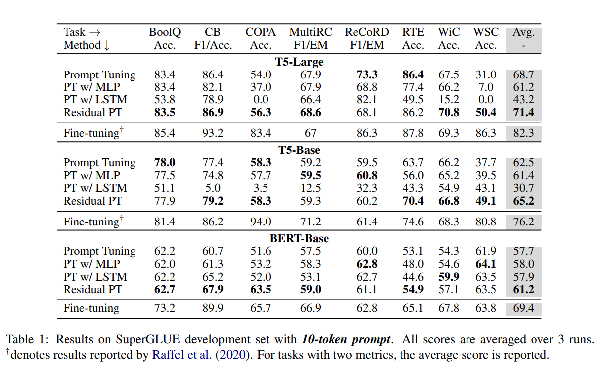
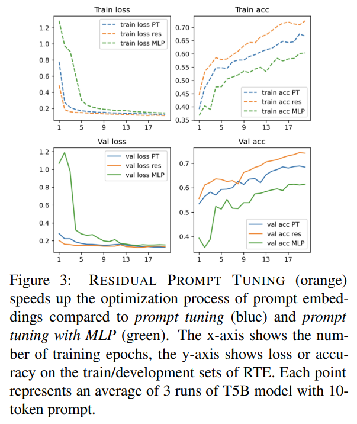
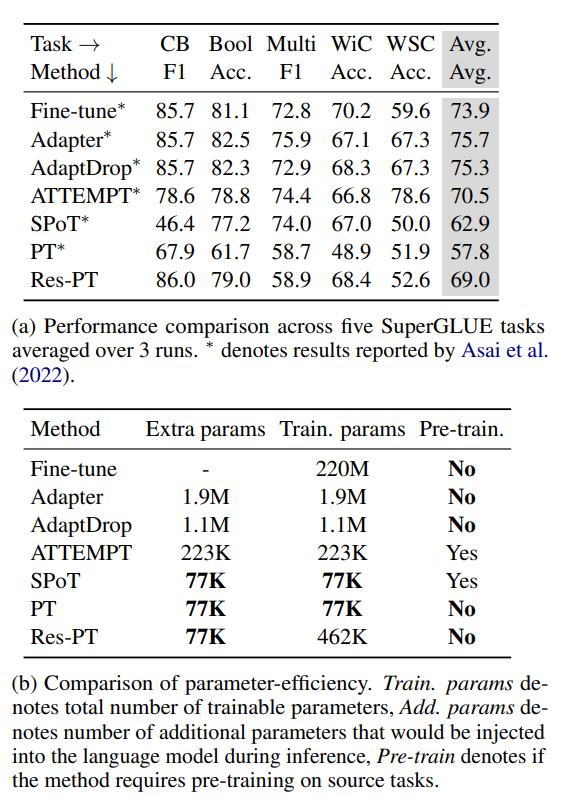
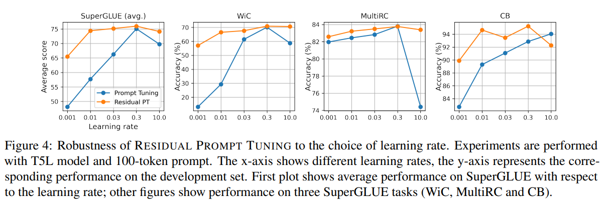
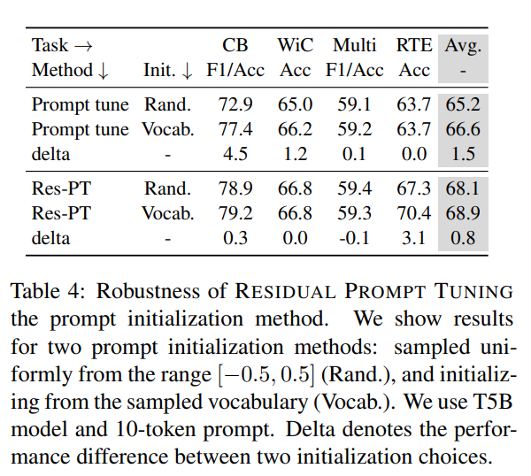
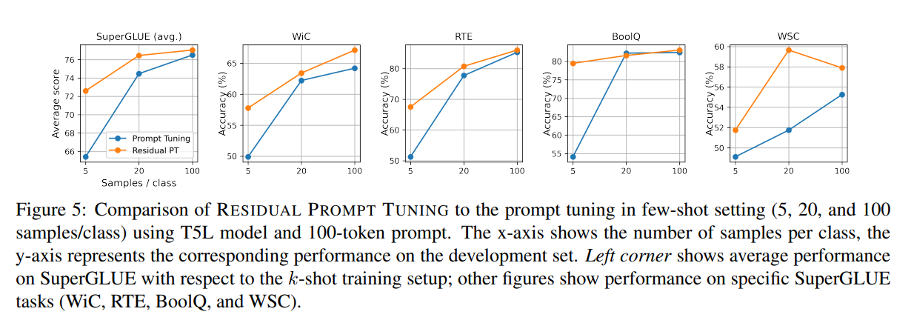
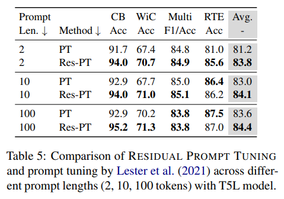
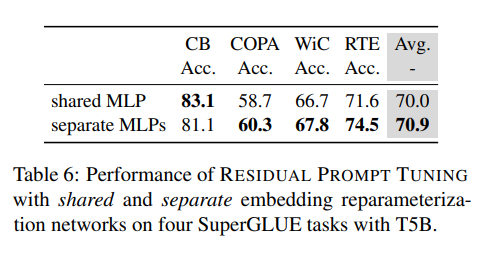
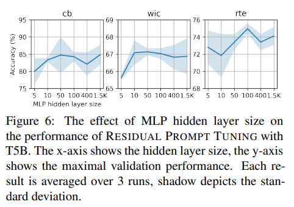

논문 및 이미지 출처: <https://arxiv.org/pdf/2305.03937v1.pdf>

# Abstract

Prompt Tuning 은 성공적인 PEFT 접근법 중 하나지만 (tuned soft prompts < 0.1% of total parameters) 로 인해 다른 PEFT 보다 성능이 안좋거나 hyper-parameter 에 민감

본 논문에서 저자는 **RESIDUAL PROMPT TUNING** 을 제안

- 간단하고 성능 및 prompt tuning 의 안정성을 크게 향상시키는 efficient method
- shallow network with a residual connection 을 사용하여 soft prompt embeddings 를 reparameterize

Residual Prompt Tuning 은 T5-Large, T5-Base 및 BERT-Base 전역에 SuperGLUE 에서 prompt tuning 능가

Notably,

- T5-Base 에서 prompt tuning +7 points 도달
- 성능 손실 없이 prompt length X10 줄임

저자의 접근법은 learning rate 및 prompt initialization 선택에 있어 robust 하며 few-shot settings 에 효과적

# 1. Introduction

Pre-trained language models (PLMs) 는 NLU task 에 큰 성능을 도달하고, scaling up 으로 성능을 더욱 향상시키고 있다. (e.g. GPT-3 175B, MT-NLG 530B)

large-scale models 의 성능은 향상하지만 사이즈 때문에 응용에 있어 제한이 걸린다.

_fine-tuning_ 은 all model parameters 의 gradients 및 optimizer states 를 저장해야 하므로 비용이 만만치 않다. 또한 각 task 에 대한 fine-tuned model copy 도 있어야 하므로 billion-parameter models 로 현실적으로 어렵다. 

full fine-tuning 해결을 위해 _prompt design_ 에 초점이 맞추어져 왔다. 이는 frozen model 에 natural language prompts 를 쿼리한다.

이 설정에선 all tasks 를 language modeling tasks 로 변환(e.g. 0/1 classes 를 "True"/"False" 로 인코딩할 수 있다.)하고 원하는 output 을 생성하도록 수동으로 선택한 prompts 를 frozen model 에 조건화시킨다.

few-shot 성능에 강하지만, 최적의 prompt 를 수동으로 찾는 것은 어렵고 시간소비가 크며 서로 다른 prompts 는 최종 성능에 큰 분산을 일으킨다.

---

최근 _prompt tuning_ 이 제안되었으며, 수동 prompt designing 대신 _soft prompts_ 를 gradient descent 로 학습시킨다.

soft prompts 는 input 앞에 붙여지는 continuous embedding 으로, training 으로 업데이트되며 일반적으로 < 0.1% of total parameter 만 구성된다.

prompt tuning 은 모델이 클수록 full fine-tuning 에 가까운 성능을 보이며 11B 이상에선 차이가 거의 없다.

하지만 smaller model 에선 여전히 성능이 낮으며, 성능이 hyperparameter 선택에 의존된다. 게다가 안정적인 성능을 위해 long training 과 large tokens (over 100)이 요구된다.

이는 prompt 가 순차 학습되는 continual learning setup 이거나 context length 가 제한된 경우 주요 bottleneck 이 될 수 있다.

본 논문에선 prompt embeddings 의 residual reparameterization 을 통해 prompt tuning 을 향상시키고 안정적이게 한다. 이를 **_RESIDUAL PROMPT TUNING_** 이라 한다.

- shallow network 및 residual connection 으로 soft prompt embedding 을 통과시킴
- 그 후, reparameterized prompt 를 input 앞에 붙이고 LM 에 feed
  - 이 prompt 는 모델이 각 prompt token 에 대한 개별 embedding 을 사용하는 것과 shared reparameterization network 에서 얻은 representation 사이를 결정하는데 더 많은 유연성을 제공
- 훈련 후에는, reparameterizatione network 는 버리고, original prompt embeddings 는 projections 로 대체할 수 있다.

T5-Large, T5-Base 및 BERT-Base 로 SuperGLUE task 에서 실험 진행하여, T5-Base 에서 이전 prompt-tuning +7 points 를 달성하였다.

또한 Residual Prompt Tuning 은 다양한 learning rate/prompt initializations 에서 성능 분산을 줄였으며, fewer training iterations 에서도 강한 성능을 만들었다.

마지막으로, Residual Prompt Tuning 은 few-shot settings 에서도 prompt tuning 을 능가했다

# 2. Background

### Fine-tuning

downstream task 에 PLMs 를 adapting 하는 일반적인 approach 는 all parameters Θ 를 fine-tune

classification task $T$, input text $x$ 및 output scalar label $y$ 에서, $p_Θ$ 는 full model weights Θ 에 의해 parameterize 된 output classes 의 확률 분포

$$
\begin{equation}
    \underset{Θ}{\max} \sum_{x,y \in T} \log p_Θ (y|x).
\end{equation}
$$

all model parameter 업데이트로 LLM 에 대한 비용은 매우 크다.

### Prompt Tuning

prompt tuning 은 fine-tuning 의 경량화된 대안으로 제안되었다.

주요 아이디어는 virtual token embeddings 의 sequence 또는 _soft prompt_ $P$ 를 input text $x$ 앞에 붙이고 model parameter 는 fix 한채 이들만 학습시키는 것이다.

model parameters Θ 는 frozen PLMs 와 additional soft prompt parameter $\theta_P$ 가 결합되게 된다.

$$
\begin{equation}
    \underset{\theta_P}{\max} \sum_{x,y \in T} \log p_Θ (y| [P; x]).
\end{equation}
$$

Prompt tuning 은 많은 real-world 응용에 PLMs 를 parameter-efficient solution 을 제공하지만, soft prompts training 은 hyperparameter tuning 및 원하는 성능 도달을 위한 loger traning time 이 요구된다.

# 3 Method

## 3.1 RESIDUAL PROMPT TUNING

저자는 shallow network with a skip connection 으로 soft prompt 에 flexible reparameterization 사용을 제안.

특히 $n$ 개의 virtual tokens $[P_1, \dots , P_n]$ 로 구성된 prompt embeddings $P$ 의 sequence 를 reparameterized sequence $P'$ 로 project

$$
\begin{equation}
    P' = [P'_1, \dots , P'_n] = [\Phi(P_1), \dots , \Phi(P_n)],
\end{equation}
$$

- $\Phi(\cdot)$ : residual connection 한 shallow network $\phi(\cdot)$ 로 구성된 reparameterization function
- $\Phi(\cdot)$ 은 각 prompt token 에 독립적으로 적용됨

$$
\begin{equation}
    \Phi(P_i) = \phi(P_i) + P_i \ , i \in \{1\dots n \}
\end{equation}
$$

- 저자의 $\phi(\cdot)$ 는 일반적으로 사용되는 ResNet 및 adapter modules 를 따른 MLP 이다
- down-projection $W_{\text{down}} \in \mathbb{R}^{d\times m}$ 및 up-projection $W_{\text{up}} \in \mathbb{R}^{m \times d}$ layers 로 구성 (Figure 2)
  - 이 결합은 (ResNet 및 adapter modules) 에서 이미 연구됨
  - $d$ : model embeddings 의 차원
  - $m$ : MLP 의 bottleneck size
- downstream task 에 prompt embeddings $\theta_P$ 및 reparameterization parameters $\theta_{\phi}$ 만 훈련하며 다른 parameters 는 freezing
- training objective 는 reparameterized soft prompt $P'$ 가 붙여진 input text $x$ 에 대한 correct output $y$ 의 log-likelihood 최대화

$$
\begin{equation}
    \underset{\theta_P, \theta_\phi}{\max} \sum_{x, y \in T} \log p_\Theta (y|[P';x]).
\end{equation}
$$

## 3.2 Design choices

### Residual connection

저자는 residual connection 이  RESIDUAL PROMPT TUNIONG 에 있어 성능 증가 및 수렴 속도 증가에 있어 중요한 역할을 하는 것을 발견 ([Section 5.1](#51-main-results))

저자는 residual learning 이 모델에게 각 prompt token 에 대한 개별 embedding 을 사용하는 것과 shared reparameterization network 에서 얻은 representation 사이를 결정하는데 더 많은 유연성을 준다고 가정한다.

residual connection 의 이점은 [Appendix B.2](#b2-covergence-of-different-prompt-tuning-approaches) 에서 다룬다.

### Depth and width of MLP

two-layer MLP, up- 및 down-projection matrics $W_{\text{up}}$ 및 $W_{\text{down}}$ 은 additional trainable parameter 로 구성된다.

hidden layer 의 차원 $m$ 의 증가는 높은 성능을 보여주며([Section 5.6](#56-ablation-studies)), prompt token 의 overparameterization 은 성능 향상에 중요하다.

자세한 parameter-efficiency 는 [Appendix A.6](#a6-parameter-efficiency-of-residual-prompt-tuning)

### Non-linearity and normalization

저자는 normalization layer 로 LayerNorm, non-linearity 로는 ReLU 를 선택

LayerNorm 은 성능 안정성에 도움이되며 non-linear layer 의 특정 선택의 효과는 덜 중요한 것을 발견

### Parameter sharing

저자는 각 virtual token embedding 에 shared reparameterization network $\Phi$ 를 적용했다.

다른 특정 설계는 각 prompt embedding 에 개별 network 를 적용했다.

두 가지를 비교한 결과 ([Section 5.6](#56-ablation-studies)), shared MLP 가 더 parameter-efficient 및 제한된 데이터에 대한 knowledge sharing 의 이점 제공을 가져왔다.

## 3.3 Training and Inference

training 중, 백본 모델은 freezing 하며 prompt embeddings $P$ 및 reparameterization network $\Phi(\cdot)$ 의 parameter 를 공동으로 최적화한다.

reparameterized prompt 는 input text embeddings 전에 삽입되고 LM 에 feed 된다.

저자는 task-specific prompts 를 사용했으며, 이는 reparameterized prompt embeddings 가 input 에 의존하지 않는다는 것을 의미한다.

---

훈련 후, learned reparameterized network $\Phi(\cdot)$ 으로 prompt embeddings 를 project 하고 original prompt embeddings 를 상응하는 projections $P' = \Phi(P)$ 로 교체한다.

inference 중에는, **reparameterization network 는 버리고** projected prompt embeddings $P'$ 를 사용한다.

input text embeddings 앞에 $P'$ 를 삽입하고 frozen PLMs 에 함께 feed 한다.

# 4. Experiments

## 4.1 Datasets

SuperGLUE 벤치마크인 NLU tasks 를 사용하며 8가지 datasets 을 사용한다.

BoolQ, CB, COPA, MultiRC, ReCoRD, RTE, WiC, WSC

## 4.2 Architectures

encoder-decoder T5 model 및 encoder-only BERT 모델에서의 성능을 실험하며, BERT-Base (110M), T5-Base (220M) 및 T5-Large(770M) 에 초점을 둔다.

### BERT

sequence 앞에 trainable prompt 삽입하며 그 앞에 [CLS] token 삽입

LM 에는 $\hat{x}$ 을 입력한다.

$\hat{x} = concat[E([CLS]), P' , E(S[EOS])]$

- $P'$ : reparameterized soft prompt 의 embedding matrix
- [CLS], [EOS] : special tokens
- E : tokenization 및 embedding 추출

input text $\hat{x}$ 의 클래스 예측을 위해 BERT original 설정과 [CLS] token 의 encoder representation $h_{[CLS]}$ 을 사용하며 $w$ 로 parameterzie 된 linear transformation 과 softmax layer 을 추가한다.

$$
p(y = c|h) = \frac{e^{w_c h_{[CLS]}}}{\sum_{k \in \mathcal{C}}e^{w_k h_{[CLS]}}}
$$

이후 prompt embedding, linear head, reparameterization network 에 gradient update 를 위해 cross-entropy loss 를 적용한다

### T5

T5 에선 all tasks 를 language modeling task 로 변환

이 설정에선, classification task 를 conditional generation 으로 모델링하며, 여기서 output 은 class label 을 나타내는 token 의 sequence 이다.

input text embedding 앞에 reparameterized prompt embedding $P'$ 를 덧붙여 total input $\hat{x} = concat[P', E(S)]$ 이 PLM 에 전달된다.

T5 은 input tokens 에 multi-headed self-attention 적용 후 position-wise feed-forward layers 로 target token 에 대한 분포 출력한다.

cross-entropy loss 로 prompt embeddings 및 reparameterization network 의 parameter 를 훈련한다.

## 4.3 Baselines

Residual Prompt Tuning 를 두 카테고리: prompt reparameterization 및 PEFT 에 대해 비교한다.

- residual reparameterization 이 prompt tuning 을 얼마나 향상시키는지 연구하고 다른 기술과 비교
  - original prompt tuning (PT)
  - PT with MLP reparameterization
  - PT with LSTM
  - fine-tuning
- residual prompt tuning 의 이점을 기존 PEFT 와 비교
  - AdapterDrop
  - SPoT
  - ATTEMPT

## 4.4 Experimental setup

모든 prompt-tuning based 실험에서 prompt tuning 의 프로토콜을 따름

특별한 명시가 없다면 표준 메트릭을 사용한다고 한다.

PEFT 비교에서는 PEFT 훈련 프로토콜을 따른다고 한다.

# 5. Results

## 5.1 Main Results

### 5.1.1 Comparison with prompt tuning

Residual prompt tuning 및 기존 prompt tuning 과 두 가지 reparameterization methods (MLP 및 LSTM) 비교한다.

위는 각 모델에 10-tokens 및 100-tokens 를 비교한 결과다.

residual prompt tuning 이 다른 방법보다 우수한 성능을 보인다

- 10-tokens 에서 T5B, T5L 에서 +3 points 개선, 100-tokens 에선 T5B 가 +7 points 이상 개선
- Table 1 결과는 10-token prompt 로 실험했으며, 작업결로 일관된 개선을 보인다.

Fig. 3 에서 보이듯, residual prompt tuning 은 다른 방법보다 더 빠른 수렴을 이끈다.

reparameterization network 의 residual connection 은 성능 향상에 중요한 역할을 했다. (non skip connection MLP 는 prompt tuning 보다 느리게 수렴)

저자는 skip connection 이 identity function (linearity) 를 학습하는 것을 우회하고 original embedding 의 "top" 에 project 할 수 있게 한다고 가설을 세운다. ([Appendix B.2](#b2-covergence-of-different-prompt-tuning-approaches))

### 5.1.2 Other parameter-efficient methods

저자는 SuperGLUE 에서 다양한 PEFT 들과 성능 비교

설정은 Prompt Tuning 을 따르며, 5개의 SuperGLUE task 에서 T5-Base 100-tokens prompt 로 훈련시킨다.

- Table 3a 에서 residual prompt tuning 이 평균적으로 +10 points 큰 성능 향상 이룸
- 저자의 방법 중 주요 이점은 강력한 결과를 위한 source task transfer learning 이 필요하지 않다는 것
  - 이는 SPoT 과 ATTEMPT 와 대조적
- Table 3b 에서 PEFT 내용을 비교
  - reparameterization network 는 훈련 후 폐기되어 original prompt tuning 과 추가 추론 비용이 같다
  - adapter-based 방법들과 비교해 25배 적은 파라미터만 필요
  - 사전 훈련이 필요 없다

residual prompt tuning 의 parameter-efficient 에 대한 내용은 [Appendix A.6](#a6-parameter-efficiency-of-residual-prompt-tuning).

## 5.2 Robustness to the choice of learning rate

넓은 범위의 learning rate 에서 RESIDUAL PROMPT TUNING 성능 연구 (Fig. 4)

이전 연구들은 prompt tuning 이 learning rate 에 민감하여 하이퍼파라미터 탐색이 필요하다 보고한다 [Prompt Tuning, SPoT].

저자는 Prompt Tuning 의 learning rate {0.001, 0.01, 0.03, 0.3, 10} 으로 SuperGLUE 평가하고, 공정한 비교를 위해 안정적인 T5-Large 및 100 tokens prompt 사용.

- residual reparameterization 은 learning rate 범위에서 prompt tuning 성능을 안정화시키는데 도움 줌
- 기존 prompt tuning 은 변동이 있지만, RESIDUAL RPOMPT TUNING 은 견고하며, 0.01 ~ 10 사이인 경우, 성능이 안정적이며 평균 2 points 미만의 변동이 나타난다.

## 5.3 Robustness to the prompt initialization

Prompt Tuning 연구에선 prompt parameter 초기화가 최종 성능에 영향을 미치는 것을 발견.

구체적으로, sampled vocalbulary embeddings 을 초기화하는 것은 random uniform initialization 에 비해 평균 SuperGLUE 성능 +10 points 향상 시켰다. 이에 대한 RESIDUAL PROMPT TUNING 성능에도 조사한다.

10 tokens prompt 를 사용한 T5B 모델을 사용

- RESIDUAL PROMPT TUNING 이 프롬프트 초기화 방법에 견고한 것을 볼 수 있음
- random uniform initialization 과 sampled vocabulary  두 결과가 비슷한 성능 달성
- 특이한 점은 초기화 효과가 데이터셋 크기가 작은 CB (250 sample)인 경우 더 두드러진다는 것이다.

## 5.4 Prompt tuning in few-shot setting

적은 양의 데이터로 실험을 더 진행했다.

각 클래스 당 5, 20, 100개 샘플 추출하여, 선택된 샘플로 인한 분산을 피하기 위 각 task 에 대해 모든 실험에서 동일한 학습 집합을 고정함.

저자는 T5-Large 및 100 tokens prompts 를 사용했다.

RESIDUAL PROMPT TUNING 은 적은 양의 데이터에서도 효과적이며, 5 및 20개 샘플에 대해 각각 +7 및 +2 points 향상시켰다.

## 5.5 Performance and prompt length

저자는 더 작은 prompt 로 성능을 평가하고, Prompt Tuning 과 평가

T5-Large 모델로 길이가 2, 10 및 100 tokens 인 prompt 의 성능을 탐색한다.

RESIDUAL PROMPT TUNING 은 모든 prompt 길이에서 성능 향상이 있었으며, 각각 2, 10 및 100 tokens 에 대해 평균적으로 +2.6, +1.1 및 +0.8 points 향상 달성

## 5.6 Ablation studies

### Parameter sharing.

각 prompt 가 MLP 로 skip connection 을 통해 reparameterization 될 때의 성능을 평가함으로써 sharing reparameterization network 의 영향을 ablation 한다.

네 가지 SuperGLUE task 를 선택 (CB, COPA, WiC, RTE) 했으며, 작은 데이터 범위에선 sharing reparameterization network 가 유리한 것을 발견했다.

더 큰 데이터셋에서는 더 많은 trained parameters 를 희생함으로써 더 나은 성능을 달성하였다.

### Overparameterization

최종 성능에 미치는 overparameterization 영향 연구를 위해 MLP width 를 albation 하여 MLP hidden layer 의 차원 범위를 변화시킴: {5, 10, 50, 100, 400, 1500}

차원 증가에 따라 성능 향상이 있으며, 차원이 50 Unit 이상으로 증가하면 성능이 포화된다.

# 7. Conclusion

RESIDUAL PROMPT TUNING 을 제안하며, 이는 prompt embedding 의 residual reparameterization 으로 soft prompt 를 효과적으로 학습

이 방법에 대한 넓은 하이퍼파라미터 탐색, 긴 훈련 시간 및 source task 에서의 pre-train 없이 효과적으로 학습할 수 있게 한다.

이 방법은 SuperGLUE 에서 Prompt Tuning 등과 비교해 뛰어난 성능을 보이는 것을 보여준다. 또한 하이퍼파라미터 선택 (learning rate, prompt initialization)에 견고하며, 수렴을 빠르게 하고 적은 양의 데이터에도 효과적이다.

### Limitations

1. 성능이 fine-tuning 과 비교하면 만족스럽진 않음. (예: T5-L with 100 tokens prompt 에서 SuperGLUE 평균 점수에서 7.8 points 차이)
2. reparameterization network 훈련을 위해 prompt tuning 보다 약간 더 많은 매개변수 사용

본 논문은 encoder-decoder(T5) 및 encoder-only(BERT) 모델에 초점을 맞추어 있다.

# Appendix

## A. Implementation and Training

## A.6 Parameter-efficiency of RESIDUAL PROMPT TUNING

RESIDUAL PROMPT TUNING 의 total trainable parameter 수는 다음과 같이 구성된다.

1. trainable prompt embeddings
2. reparameterization network
   - down-projection $W_{down} \in \mathbb{R}^{d \times m}$ layer
   - up-projection $W_{up} \in \mathbb{R}^{m \times d}$ layer
     - $d$ : embedding 차원
     - $m$ : MLP bottleneck size
     - $N$ : prompt tokens 수
   - LayerNorm

$d \times N$ osft prompt parameters 와 reparameterization network 의 $m \times d + d \times + 2d = 2dm + 2d$ parameter 가 있다.

따라서, RESIDUAL PROMPT TUNING 은 $2dm + 2d + dN$ trainable parameter 가 있는 셈이다.

그리고 훈련 후 이 reparameterization network 는 버릴 수 있으며, task-specific parameter $dN$ 만 남는다.

## B. Performance on SuperGLUE

### B.2. Covergence of different prompt tuning approaches

여기서 RESIDUAL PROMPT TUNING, prompt tuning 및 MLP reparameterization 을 통한 prompt tuning 의 수렴성을 연구한다. 

Fig. 7 에서 몇 가지 SuperGLUE 작업에서 훈련 중의 정확도와 손실의 진화를 보여줬다. 

저자는 RESIDUAL PROMPT TUNING 이 Prompt Tuning 보다 수렴을 크게 가속화한다는 것을 관찰했다. 

특히, reparameterization network 내의 residual connection 이 성능 향상에 핵심 역할을 한다.

- skip connection 없이 MLP-based reparameterization 은 사실 표준 프롬프트 튜닝보다 수렴 속도가 느림 (Fig. 7). 
  - 이는 skip connection 이 prompt embedding 을 최적화하기 쉽게 만들어서 설명될 것으로 추측
- 구체적으로, skip connection 을 통해 학습할 필요 없는 항등 함수를 우회하고 원래 임베딩 위에 projections 를 학습하는 대신, 처음부터 그것들을 학습하는 대신 "위에" projections 를 학습하도록 허용(ResNet 에서 비슷한 관찰). 
- 따라서 residual prompt reparameterization 은 원래 prompt embedding 을 embedding projections 와 유연하게 결합하여 빠른 수렴과 개선된 성능을 달성