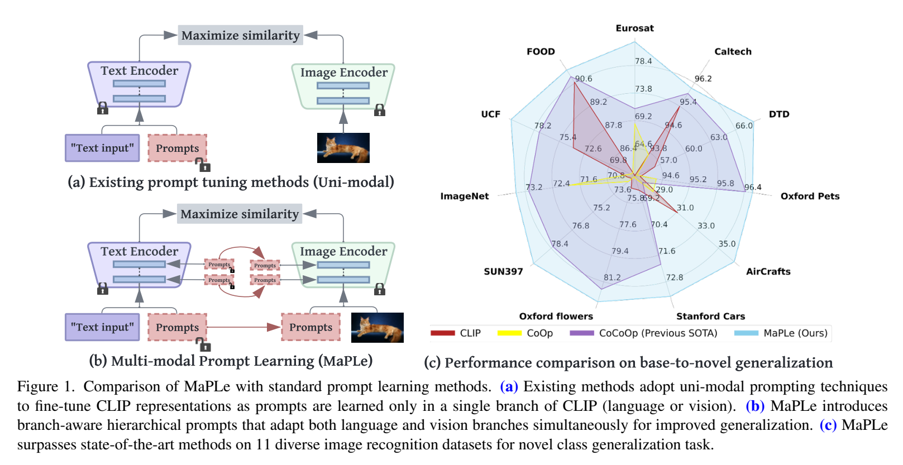
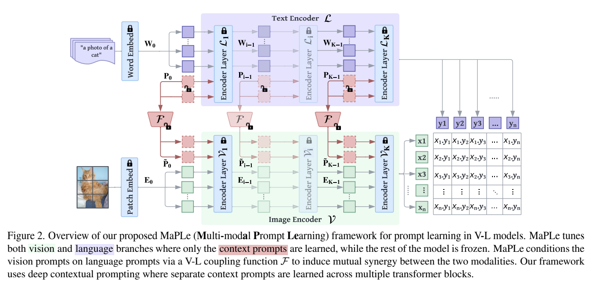
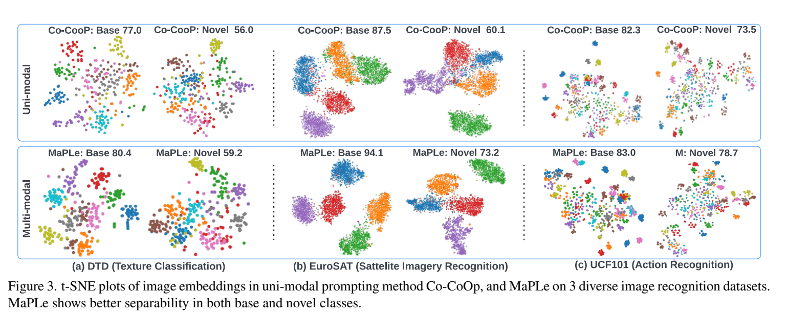
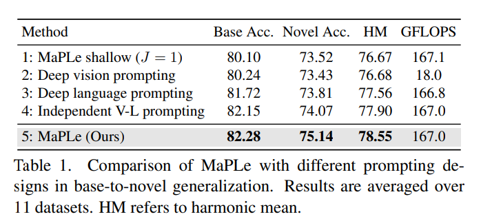
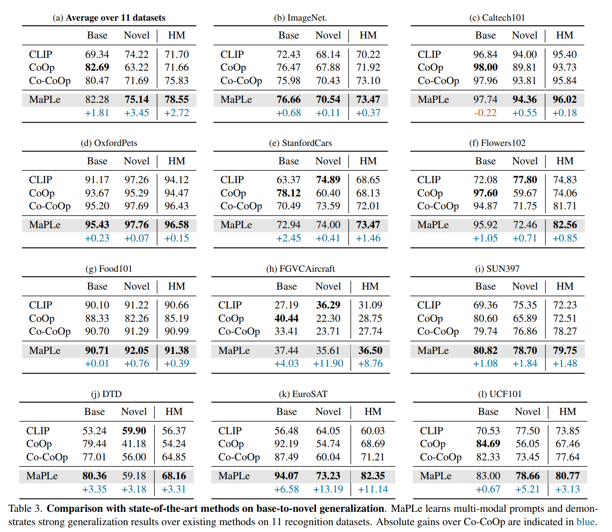
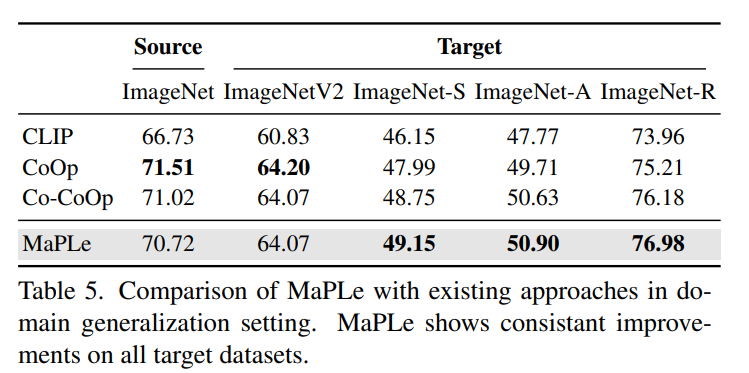

논문 및 이미지 출처 : <https://openaccess.thecvf.com/content/CVPR2023/papers/Khattak_MaPLe_Multi-Modal_Prompt_Learning_CVPR_2023_paper.pdf>

# Abstract

CLIP 같은 pre-trained vision-language (V-L) model 은 downstream task 에 대해 우수한 generalization ability 을 보인다.

그러나 이 모델들은 input text prompts 의 선택에 민감하며, 성능을 잘 내기 위해서는 prompt templates 을 신중하게 선택해야 한다.

최근 CLIP adaptation approaches 는 NLP 문헌에서 영감을 받아, CLIP 을 downstream task 을 위해 fine-tuning 하는 textual inputs 로서 prompts 를 학습한다.

그러나 CLIP 의 single branch (language 또는 vision)에서 prompt 를 사용하는 것은 비효율적이다.

이는 downstream task 에서 both representation spaces 을 dynamically adjust 할 수 있는 유연성을 제공하지 않기 때문이다. 

---

이 연구에선 vision 과 language branches 모두를 위한 Multi-modal Prompt Learning (MaPLe)을 제안하여 vision 과 language representation 간의 align 을 개선하고자 한다.

- 저자의 설계는 vision-language prompts 간의 강한 결합을 촉진하여 상호 시너지를 보장하고, independent uni-modal solution 의 learning 을 억제한다.
- 또한, 저자는 different early stages 에서 별도의 prompts 를 학습하여 stage-wise feature relationships 를 점진적으로 modeling 하고 rich context learning 을 가능하게 한다. 
- 저자는 novel classes 에 대한 generalization, new target dataset, 그리고 unseen domain shifts 라는 3 tasks 에서 저자의 approach 의 효과를 평가한다.
- SOTA CoCoOp 와 비교했을 때, MaPLe 는 유리한 성능을 보이며, 11 image recognition datasets 에서 novel classes 에서 3.45%, 전체 harmonic-mean 에서 2.72% 의 절대적인 향상을 달성한다.

# 1. Introduction

Foundational vision-language (V-L) model 인 CLIP(Contrastive Language-Image Pretraining) 은 downstream task 에 대해 우수한 generalization ability 을 보여주었다.

이러한 모델들은 web-scale data (e.g. 400M text-image pairs)를 사용하여 language 및 vision modalities 를 align 하도록 훈련된다.

이 모델들은 natural language 가 제공하는 rich supervision 덕에 open-vocabulary 의 visual concepts 에 대해 추론할 수 있다.

inference 시에 ‘`a photo of a <category>`’ 같은 hand-engineered text prompts 를 query 로 사용하여 text encoder 에 입력된다.

output text embeddings 은 image encodeer 에서 나온 visual embeddings 와 일치시켜 output class 를 예측한다.

high-quality 의 contextual prompts 를 설계하는 것이 CLIP 및 기타 V-L model 의 성능을 향상시키는 것으로 입증되었다.

---

CLIP 이 new concepts 에 대한 generalization 에 효과적임에도 불구하고, large-scale 과 training data 의 부족(e.g., few-shot settings)으로 인해 full model 을 downstream task 을 위해 fine-tuning 하는 것은 실용적이지 않다.

이러한 fine-tuning 은 large-scale pre-training phase 에서 얻은 유용한 지식을 잊게 만들 수 있으며, downstream task 에 대해 over-fitting 의 위험을 초래할 수 있다.

이러한 문제를 해결하기 위해 기존의 연구들은 모델의 original wE_ights 를 고정한 채로 prompt templates 을 수동으로 조정하지 않고 모델을 적응시킬 수 있는 language prompt learning 을 제안한다 (Fig. 1:a).

NLP 에서 영감을 받은 이러한 approach 은 CLIP 의 text encoder 에 대한 prompt learning 만을 탐구하며, CLIP 의 image encodeer 와 함께 중요한 adaptation choices 가 문헌에서 다루어지지 않은 주제이다.

---

저자의 동기는 CLIP 의 multi-modal nature 에서 비롯된다. 여기서 text 와 image encodeer co-exist 및 both 가 V-L modalities 를 올바르게 aligning 하는 것을 기여한다.

저자는 any prompting 기법이 모델을 완전히 적응시켜야 한다고 주장하며, 따라서 CLIP 의 text encoder 에 대해서만 prompt 를 학습하는 것은 image encodeer 에 필요한 adaptation 을 modeling 하기에 충분하지 않다.

- 이를 위해, 저자는 prompting approahc 의 완성도를 목표로 하고 Multi-modal Prompt Learning (MaPLe) 을 제안하여 text 와 image encodeer representations 를 적절히 fine-tuning 하고, downstream task 에서 optimal alignment 를 달성하도록 한다 (Fig. 1:b).
- 저자의 광범위한 실험은 base-to-noval generalization, cross-dataset evaluation, domain generalization 라는 3 settings 에서 MaPLe 의 강점을 입증한다.
- base-to-noval generalization task 에서, MaPLe 는 11 image recognition dataset 에서 기존의 prompt learning approach 을 초월하며 (Fig. 1:c) 에서 novel classes 에서 3.45%, harmonic-mean 에서 2.72% 의 절대 평균 향상을 달성한다. 
- 또한, MaPLe 는 cross-dataset transfer 과 domain generalization settings 에서 유리한 generalization ability 과 robustness 를 보여주며 기존 approach 에 비해 일관된 개선을 이룬다.
- MaPLe 는 Co-CoOp 과 비교했을 때, image instance conditioning 설계로 인해 비효율적인 Co-CoOp 에 비해 training 및 inference 에서 효율성이 향상된다.

요약하자면, 이 작업의 주요 기여는 다음과 같다:

- 저자는 CLIP 에서 _multi-modal_ prompt learning 을 제안하여 vision-language representation 의 align 을 개선한다. 이를 통해 CLIP 의 fine-tuning 에 대한 최초의 multi-modal prompt approach 을 제시한다.
- text 와 image encodeer 에서 learned prompts 를 연결하기 위해, 저자는 vision prompts 를 language counterparts 에 명시적으로 condition 하는 _coupling function_ 을 제안한다. 이는 two modalities 간의 bridge 역할을 하며, 시너지를 촉진하기 위해 gradient propagation 을 허용한다.
- 저자의 multi-modal prompt 는 vision 과 language  branches 모두에서 multiple transformer blocks 를 통해 학습되어 two modalities 의 시너지 행동을 점진적으로 학습한다. 이 deep prompting 전략은 contextual relationships 를 independent 적으로 modeling 할 수 있게 하여 vision-language representation 을 align 하는 데 더 많은 유연성을 제공한다.

# 2. Related Work

#### Vision Language Models:

natural image 와 language supervision 의 결합 사용은 CV 커뮤니티에서 큰 관심을 받고 있다.

image supervision 만으로 학습된 모델과는 달리, 이러한 vision-language (V-L) model 은 rich multi-modal representations 를 encoding 한다.

최근 CLIP, ALIGN, LiT, FILIP, Florence 같은 V-L model 은 few-shot 및 zero-shot visual recognition 을 포함한 다양한 tasks 에서 탁월한 성능을 보여주었다. 

이 모델들은 web data 를 사용하여 self-supervised manners 로 image-language representation 을 joint learning 한다

예로, CLIP 과 ALIGN 은 각각 약 ~ 400M 및 ~1B 의 image-text pairs 를 사용하여 multi-modal network 를 훈련한다.

이러한 pre-trained V-L model 들은 generalized representation 을 학습하지만, downstream task 에 효과적으로 적응하는 것은 여전히 도전적인 문제이다.

많은 연구들이 V-L model 을 few-shot image recognition, object detection, 및 segmentation 을 위해 맞춤화된 방법을 사용하여 더 나은 성능을 보여주었다. 

이 연구에선 CLIP 을 few-shot 및 zero-shot visual recognition task 에 effectily adapting 을 위해 novel multi-modal prompt learning 기법을 제안한다.

#### Prompt Learning:

문장의 형태로 제공되는 instruction 을 text prompt 라고 하며, 이는 V-L model 의 language branches 에 주어져 task 를 더 잘 이해할 수 있도록 한다. 

Prompt 는 downstream task 을 위해 handcraft 되거나 fine-tuning 단계에서 자동으로 학습될 수 있다.

후자는 'prompt learning' 이라고 하며, 이는 처음에 NLP 에서 사용된 이후 V-L 및 vision-only model 에 적응되었다.

VPT 와 유사하게, 저자의 디자인도 deep 'vision' prompt 를 사용한다. 

그러나 저자의 설계는 첫 번째 multi-modal prompt 설계이며, VPT 는 uni-modal 이다.

#### Prompt Learning in Vision Language models: 

full fine-tuning 과 linear probing 은 V-L model (i.e., CLIP) 을 downstream task 에 adapting 하는 두 가지 전형적인 접근 방식이다.

full fine-tuning 은 learned joint V-L representation 을 저하시키는 반면, linear probing 은 CLIP 의 zero-shot 능력을 제한한다.

이를 해결하기 위해, NLP 에서의 prompt learning 에서 영감을 받아 많은 연구들이 prompt token 을 학습하여 V-L model 을 adapting 하는 방법을 제안해왔다.

- CoOp : CLIP 의 language branch 에서 continuous prompt vector set 을 optimizing 하여 few-shot transfer 을 fine-tuning 한다.
- Co-CoOp : CoOp 의 novel classes 에서의 열악한 성능을 강조하고, image instance 에서 prompt 를 명시적으로 conditioning 하여 generalization 문제 해결
- [Prompt Distribution Learning] 는 prompt 의 distribution 을 학습하여 multiple set 의 prompt 를 optimizing 하는 것을 제안한다.
- [Prompting visual-language models for efc_ient video understanding.] : CLIP 을 video understanding task 을 위해 prompt 를 학습하여 적응시킨다.
- [Exploring Visual Prompts for Adapting Large-Scale Models] : vision branch 에서 prompting 을 통해 CLIP 의 visual prompt tuning 을 수행한다.

기존의 방법들은 independent uni-modal 솔루션을 따르며, CLIP 의 language 또는 vision branches 에서만 prompt 를 학습하여 CLIP 을 부분적으로 적응시킨다.

본 논문에서는 CLIP 의 multi-modal nature 을 고려하여, complete prompting (i.e., language 및 vision branches  both)가 CLIP 을 adapting 하기에 더 적합한지에 대한 중요한 질문을 탐구한다.

저자의 연구는 vision 과 language representation 간의 alignment 를 개선하기 위해 multi-modal prompt learning 의 효과를 조사한다

# 3. Method

저자의 approach 은 pre-trained multi-modal CLIP 을 보다 나은 downstream task 의 generalization 를 위해 context optimization 를 통해 fine-tuning 하는 것을 다룬다. 

Fig. 2 는 MaPLe (Multimodal Prompt Learning) framework 의 전체를 보여준다.

이전엔 language branch 에서만 context prompts 만 학습한 것과 달리, MaPLe 은 vision 과 language branches 모두에서 context prompts 를 학습하는 joint prompting approach 를 제안한다.

구체적으로, 저자는 language branch 에 learnable context token 을 추가하고, vision prompts 를 language prompting 에 명시적으로 conditioning 하여 interaction 을 구축하는 coupling function 를 사용한다.

hierarchical contextual representation 을 학습하기 위해, 저자는 different transformer blocks 를 통해 two branches 모두에서 deep prompting 를 도입한다.

fine-tuning 중에는 context prompts 와 그 coupling function 만 학습하며, 나머지는 동결된다.

## 3.1. Revisiting CLIP

저자는 text 와 vision encoder 로 구성된 pre-trained vision-language(V-L) model 인 CLIP 을 기반으로 approach 을 구축한다.

기존의 방법들과 일치하게, 저자는 ViT-based CLIP 을 사용한다. 

CLIP 은 image $I \in \mathbb{R}^{H \times W \times 3}$ 와 이에 해당하는 text description 을 다음과 같이 encoding 한다.

#### Encoding Image:

image encodeer $\mathcal{V}$ 는 $K$  개의 transformer layers $\{ \mathcal{V}_i \}_{i=1}^K$ 를 가지고 있으며, image 를 $M$ fixed-size patches 로 나눈 후 patch embeddings $E_0 \in \mathbb{R}^{M \times d_v}$ 로 변환한다.

patch embeddings $E_i$는 $(i + 1)^{th}$ transformer block $(\mathcal{V}_{i+1})$ 에 입력되며, learnable class (CLS) token $c_i$ 와 함께 $K$ transformer blocks 을 순차적으로 처리한다.

$$
[c_i, E_i] = \mathcal{V}_i([c_{i−1}, E_{i−1}]) \qquad i = 1, 2, \cdots, K.
$$

final image representation $x$ 는 last transformer layers $(\mathcal{V}_K)$ 의 class token $c_K$ 가 `ImgProj` 을 통해 common V-L latent embedding space 로 project 된다.

$$
x = \text{ImageProj}(c_K) \qquad x \in \mathbb{R}^{d_{vl}}.
$$

#### Encoding Text:

CLIP text encoder 는 text description 에 대한 feature representations 를 생성하는데, 이는 words 를 tokenizing 하고 word embeddings $W_0 = [w_1^0, w_2^0, \cdots, w_N^0] \in \mathbb{R}^{N \times d_l}$로 변환한다.

각 stage 에서, $W_i$ 는  text encoding branch 의 $(i + 1)^{th}$ transformer layers $(L_{i+1})$ 에 입력된다.

$$
[W_i] = \mathcal{L}_i(W_{i-1}) \qquad i = 1, 2, \cdots, K.
$$

final text representation $z$ 은 last transformer block $\mathcal{L}_K$ 의 last token 에 해당하는 text embeddings 를 common V-L latent embedding space 로 projecting 하는 `TextProj` 을 통해 얻어진다

$$
z = \text{TextProj}(w_N^K) \qquad z \in \mathbb{R}^{d_{vl}}.
$$

#### Zero-shot Classification:

zero-shot classification 를 위해, hand-crafted class label $y \in \{1, 2, \cdots, C\}$ (e.g., ‘`a photo of a <category>`’)로 text prompts 를 사용한다.

image $I$ 에 대한 prediction $\hat{y}$ 는 highest cosine similarity score $\text{sim}(·)$ 을 가진 class 가 된다.

temperature parameter $\tau$ 를 사용하여 다음과 같이 계산된다.

$$
p(\hat{y} \mid x) = \frac{\exp(\text{sim}(x, z_{\hat{y}}) / \tau)}{\sum_{i=1}^C \exp(\text{sim}(x, z_i) / \tau)}.
$$

## 3.2. MaPLe: Multi-modal Prompt Learning

CLIP 을 downstream image recognition task 에 맞게 효율적으로 fine-tuning 하기 위해, 저자는 _multi-modal_ prompt tuning 의 가능성을 탐색한다. 

기존의 연구들이 주로 uni-modal approach 을 탐색해온 반면, 이러한 approach 들은 language 및 vision representation spaces 을 동적으로 조정하는 유연성을 제공하지 않기 때문에 적합하지 않다고 생각한다.

따라서 prompt 의 완성도를 달성하기 위해, 저자는 multi-modal prompt approach 의 중요성을 강조한다.

Fig. 3 에서는 MaPLe 의 image embeddings 를 SOTA Co-CoOp 과 시각화하고 비교한다.

- CLIP, CoOp, Co-CoOp 의 image embeddings 은 vision branch 에서 prompt 를 학습하지 않기 때문에 동일하다.
- 시각화 결과, MaPLe 의 image embeddings 이 더 분리되어 있으며, 이는 language prompting 와 함께 vision prompts 를 학습하는 것이 CLIP 의 adapting 을 더 좋게 만든다는 것을 나타낸다.
- multi-modal prompt 외에도, 저자는 deeper transformer layers 에서 prompt learning 이 stage-wise feature representations 을 점진적으로 modeling 하는 데 필수적이라고 발견했다.

이를 위해, 저자는 vision 과 language branches 모두에서 first $J$ (여기서 J < K) layers 에 learnable token 을 도입할 것을 제안한다.

이러한 multi-modal hierarchical prompt 는 CLIP model 의 embedded knowledge 를 활용하여 task relevant contextual representations 를 효과적으로 학습한다. (Fig. 4 참조).

### 3.2.1. Deep Language Prompting

language context prompts 를 학습하기 위해, 저자는 CLIP 의 language branch 에 $b$ learnable token $\{P_i \in \mathbb{R}^{d_l} \}_{i=1}^b$ 을 도입한다. 

input embedding 은 이제 다음 형태를 따른다: $[P^1, P^2, \cdots, P^b, W_0]$, 여기서 $W_0 = [w^1, w^2, \cdots, w^N]$ 는 fixed input tokens 에 해당한다.

new learnable tokens 는 language encoder $(\mathcal{L}_i)$ 의 각 transformer block 에 추가되어 specific depth $J$ 까지 처리된다.

$$
\begin{equation}
    [\_ , W_i] = \mathcal{L}_i([P_{i-1}, W_{i-1}]) \qquad i = 1, 2, \cdots, J.
\end{equation}
$$

- $[\cdot, \cdot]$ : concatenation operation

$J^{th}$ transformer layers 이후, 후속 layers 는 이전 layers 의 prompt 를 처리하며 final text representation $z$ 가 계산된다.

$$
\begin{equation}
    [P_j, W_j] = \mathcal{L}_j([P_{j-1}, W_{j-1}]) \qquad j = J + 1, \cdots, K,
\end{equation}
$$

$$
\begin{equation}
    z = \text{TextProj}(w_N^K).
\end{equation}
$$

- $J = 1$ 일 경우, learnable token $P$ 는 first transformer layers 의 입력에서만 적용되며, 이 deep language prompt learning 기법은 CoOp 으로 퇴화한다.

### 3.2.2. Deep Vision Prompting

deep language prompt learning 과 유사하게, 저자는 CLIP 의 vision branch 에 $b$ learnable token $\{ \tilde{P}_i \in \mathbb{R}^{d_v} \}_{i=1}^b$ 을 도입하며 input image tokens 와 함께 사용한다.

new learnable tokens 는 image encodeer $(\mathcal{V})$ 의 deep transformer layers 에서 depth $J$ 까지 추가된다.

$$
\begin{align*}
    [c_i, E_i, \_] &= \mathcal{V}_i([c_{i-1}, E_{i-1}, \tilde{P}_{i-1}]) \qquad i = 1, 2, \cdots, J, \\
    [cj, Ej, \tilde{P}_j] &= \mathcal{V}_i([c_{j-1}, E_{j-1}, \tilde{P}_{j-1}]) \qquad j = J + 1, \cdots, K, \\
    x &= \text{ImageProj}(c_K).
\end{align*}
$$

저자의 deep prompting 는 ViT 내에서 different feature hierarchies 를 통해 prompt 를 학습할 수 있는 유연성을 제공한다.

저자는 각 단계에서 prompt 를 공유하는 것이 independent prompting 보다 더 좋다고 발견했다. 왜냐하면 feature 가 연속적인 transformer block 처리를 통해 더 상관되기 때문이다.

따라서 후속 단계는 초기 단계에 비해 independently-learned complimentary prompts 를 제공하지 않는다.

### 3.2.3. Vision Language Prompt Coupling

prompt tuning 에서 multi-modal 접근 방식을 취하고 CLIP 의 vision 과 language branches 를 _simultaneously_ adapting 하는 것이 context optimization 에서 완성도를 달성하는 데 필수적이라고 생각한다.

간단한 approach 은 deep vision 과 language prompting 을 단순히 결합하는 것이며, 여기서 language prompts $P$ 와 vision prompts $\tilde{P}$ 는 동일한 training schedule 동안 학습된다.

저자는 이 설계를 ‘_independent V-L Prompting_’ 이라고 부른다.

이 approach 은 prompting 의 완성도 요구 사항을 충족하지만, two branches 가 task relevant context prompts 를 학습하는 동안 interaction 하지 않기 때문에 vision 과 language branches 간의 시너지 부족이 있다.

이를 해결하기 위해, 저자는 vision 과 language branches 를 함께 tuning 하고 two modalities 간에 sharing prompts 하는 branch-aware multi-modal prompting 을 제안한다.

- language prompt token 은 Eqs 1-3 의 deep language prompt 과 유사하게 language branch 의 $J^{th}$ transformer block 까지 도입된다. 
- V-L prompts 간의 상호 시너지를 보장하기 위해, vision prompts $\tilde{P}$ 는 language prompts $P$ 를 vision-to-language projection 을 통해 얻는다.
  - 저자는 이를 _V-L coupling function_  $\mathcal{F}(\cdot)$ 라고 부르며, 다음과 같이 표현된다: $\tilde{P}_k = \mathcal{F}_k(P_k)$.
  - coupling function 는 diemsion $d_l$ 의 input 을 $d_v$ 로 mapping 하는 linear layers 로 구현된다.
  - 이는 two modalities 간의 bridge 역할을 하여 gradient mutual propagation 를 장려한다.

$$
\begin{align*}
    [c_i, E_i, \_] &= \mathcal{V}_i([c_{i-1}, E_{i-1}, \mathcal{F}_{i-1}(P_{i-1})]) \qquad i = 1, \cdots, J \\
    [c_j, E_j, \tilde{P}_j] &= \mathcal{V}_j([c_{j-1}, E_{j-1}, \tilde{P}_{j-1}]) \qquad j = J + 1, \cdots, K \\
    x &= \text{ImageProj}(c_K)
\end{align*}
$$

independent V-L prompt learning 과 달리, $P$ 에 대한 explicit conditioning 이 있는 $\tilde{P}$ 는 two branches 간의 shared embedding space 에서 prompt learning 하여 상호 시너지를 개선한다.

# 4. Experiments

## 4.1. Benchmark setting

#### Generalization from Base-to-Novel Classes:

MaPLe 의 generalization ability 을 평가하기 위해, dataset 을 base classes 와 novel classes 로 나누는 zero-shot 설정을 따른다.

모델은 few-shot settings 으로 base classes 에서만 학습되고, base 및 novel categories 에서 평가된다.

#### Cross-dataset Evaluation:

저자의 approach 는 cross-dataset transfer 에서 잠재력을 발휘하는지 검증하기 위해, ImageNet 에서 학습된 모델을 다른 dataset 에서 직접 평가한다.

Co-CoOp 과 일관되게, 저자의 모델은 1000 ImageNet classes 모두를 few-shot 방식으로 학습한다.

#### Domain Generalization:

저자의 방법의 robustness 을 out-of-distribution dataset 에서 평가한다.

cross-dataset 평가와 유사하게, ImageNet 에서 학습된 모델을 domain shifts 는 다양한 4 different ImageNet datasets 에서 직접 테스트한다.

#### Datasets:

base classes 에서 novel classes 으로의 generalization 및 cross-dataset 평가를 위해, CoOp 및 CoOpOp 를 따르며, 광범위한 recognition tasks 를 포함하는 11 image classification dataset 에서 성능을 평가한다. 

- 이 dataset 에는 generic-objects dataset, ImageNet 과 Caltech101;
- 5 fine-grained dataset, OxfordPets, StanfordCars, Flowers102, Food101, FGVCAircraft; 
- scene recognition dataset SUN397; 
- action recognition dataset UCF101; 
- texture dataset DTD 및 satellite image dataset EuroSAT 이 포함된다.

domain generalization 의 경우, ImageNet 을 source dataset 으로 사용하고, ImageNetV2, ImageNetSketch, ImageNet-A, ImageNet-R 을 target dataset 으로 사용한다.

#### Implementation Details

모든 실험에서 16-shot 의 few-shot learning 전략을 사용하며, 각 class 에 대해 무작위로 샘플링한다.

pre-trained ViT-B/16 CLIP 모델에 prompt tuning 을 적용하며, 여기서 $d_l = 512$, $d_v = 768$, $d_{vl} = 512$ 이다.

- MaPLe 의 경우, prompt depth $J$ 를 9 로 설정하고, language 및 vision prompts length 를 2 로 설정한다.
- 모든 모델은 batch size 4 로 5 epochs 동안 SGD optimizer 를 사용하여 NVIDIA A100 GPU 에서 학습된다.
- 저자는 base classes 및 novel classes 정확도와 이들의 harmonic-mean (HM)을 3 runs 를 평균하여 보고한다.
- language prompting 의 first layers $P_0$ 는 '`a photo of a <category>`' template 의 pre-trained CLIP word embeddings 로 초기화되며, 이후 layers 의 prompt 는 normal distribution 에서 무작위로 초기화된다.
- ImageNet 의 1000 classes 에서 MaPLe 를 학습할 때는 prompt depth $J$ 를 3 으로 설정하고, 모델은 2 epochs 동안 학습되며 learning rate 는 0.0026 이다.

## 4.2. Prompting CLIP via Vision-Language Prompts

#### Prompting Variants:

먼저 제안된 branch-aware multi-modal prompt, MaPLe 에 대한 ablation 으로 다양한 possible prompt 설계의 성능을 평가한다.

이러한 variants 에는 shallow MaPLe, deep language prompting, deep vision prompts 및 independent V-L prompting 이 포함된다. 

Tab. 1 에서는 11 image recognition dataset 에서 평균된 결과를 제시한다.

- shallow MaPLe (row-1)는 generalization 측면에서 CoOp 과 Co-CoOp 에 비해 일관된 개선을 제공한다.
- deep language prompting (row-3)는 deep vision prompts (row-2)에 비해 개선을 보이며, 이는 language branch 에서 learned prompts 가 CLIP 의 adapting 을 더 잘 제공함을 나타낸다.
- 두 approaches 를 별도로 결합한 경우 (row-4) 성능이 추가로 향상되지만, language 및 vision branches 에서 포괄적인 이점을 얻기 어렵다.
  - 이는 learned vision 과 language prompt 가 훈련 중 상호작용하지 않기 때문에 시너지 부족이 원인일 수 있다.
- 한편, MaPLe 는 deep prompting 과 함께 (row-4) two branches 에서 prompt 의 장점을 결합하여 vision prompts 를 language prompting 에 명시적으로 conditioning 하여 상호작용을 강제한다.
  - 이는 novel classes 와 base classes 정확도를 개선하여 78.55% 의 최상의 harmonic-mean 을 달성한다.

## 4.3. Base-to-Novel Generalization

#### Generalization to Unseen Classes:

Tab. 3 은 11 recognition dataset 에서 MaPLe 의 base-to-noval classes generalization 성능을 제시한다. CLIP zero-shot, 그리고 SOTA prompt learning 방법인 CoOp 과 Co-CoOp 과의 성능을 비교한다. CLIP 의 경우, 각 dataset 에 맞게 특별히 설계된 hand-crafted prompt 를 사용한다.

- SOTA 인 Co-CoOp 과 비교할 때, MaPLe 는 Caltech101 의 base classes 성능에서만 소폭 감소를 제외하고, 11 datasets 모두에서 base 및 novel category 에서 성능이 개선된다.
- branch-aware multi-modal prompt 의 상호 시너지 덕분에 MaPLe 는 Co-CoOp 과 비교하여 11 datasets 모두에서 novel categories 에 더 잘 generalization 되며, 전체적으로 71.69% 에서 75.14% 로 향상된다.
- base classes 와 novel classes 를 모두 고려할 때, MaPLe 는 Co-CoOp 에 비해 절대 평균 2.72% 의 향상을 보인다.
- CLIP 과 비교할 때, Co-CoOp 은 4/11 datasets 에만 개선을 보이며, 평균 novel classes 정확도는 74.22% 에서 71.69% 로 감소한다.
- MaPLe 는 6/11 datasets 에서 CLIP 에 대한 정확도를 개선하여 평균 74.22% 에서 75.14% 로 향상된 성과를 보인다.

#### Generalization and Performance on Base Classes:

- CoCoOp 은 image instance 에 대한 prompt conditioning 을 통해 CoOp 의 generalization 문제를 해결하고 novel categories 에서 큰 향상을 보인다.
- 그러나 base classes 에선 CoOp 에 비해 3/11 datasets 에서만 개선되며, 성능 평균이 82.69% 에서 80.47% 로 감소한다.
- 한편, MaPLe 는 completeness prompting 덕에 6/11 datasets 에서 CoOp 에 비해 base classes 성능을 개선하며 평균 base 정확도를 약 82.28% 로 유지하고, novel classes 에 대한 generalization 또한 개선된다.
- Co-CoOp 의 훈련 전략이 vanilla CoOp 의 generalization 성능을 크게 향상시킬 수 있음을 발견하였다 (novel classes 에서 6.8% 향상). 
  - 따라서 CoOp† 와 비교한다. CoOp† 와 비교할 때, vanilla CoOp 모델은 base classes 에서 over-fitting 되는 경향이 있다. 
  - 평균 base 정확도가 80.85% 인 CoOp† 와 비교할 때, MaPLe 는 82.28% 의 평균 base 정확도로 1.43% 향상을 보인다 (Tab. 2).

## 4.4. Cross-Dataset Evaluation

MaPLe 의 cross-dataset generalization ability 을 평가하기 위해, 모든 1000 ImageNet classes 에서 multi-modal prompt 를 학습한 후, 나머지 10 datasets 에서 직접 transfer 한다.

Tab. 4 는 MaPLe, CoOp, Co-CoOp 간의 성능 비교를 보여준다. 

- ImageNet source dataset 에서, MaPLe 는 경쟁 방법들과 비슷한 성능을 달성하지만, 9/10 datasets 에서 CoOp 을 초과하고, 8/10 datasets 에서 Co-CoOp 을 초과하는 훨씬 더 강력한 generalization 성능을 보인다.
- 전반적으로 MaPLe 는 가장 높은 평균 정확도인 66.30% 를 기록하며 경쟁력 있는 성능을 보인다. 
- 이는 MaPLe 의 branches recognition V-L prompting 사용이 더 나은 generalization 를 촉진한다는 것을 시사한다.

## 4.5. Domain Generalization

MaPLe 는 CoOp 및 Co-CoOp 과 비교하여 out-of-distribution dataset 에서 유리하게 generalization 됨을 보여준다.

- ImageNet 에서 학습된 모델의 various out-of-domain datasets 로의 direct transferability 를 평가하며, 모든 기존 접근 방식에 대해 일관되게 개선됨을 관찰하였다 (Tab. 5). 
- 이는 multi-modal branch-aware prompting 활용이 MaPLe 가 CLIP 같은 V-L model 의 generalization 및 robustness 을 향상시키는 데 도움이 된다는 것을 나타낸다.

## 4.6. Ablation Experiments

#### Prompt Depth:

Fig. 4 (left)에서는 MaPLe 의 prompt depth $J$ 의 영향을 설명하고, language 및 vision branches 의 depth 를 개별적으로 분석한다.

- 일반적으로 prompt depth 가 증가함에 따라 성능이 향상된다. prompt 가 model feature spaces 가 이미 성숙해진 deep layers 에 randomly initialized 상태로 삽입될 때 performance sensitivity 가 증가함을 알 수 있다.
- 이전 연구에서도 유사한 경향이 보고되었다.
- 기존 방법들이 shallow language prompting $(J = 1)$ 를 사용하는 반면, 저자의 방법은 deep language prompting 와 비교된다.
- 전체적으로 MaPLe 는 deep language prompting 보다 더 나은 성능을 달성하며, depth 9 에서 최대 성능을 기록한다.

#### Prompt Length:

Fig. 4 (right)에서는 MaPLe 의 prompt length 의 영향을 보여준다.

- prompt length 가 증가함에 따라 base classes 에 대한 성능은 일반적으로 유지되지만, novel classes 의 정확도는 감소한다.
- 이는 novel classes 에 대한 generalization 를 본질적으로 피해는 over-fitting  나타낸다.

#### Effectiveness of Multi-modal Prompting: 

Fig. 5 는 선택된 dataset 에서의 per-class accuracy 분석을 domain shift 가 증가하는 순서로 보여준다.

- MaPLe 의 성능 향상이 Co-CoOp 과 비교하여 다양한 dataset 에서 다르게 나타남을 알 수 있다.
- MaPLe 는 CLIP 의 pre-trained dataset 과의 distribution shift 는 large dataset 과 일반적이지 않고 드문 vision concepts 를 가진 dataset 에서 Co-CoOp 보다 상당한 향상을 제공한다.

#### Prompting complexity:

Tab. 6 은 MaPLe 와 다른 접근 방식의 computational complexity 을 비교한다.

- MaPLe 는 multi-modal prompt 를 사용하지만, full FLOPS (Floating Point Operations)는 CoOp 및 Co-CoOp 보다 0.1% 만 초과한다.
- independent V-L prompting 도 유사한 FLOP 수치를 제공한다.
- inference speed 측면에서, Co-CoOp 은 상당히 느리며 batch size 가 증가해도 FPS (초당 frame 수)는 일정하다. 반면, MaPLe 는 이러한 overhead 가 없으며 훨씬 더 나은 inference 및 training 속도를 제공한다.
- 또한, MaPLe 는 Co-CoOp 보다 training epochs 가 절반만 필요해 더 나은 수렴을 제공한다 (5 epochs 대 10 epochs).
- MaPLe 는 CLIP 위에 약 2.85% 의 training parameters 를 추가한다. 
  - 성능 향상이 주로 더 많은 parameters 에 기인하는지 연구하기 위해, all layers prompts 에 대해 통합된 V-L coupling function 을 사용하는 MaPLe† 를 실험하였다.
  - 약 9x lesser parameters 를 가진 MaPLe† 도 기존 방법들보다 향상을 보였다.

# 5. Conclusion

large-scale V-L model, 예로 CLIP 을 downstream task 에 대한 adapting 은 tunable parameters 수가 많고 downstream dataset 의 크기가 제한되어 있어 도전적인 문제이다.

prompt learning 은 V-L model 을 new downstream task 에 맞추기 위한 효율적이고 확장 가능한 기술이다. 

현재의 prompt learning  접근 방식은 vision 측면 또는 language 측면의 prompting 만 고려한다. 

저자의 연구는 vision 과 language  branches 모두에 대해 prompting 을 수행하는 것이 V-L model 을 downstream task 에 적절히 적응시키는 데 중요하다는 것을 보여준다. 또한, 저자는 vision prompts 를 text prompts 에 명시적으로 conditioning 하여 vision-language modalities 간의 시너지를 보장하는 전략을 제안한다.

저자의 접근 방식은 novel categories 에 대한 generalization, cross-dataset transfer 및 domain shift 가 있는 dataset 에서의 성능을 개선한다.