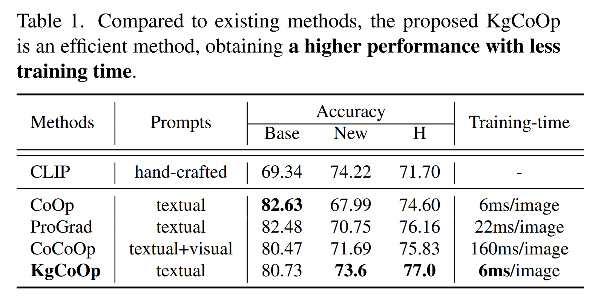
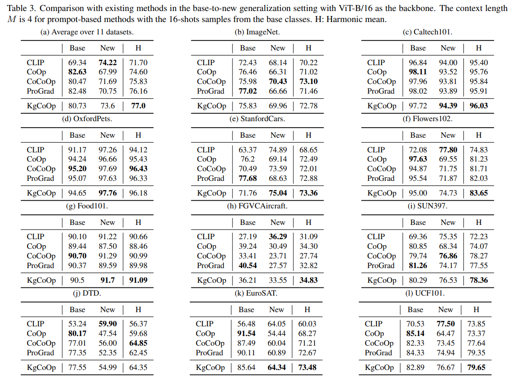
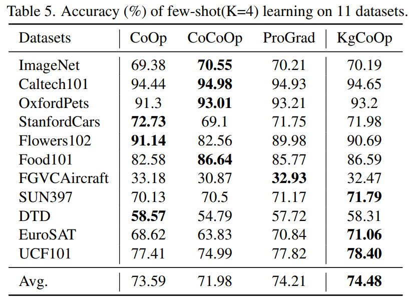
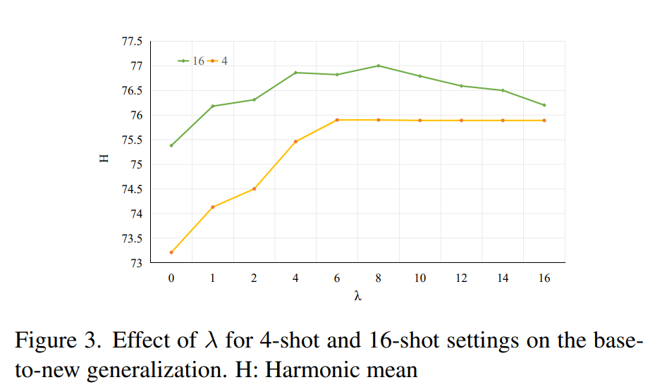
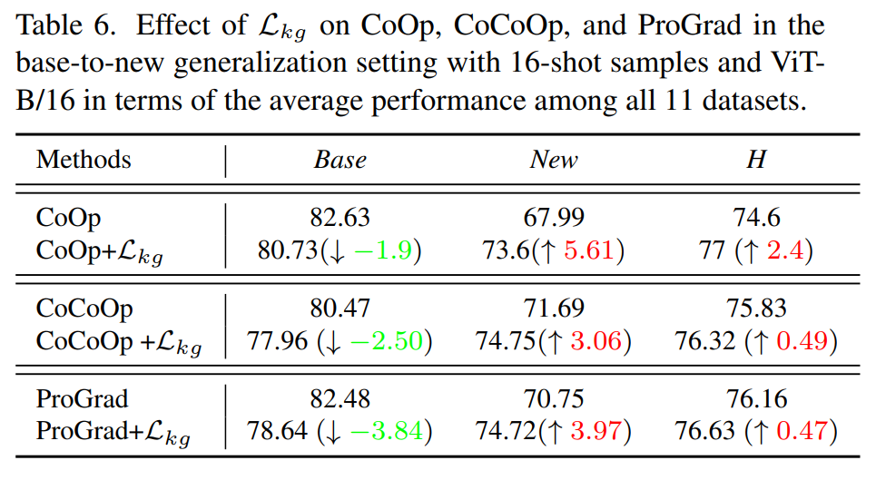

논문 및 이미지 출처 : <https://openaccess.thecvf.com/content/CVPR2023/papers/Yao_Visual-Language_Prompt_Tuning_With_Knowledge-Guided_Context_Optimization_CVPR_2023_paper.pdf>

# Abstract

Prompt tuning 은 pre-trained vision-language model(VLM)을 downstream task 에 적응시키기 위해 task-related textual tokens 을 사용하는 효과적인 방법이다.

CoOp-based work 는 learnable textual tokens 을 class tokens 과 결합하여 specific textual knowledge 를 얻는다.

그러나 이러한 specific textual knowledge 은 essential general textual knowledge 를 잊어버리기 때문에 unseen classes 에 대한 generalization 성능이 떨어진다.

이를 해결하기 위해, learnable prompt 의 unseen classes 에 대한 generalization 능력을 향상시키는 novel Knowledge-guided Context Optimization (**KgCoOp**)을 소개한다. 

- KgCoOp 의 핵심은 learnable prompt 와 hand-crafted prompt 간의 discrepancy 를 줄임으로써 essential knowledge 에 대한 forgetting 을 완화할 수 있다는 것이다.
- 특히, KgCoOp 은 learned prompt 와 hand-crafted prompt 에 의해 생성된 text embeddings 간의 discrepancy 를 minimizing 한다.
- 마지막으로, KgCoOp 을 contrastive loss 에 추가하면, seen 및 unseen tasks 모두에 대해 discriminative prompts 를 만들 수 있다.

여러 벤치마크에 대한 광범위한 평가를 통해 KgCoOp prompt tuning 을 위한 효율적인 방법임을 입증하였으며, less training time 으로 더 나은 성능을 달성할 수 있다.

# 1. Introduction

large-scale image-text association paris 덕에, learned vision-language model(VLM)은 다른 작업에 대한 generalization 능력이 뛰어난 essential general knowledge 을 포함하게 된다.

최근 Contrastive Language-Image Pretraining (CLIP), Flamingo, ALIGN 등과 같은 많은 vision-language model 들이 제안되었다.

- 비록 VLM 이 visual 및 text description 을 추출하는 데 효과적인 모델이지만, VLM 을 학습하려면 large-scale 의 high-quality dataset 이 필요하다.
- 실제 vision-language tasks 에서 task-related model 을 학습시키기 위해 large-scale data 를 수집하는 것은 어렵다.

이를 해결하기 위해, pre-trained VLM 을 downstream task 에 adapting 하는 prompt tuning 이 제안되어, 이는 다양한 few-shot 또는 zero-shot visual recognition tasks 에 뛰어난 성능을 달성한다.

prompt tuning 은 주로 task-related textual tokens 을 적용하여 예측을 위한 task-specific textual knowledge 를 embedding 한다.

- CLIP 의 hand-crafted template “a photo of a [Class]” 는 zero-shot prediction 을 위한 textual-based class embeddings 를 modeling 하는 데 사용된다.
- fixed (hnad-crafted) prompt 에 의해 포착된 knowledge 를 _general textual knowledge_ 으로 정의하면, 이는 unseen tasks 에 대한 높은 generalization 능력을 가진다.
- 그러나 general textual knowledge 은 각 task 의 specific knowledge 을 고려하지 않기 때문에 downstream task 을 설명하는 데 덜 효과적이다.
- discriminative task-specific knowledge 를 얻기 위해, Context Optimization(CoOp), Conditional Context Optimization(CoCoOp), ProGrad 는 hand-crafted prompt 를 labeled few-shot samples 에 의해 유추된 learnable prompt set 으로 대체한다.
- 공식적으로, learned prompt 에 의해 생성된 discriminative knowledge 는 _specific textual knowledge_ 으로 정의된다.
- 그러나 CoOp-based methods 은 동일한 task 에서 unseen classes 에 대한 generalization 성능이 떨어지며, 예로, Tab. 1 같이 unseen classes (New) 에 대해 CLIP 보다 성능이 나쁘다.

specific textual knowledge 은 labeled few-shot samples 로부터 유추되기 때문에 seen classes 에는 차별화되지만 unseen classes 에서는 편향되어 unseen domain 에서 성능이 떨어지게 된다.

- 예로, non-training CLIP 은 unseen classes 에서 CoOp-based methods 보다 높은 _New_ accuracy 를 얻으며, CLIP/CoOP/CoCoOp 의 경우 각각 74.22%/63.22%/71.69% 이다.
- CLIP 이 unseen classes 에서 우수한 성능을 보이는 것은 그 general textual knowledge 이 unseen classes 에 대해 더 나은 generalization 능력을 가지고 있음을 확인시켜준다. 
- 그러나 CoOp-based methods 에 의해 유추된 specific textual knowledge 은 항상 essential general textual knowledge 을 잊어버리며, 이를 knowledge forgetting (catastrophic knowledge forgetting)이라 부르며, forgetting 이 심할수록 성능 저하가 더 크다.

이를 해결하기 위해, general textual knowledge 의 forgetting 을 줄임으로써 unseen classes 의 generality 을 높이기 위한 novel prompt tuning 방법인 Knowledge-guided Context Optimization(KgCoOp)을 도입한다.

- 핵심은 learnable prompt 와 hand-crafted prompt 간의 discrepancy 를 줄임으로써 general textual knowledge 에 대한 forgetting 을 완화할 수 있다는 것이다.
- two prompts 간의 discrepancy 와 성능 저하의 관계를 관찰한 결과, 이러한 통찰이 확인되었다. 
- Fig. 1 처럼, learnable prompt 와 hand-crafted prompt 에 의해 생성된 text embeddings 간의 distance 가 멀수록 성능 저하가 심해진다.
- 공식적으로, hand-crafted prompt “a photo of a [Class]” 는 CLIP 의 _text encoder_ 에 주입되어 general textual embeddings 을 생성하며, 이는 general textual knowledge 으로 간주된다.
- 반면, learnable prompts set 은 task-specific text embeddings 을 생성하도록 optimizing 된다.
- 더욱이, Knowledge-guided Context Optimization(KgCoOp)은 general textual embeddings 와 specific textual embeddings 간의 euclidean distance 를 minimizing 하여 essential general textual knowledge 을 기억하도록 한다.
- CoOp 및 CoCoOp 과 유사하게, task-specific textual 와 visual embeddings 간의 contrastive loss 을 사용하여 learnable prompt 를 optimizing 한다.

11 image classification dataset 과 4 ImageNet base-to-new generalization setting, few-shot classification, domain generalization 에 대한 포괄적인 실험을 수행했다.

평가 결과, KgCoOp 이 less training time 으로 더 높은 성능을 얻는 효율적인 방법임이 확인되었다(Tab. 1).

요약하자면, KgCoOp 은 다음을 달성했다: 

1. higher performance: KgCoOp 은 기존 방법들보다 더 높은 최종 성능을 얻었다. 특히, KgCoOp 은 CoOp, CoCoOp, ProGrad 보다 _New_ class 에서 명확한 개선을 이루어 general textual knowledge 을 고려하는 것의 타당성과 필요성을 입증
2. less training time: KgCoOp 의 training time 은 CoOp 과 동일하며, CoCoOp 및 ProGrad 보다 더 빠르다.

# 2. Related Work

#### Vision-Language Models

최근 단순히 image 만 고려하는 것이 아니라 image-text association paris 을 사용하여 strong vision-language model 을 학습할 수 있음을 보여주었다.

image-text association paris 을 기반으로 유추된 모델은 vision-language model(VLM)이라고 정의된다.

최근 vision-language model 은 다음과 같은 측면에서 개선될 수 있다: 

1. stronger text encoder 또는 visual encoder 를 사용, 예로 Transformers;
2. contrastive representation learning;
3. more images 사용.

VLM 을 학습하기 위해 large-scale 의 annotated dataset 이 필요하기 때문에, unannotated images 를 학습하기 위해 unsupervised learning 또는 weakly supervised learning 이 사용된다.

특히 Masked Language Modeling (MLM) 은 text word 를 randomly masking 하여 visual 및 text embeddings 의 robustness 을 향상시키고, Masked autoencoders 은 input image 의 random patch masking 으로 scalable self-supervised learner 가 된다.

대표적인 예로 CLIP 이 있는데, 이는 400M image-text association paris 을 기반으로 contrastive loss 를 사용하여 visual encoder 와 text encoder 를 학습시키며, unseen classes 에 대해 뛰어난 generality 을 보여준다.

이전 연구인 CoOp 및 CoCoOp 과 유사하게, 저자는 knowledge transfer 을 위해 pre-trained CLIP 을 적용한다.

#### Prompt Tuning

- pre-trained VLM 을 downstream task 에 adapting 하기 위해, prompt tuning 은 항상 task-related textual tokens 을 적용하여 task-specific textual knowledge 을 유추한다.
  - 예로, CLIP 에서 hand-crafted template “a photo of a [CLASS]” 는 zero-shot prediction 을 위한 text embeddings 을 modeling 하는 데 사용된다. 
  - 그러나 hand-crafted prompt 는 현재 task 의 specific knowledge 을 고려하지 않기 때문에 downstream task 을 설명하는 데 한계가 있다.
- 이를 해결하기 위해, Context Optimization(CoOp) 은 labeled few-shot samples 에 의해 유추된 learnable soft prompts 로 hand-crafted prompt 를 대체한다.
  - CoOp 의 단점은 learnable prompt 가 각 task 의 image 에 대해 고유하고 고정되어 있다는 점이다.
  - 즉, CoOp 는 task-related prompts 를 유추하며 다양한 이미지의 특성을 무시한다.
  - 이에 더해, Conditional Context Optimization(CoCoOp) 은 각 이미지에 대해 image-conditional context 를 생성하고 prompt tuning 을 위한 textual-conditional context 를 결합하는 방법을 제안한다.
  - 특히, lightweight neural network 를 사용하여 learnable text prompts 인 vector 를 생성한다.
- high-quality 의 task-related tokens 를 얻기 위해, ProDA 는 prompts 의 prior distribution learning 을 고려한다.
- 더욱이, ProGrad 는 original prompts 에 의해 생성된 “general knowledge” 에 aligned prompts 만 업데이트한다.
- DenseCLIP 은 context-aware prompts 전략을 사용하여 dense prediction tasks 를 생성하고,
- CLIP-Adapter 은 adapter 를 적용하여 visual 또는 text embeddings 를 조정한다.

기존 방법들 중에서, CoOp 와 ProGrad 가 관련이 있다. CoOp 는 KgCoOp 의 baseline model 로 간주될 수 있다.

- CoOp 와 비교했을 때, KgCoOp 는 learnable prompt 가 original prompts 와의 discrepancy 를 minimizing 하도록 additional term 을 고려하여, unseen classes 의 성능 측면에서 CoOp 보다 더 높은 성능을 얻는다.
- ProGrad 는 KgCoOp 와 동일한 아이디어를 가지고 있으며, learnable specific knowledge 이 general knowledge 와 align 되도록 한다.
  - 그러나 ProGrad 는 prompt tuning 중에 충돌하는 업데이트를 버리고, aligned direction 만 prompts 를 optimizing 한다.
  - 즉, ProGrad 는 prompt tuning 동안 많은 conflict knowledge 를 버린다.
- ProGrad 와 달리, KgCoOp 는 knowledge 를 버리지 않고 learnable specific knowledge 이 general knowledge 에 가깝도록 한다.
  - 더욱이, KgCoOp 는 additional computation 이 필요하지 않기 때문에 ProGrad 보다 효율적이다.

종합적인 평가 결과, KgCoOp 는 less training time 을 사용하여 더 높은 성능을 얻는 효율적인 방법임을 보여준다.

# 3. Methodolgy

## 3.1. Preliminaries

기존 vision-language model 중 Contrastive Language-Image Pre-training(CLIP)은 400M image-text association paris 으로 학습된 대표적인 모델로, zero-shot image recognition 에서 strong generalization 능력을 가진다.

CLIP 은 image-text association paris 을 기반으로 학습되어 visual encoder 와 text encoder 라는 two types encoder 를 포함한다.

visual encoder 는 주어진 이미지를 visual embeddings 으로 매핑하는 데 사용되며, text encoder 는 해당 text information 을 embedding 하는 데 사용된다.

CLIP 에서 pre-trained visual 및 text encoder 를 고정한 상태에서, prompt tuning 은 hand-crafted prompt 또는 learnable prompt 를 사용하여 pre-trained CLIP 을 downstream task 에 적응시킨다.

- 공식적으로, visual encoder 와 text encoder 를 각각 $\phi$ 와 $\theta$ 로 정의.
- $N_c$ categories 로 구성된 downstream task 에 대해, CLIP 은 textual class embeddings 를 생성하기 위해 hand-crafted prompt 를 사용한다. 
  - i.e., $W^{clip} = \{w^{clip}_i\}_{i=1}^{N_c}$ : all categories 의 text embeddings
  - $w^{clip}_i$ : $i$-th class 의 text embeddings
- 구체적으로, $i$-th class name 이 "class-name" 이라고 가정하면, 해당 text embeddings $w^{clip}_i$ 는 "a photo of a [class-name]" 이라는 hand-crafted prompt 로부터 text encoder  $\theta(\cdot)$ 와 transformer-based encoder $e(\cdot)$를 통해 생성
  - $e(\cdot)$ : word sequence 를 입력으로 받아 vecterized textual tokens 을 출력.
  - 공식적으로, $i$-th class template "a photo of a [class-name]" 의 vecterized textual tokens: $t^{clip}_i = e(\text{``a photo of a [class-name]''})$ 로 정의
  - $t^{clip}_i$ : text encoder $\theta$ 를 통해 textual class embeddings $w^{clip}_i$ 로 project: $w^{clip}_i = \theta(t^{clip}_i)$.
- label $y$ 와 함께 주어진 이미지 $I$ 가 있을 때, visual embeddings 은 visual encoder $\phi(\cdot)$ 를 사용해 추출: $x = \phi(I)$.
- 그 후, visual embeddings $x$ 와 text embeddings $W^{clip}$ 사이의 prediction probability 는 다음과 같이 계산된다:

$$
\begin{equation}
    p(y|x) = \frac{\exp(d(x, w^{clip}_y)/\tau)}{\sum_{i=1}^{N_c} \exp(d(x, w^{clip}_i)/\tau)},
\end{equation}
$$

- $d(\cdot)$ : cosine similarity
- $\tau$ : learnable temperature

비록 위의 식이 zero-shot prediction 에 쉽게 적용될 수 있지만, CLIP 은 fixed hand-crafted prompt ("a photo of a []") 를 사용하여 text embeddings 을 생성하기 때문에 downstream task 에 대한 generalization 능력이 약하다.

이를 해결하기 위해, CoOp 는 task-related text embeddings 을 생성하기 위해 자동으로 continuous context vector set 을 학습한다.

- 구체적으로, CoOp 는 learnable prompt 로 $M$ context vectors $\mathbb{V} = \{v_1, v_2, ..., v_M\}$ 을 도입한다.
- 마지막으로, $i$-th class 의 해당 class tokens embeddings $c_i$ 를 learnable context vectors $\mathbb{V}$ 와 연결하여 prompts $t^{coop}_i = \{v_1, v_2, ..., v_M, c_i\}$ 를 생성한다.
- 그 후, textual class embeddings $w^{coop}_i$ 는 learnable prompt $t^{coop}_i$ 를 text encoder $\theta$ 에 전달하여 얻는다: $w^{coop}_i = \theta(t^{coop}_i)$.
  - 따라서, all classes 의 final textual class embeddings 은 $W^{coop} = \{w^{coop}_i\}_{i=1}^{N_c}$ 로 정의된다.

주어진 few-shot samples 를 사용하여, CoOp 는 image feature $x$ 와 해당 class textual embeddings $w^{coop}_y$ 사이의 negative log-likelihood 를 minimizing 함으로써 learnable 컨textual tokens $\mathbb{V}$ 를 optimizing 한다:

$$
\begin{equation}
    p_{coop}(y|x) = \frac{\exp(d(x, w^{coop}_y)/\tau)}{\sum_{i=1}^{N_c} \exp(d(x, w^{coop}_i)/\tau)}.
\end{equation}
$$

CLIP 과 CoOp 에 대한 training 중 visual encoder $\phi$ 와 pre-trained text encoder $\theta$ 는 고정된다.

fixed prompts 를 사용하는 CLIP 과 달리, CoOp 는 suitable task-related prompts $t^{coop}_i$ 를 유추하여 generalization 능력과 구별력을 향상시킨다.

## 3.2. Knowledge-guided Context Optimization

기존 CoOp-based prompt tuning 방법은 pre-trained CLIP 을 downstream task 에 효과적으로 적응시킬 수 있지만, 학습에 사용된 labeled image 가 적기 때문에 쉽게 seen classes 에 over-fitting 될 수 있다. 

- 예로, CoOp 는 CLIP 보다 _Base_ accuracy 에서 눈에 띄는 향상을 얻지만, unseen classes 에서는 CLIP 보다 더 낮은 _New_ accuracy 를 얻는다.
- CLIP 과 CoOp 의 11 dataset 에서 _New_ accuracy 를 추가로 분석한 결과, unseen classes 에서의 성능 저하는 learnable prompt 와 fixed prompts 간의 distance 와 일관되게 나타난다.
- 본 연구에서는 CLIP 과 CoOp 간의 성능 저하 비율 $\triangledown_{new}$ 가 성능 저하의 정도를 나타낸다.
  - 또한, learnable text embeddings(CoOp)과 fixed text embeddings(CLIP) 간의 distance 는 two types prompts 간의 similarity 를 측정하는 데 사용된다.
  - Fig. 1 에서 보듯이, distance 가 클수록 성능 저하가 심해지며, distance 가 작을수록 성능 저하가 적어진다.
  - 예로, 11 dataset 중 CoOp 는 DTD dataset 에서 20.63% 로 가장 큰 성능 저하 비율을 얻었으며, 그 special class embeddings 은 CLIP 의 embeddings 와 비교했을 때 가장 큰 distance 를 가지고 있다.
- 이러한 결과를 바탕으로, learnable prompt 와 fixed prompts 간의 similarity 를 향상시키는 것이 unseen domain 의 generalization 를 강화하는 데 도움이 될 수 있음을 결론지을 수 있다.
-   이는 본 연구의 핵심 동기이며, 공식적으로, learnable prompt 가 seen classes 에 대해 high discriminative 를 가지며 unseen classes 에 대해 high generality 을 가지도록 유도하는 novel prompt tuning 방법인 Knowledge-guided Context Optimization(KgCoOp)을 제안한다.

CLIP 의 경우, image $I$ 와 해당 embeddings  $x$ 가 주어지면, prediction 은 visual embeddings 와 textual class embeddings  간의 vision-text similarity 를 계산하여 얻어진다.

CLIP 과 KgCoOp 은 visual embeddings 와 matching 시키기 위해 다른 text embeddings 을 적용하므로, general textual knowledge 와 special textual knowledge 은 주로 CLIP 과 KgCoOp 의 text embeddings 에 의해 제어된다.

또한, general textual knowledge 와 special textual knowledge 간의 discrepancy 는 해당 text embeddings 간의 distance 로 측정할 수 있다.

- 공식적으로, CLIP 과 KgCoOp 에 의해 생성된 text embeddings 을 각각 $w^{clip}_i = \theta(t^{clip}_i)$ 및 $w_i = \theta(t_i)$ 로 정의하며,
  - $t^{clip}_i$ : CLIP 의 vecterized textual tokens
  - $t_i = \{v_1, v_2, ..., v_M, c_i\}$ : $i$-th class 의 learnable prompt
- special knowledge 와 general knowledge 간의 discrepancy 는 $w_i$ 와 $w^{clip}_i$ 간의 euclidean distance 로 계산된다.
- Fig. 1 에서 보듯이, distance 가 클수록 성능 저하가 심해지며, distance 가 작을수록 성능 저하가 적어진다. 따라서, unseen classes 의 generality 을 높이기 위해 $w_i$ 와 $w^{clip}_i$ 간의 distance 를 minimizing 할 수 있다:

$$
\mathcal{L}_{kg} = \frac{1}{N_c}\sum_{i=1}^{N_c}||w_i - w^{clip}_i||^2_2,
$$

- $||\cdot||$ : euclidean distance
- $N_c$ : seen classes 의 수

한편, standard contrastive loss 은 다음과 같다:

$$
\mathcal{L}_{ce} = -\sum_{x \in X}\log\frac{\exp(d(x, w_y)/\tau)}{\sum_{i=1}^{N_c} \exp(d(x, w_i)/\tau)},
$$

- $y$ : image embeddings 의 해당 label.

standard cross-entropy loss $\mathcal{L}_{ce}$ 를 결합하여 final objective 는 다음과 같이 정의된다:

$$
L = \mathcal{L}_{ce} + \lambda \mathcal{L}_{kg},
$$

- $\lambda$ : $\mathcal{L}_{kg}$ 의 효과를 조정하는 데 사용.

# 4. Experiments

기존의 CoOp 과 및 ProGrad 과 유사하게, 본 연구에서는 각 dataset 을 two  groups 로 나누어 평가를 진행한다: 1) dataset 내의 base-to-new classes 로 generalization; 2) few-shot image classification; 3) domain generalization;

모든 실험은 pre-trained CLIP model 을 사용해 진행한다.

#### Dataset:

CLIP, CoOp, CoCoOp, ProGrad 을 따라, base-to-new generalization 은 11 image classification dataset 에서 수행된다.

- 이는 generic object classification 을 위한 ImageNet 과 Caltech
- fine-grained visual classification 을 위한 OxfordPets, StanfordCars, Flowers, Food101, FGVCAircraft
- satellite image classification 을 위한 EuroSAT
- action recognition 을 위한 UCF101
- texture classification 을 위한 DTD
- scenes recognition 을 위한 위한 SUN397 로 구성
- 추가적으로, domain generalization 을 위해 ImageNet 및 그 variants 를 사용하며, ImageNet 을 source domain 으로 간주하고, ImageNetV2, ImageNet-Sketch, ImageNet-A, 그리고 ImageNet-R 을 평가를 위한 target domain 으로 사용한다.

#### Training Details:

- 저자의 구현은 CLIP 모델을 기반으로 CoOp 과 ProGrad 의 코드를 사용.
- 실험은 ResNet-50 과 Vit-B/16 vision backbone 을 기반으로 수행.
- CoOp 에서 영감을 받아, context length 는 4로 고정하고 “a photo of a []” template 을 사용하여 context vector 를 초기화한다.
- 최종 성능은 공정한 비교를 위해 3 random seed 에서 평균화된다.
- CoOp 및 ProGrad 에서와 동일한 training epoch, training scheduler, data augmentation 을 따른다.
- hyper-parameter $λ$ 는 8.0 으로 설정.
- 모든 실험은 RTX 3090 을 기반으로 수행.

#### Baselines:

비교를 위한 4 types CoOp-based methods:

- CLIP : hand-crafted template “a photo of a []” 을 사용하여 prompt 를 생성하여 knowledge transfer
- CoOp : hand-crafted prompt 를 downstream dataset 에서 learnable prompt set 으로 대체
- CoCoOp : 각 이미지의 image context 와 CoOp 의 learnable prompts 를 결합하여 image conditional prompts 생성.
- ProGrad : CoOp 와 동일한 prompt 를 사용하되, general direction” 에 맞춰진 prompt 만 optimizing 하며, 이는 CoOp+Grad 로 간주될 수 있다.
- KgCoOp : CoOp 와 동일한 prompt 를 사용하지만, CLIP 에서 fixed prompt 에 가까운 learnable prompts 를 optimizing 하며, 이는 CoOp+Kg 로 간주될 수 있다.

비록 기존의 VPT 와 ProDA 가 prompt tuning 을 위해 제안되었지만, 이들은 CoOp-based methods 에서 사용되는 one learnable prompt 대신 multiple prompts 를 추론한다.

## 4.1 Generalization From Base-to-New Classes

기존의 CoOp 과 CoCoOp 과 유사하게, 본 연구에서는 각 dataset 을 two groups 로 나누어 평가를 진행한다: base classes(_Base_)와 new classes(_New_).

new classes 는 base classes 와는 서로 다른 집합으로 설정된다. 

CoOp-based methods 의 generalization 를 검증하기 위해, 모든 비교 방법과 KgCoOp 는 base classes 를 사용하여 prompt tuning 을 수행하고 new classes 에서 평가를 진행한다.

결과는 Tab. 2 및 3 에 나와 있다.

Tab. 2 는 11 dataset 에서 다양한 K-shot samples 과 backbones(ViT-B/16 및 ResNet-50)에 따른 평균 성능을 요약한 것이고, Tab. 3 은 ViT-B/16 backbone 과 16-shot samples 을 기준으로 한 all 11 dataset 의 상세 성능을 제공한다.

#### Total Analysis

- Tab. 2 에서 보듯이, KgCoOp 는 all settings 에서 기존 방법들보다 조화 평균(Harmonic mean) 성능이 더 높은 것으로 나타나, base-to-new classes 의 generalization 에서 우수성을 입증하였다.
  - 기존 방법들 중 ProGrad 가 all settings 에서 _Base_ classes 성능에서 가장 높은 결과를 얻었으나, _New_ classes 성능에서는 CoCoOp 보다 낮은 성과를 보였다.
  - 이는 _Base_ classes 에서 높은 성능이 ProGrad 가 _Base_ classes 에 over-fitting 을 초래하고, 따라서 _New_ classes 에 대해 biased prompts 를 생성하게 되어 _New_ classes 성능이 저하되기 때문이다. 
  - CoCoOp 와 비교했을 때, KgCoOp 는 _Base_ classes 성능을 약간 향상시키며,
    - 예로 ViT-B/16 backbone 을 기준으로 KgCoOp 는 8-shot 과 16-shot setting 에서 각각 78.36% 와 80.73% 의 _Base_ 성능을 기록하며, 
    - 이는 CoCoOp 의 78.56% 와 80.47% 에 비슷하다.
  - 그러나 KgCoOp 는 CoCoOp 에 비해 _New_ classes 에서 상당한 개선을 보였다.
    - 예로, 8-shot 과 16-shot setting 에서 각각 1.89% 와 1.91% 의 개선을 보였다.
  - _New_ classes 에서의 우수한 성능은 KgCoOp 가 unseen classes 의 generality 을 향상시키면서도 seen classes 의 구별 능력을 유지할 수 있음을 보여준다.
- 위에서 언급했듯이, ProGrad 는 _Base_ classes 에서 더 나은 성능을 보이고 _New_ classes 에서는 성능이 낮아 _Base_ classes 에 심각한 over-fitting 이 발생하였다.
  - KgCoOp 는 _New_ classes 의 generality 을 향상시키는 것을 목표로 하므로, _Base_ classes 에서는 ProGrad 보다 더 낮은 성능을 보인다.
  - 그러나 KgCoOp 는 _New_ classes 에서 더 높은 성능을 기록하며, _New_ classes 의 generality 을 향상시켜 Harmonic mean(H)을 향상시켰다.
    - 예로, 8-shot 과 16-shot setting 에서 각각 75.2% 와 76.16% 에서 76.06% 와 77.0% 로 향상되었다.
  - 이 우수한 성능은 KgCoOp 가 pre-trained VLM 을 downstream task 에 효과적으로 적응시키며 unseen classes 의 generality 을 향상시킬 수 있음을 보여준다.

#### Detailed Analysis

따라서, 저자는 ViT-B/16 backbone 을 사용한 16-shot setting 에서 prompt-based methods 들의 상세 비교를 제공한다.

- Tab. 3 에서 보듯이, 기존 CoOp-based methods 인 CoOp, CoCoOp, ProGrad 는 모두 CLIP 에 비해 _Base_ classes 에서 상당한 향상을 보였다.
  - 특히, ProGrad, CoOp, CoCoOp 는 각각 4/11 dataset , 5/11 dataset , 2/11 dataset 에서 _Base_ 성능이 가장 우수했다.
- CoOp 는 또한 ProGrad 와 CoCoOp 보다 더 나은 평균 _Base_ 성능을 기록했는데, 이는 CoOp 가 단순히 learnable prompt 를 추론하는 데만 집중하기 때문에 생성된 프롬프트가 _Base_ classes 에 대해 구별력이 있는 반면, 
  - CoCoOp 는 instance-conditional tokens 와 learnable context vectors 를 결합하여 _New_ classes 에 대한 generality 을 향상시키지만 _Base_ classes 에 대한 구별력을 저하시킨다.
  - 따라서, CoCoOp 는 _New_ classes 에서 6/11 dataset 에서 가장 좋은 성능을 기록하며 평균 _New_ 성능이 가장 우수하다. 
- 특히, CoCoOp 는 ImageNet, StanfordCars, Food101, DTD 에서 ProGrad 에 비해 각각 3.77%, 4.96%, 1.7%, 3.65% 의 성능 향상을 보였다.
  - 반면, ProGrad 는 FGVCAircraft dataset 에서 CoCoOp 에 비해 23.71% (CoCoOp) 와 27.57% (ProGrad) 의 성능 차이를 보였다.
- 그러나 기존 방법들인 CoOp, CoCoOp, ProGrad 는 대부분의 경우 CLIP 보다 낮은 성능을 보였으며, 이는 _New_ classes 에 대한 generality 이 약화되었음을 나타낸다. 
  - 기존 방법들과 비교하여 KgCoOp 는 8/11 dataset 에서 _New_ classes 에서 더 높은 성능을 기록하며, 
    - 예로 Caltech101, OxfordPets, StanfordCars, Flowers102, Food101, FGVCAircraft, EuroSAT, UCF101 에서 우수한 성능을 보였다. 
    - 이러한 우수한 성능은 KgCoOp 가 기존 CoOp-based prompt methods 보다 _New_ classes 에 대한 더 나은 generality 을 가지고 있음을 보여준다. 
  - 동시에 대부분의 경우 KgCoOp 는 _Base_ classes 에서 CoCoOp 와 동일한 성능을 기록했다. 
  - 따라서 KgCoOp 는 _Base_ classes 의 성능을 저하시키지 않으면서 _New_ classes 의 generality 을 향상시킬 수 있어 all 11 dataset 에서 최고의 Harmonic mean 을 기록하게 되었다.

## 4.2. Domain Generalization

domain generalization 은 trained model 을 source domain 과 다른 data distribution 을 가진 target dataset 에서 평가하여 generalization 성능을 평가하는 것을 목표로 한다.

CoCoOp 와 ProGrad 와 유사하게, 저자는 few-shot Imagenet 에서 prompt tuning 을 수행하고, ImageNetV2, ImageNet-Sketch, ImageNet-A, ImageNet-R 에서 모델을 평가한다.

- Tab. 4 에서 볼 수 있듯이, ProGrad 는 source ImageNet 에서 가장 우수한 성능을 기록했다. 
  - 이는 ProGrad 가 base classes 에 대해 discriminative prompt 를 생성할 수 있음을 보여주며, base-to-new setting 에서 얻은 결론과 일치한다.
- base-to-new setting 과 유사하게, ProGrad 는 더 넓은 unseen classes 에 대한 generality 이 약화되어 있다. 
  - 예로, ImageNetV2를 제외하고, ProGrad 는 다른 3 dataset 및 평균 성능에서 CoCoOp 보다 낮은 성능을 보였다.
- 기존 방법들 중에서, CoCoOp 는 CoOp 및 ProGrad 보다 domain generalization 성능이 더 우수하다. 
  - CoCoOp 와 비교할 때, KgCoOp 는 source 및 target dataset 에서 더 높은 성능을 기록하며,
    - 예로 평균 target 성능이 59.90% 에서 60.11%로 향상되었다.
- 이러한 비교는 KgCoOp 의 learnable prompt 가 domain generalization 에서 더 나은 성능을 보임을 확인해 준다.

## 4.3. Few-shot Classification

base-to-new setting 은 new classes 가 base classes 와 다른 범주를 가짐을 가정하며, 이는 다양한 클래스의 generality 을 보여줄 수 있다.

KgCoOp 의 generality 을 더욱 보여주기 위해, 저자는 few-shot labeled image 를 기반으로 모델을 훈련하고, training classes 와 동일한 범주를 가진 dataset 에서 모델을 평가하는 few-shot classification 을 수행한다.

4-shot setting 의 결과는 Tab. 5 에 요약되어 있다. 

- KgCoOp 가 기존 방법들인 CoOp, CoCoOp, ProGrad 보다 더 높은 평균 성능을 기록한 것을 관찰할 수 있다.

## 4.4 Analysis

#### Hyperparameter λ

KgCoOp 의 핵심 기여는 prompt tuning 으로 생성된 special knowledge 이 general knowledge 에 근접하도록 constraint 를 적용하는 것이다. 이는 unseen domain 에서 generality 을 향상시킬 수 있다. 

- $λ$ 는 prompt tuning 동안 regularization term 의 중요성을 균형 있게 조절하기 위해 사용된다. 
  - 예로, $λ$ 가 높을수록 prompt tuning 이 general knowledge 에 더 많은 주의를 기울이게 된다. 
- 저자는 $λ$ 의 효과를 분석하고 결과를 Fig. 3 에 나타냈다. 
- $λ$ 가 높을수록 Harmonic mean(H) metric 이 더 높아진다. 
  - 예로, $λ$ 를 8.0 으로 설정했을 때 77.0% 의 최고의 성능을 얻었다. 
- $λ$ 를 더 높이면 성능이 저하되며, 
  - 예로 $λ=10.0$ 일 때 Harmonic mean 이 76.79% 로, $λ=8.0$ 의 77.0% 보다 낮아진다.

#### Effect of $\mathcal{L}_{kg}$

우리 방법의 핵심은 $\mathcal{L}_{kg}$ 를 constraint 하여 general textual embeddings 와 specific textual embeddings 을 minimizing 하는 것이다. 

이는 기존 CoOp-based methods, 예로 CoOp, CoCoOp, ProGrad 에 쉽게 적용할 수 있다. 

- Tab. 6 에서 보듯이, CoCoOp 와 ProGrad 와 비교했을 때, 추가적인 $\mathcal{L}_{kg}$ constraint 을 고려하면 _New_ 와 H 측면에서 성능이 향상된다. 
- 특히, _New_ 성능에서 $\mathcal{L}_{kg}$ 를 사용하면 3% 이상의 개선을 달성한다. 
- 이 우수한 성능은 prompt tuning 을 위한 $\mathcal{L}_{kg}$ constraint 의 효과를 추가로 입증한다.

#### Quantitative analysis of $\mathcal{L}_{kg}$

KgCoOp 는 learnable text embeddings $w$ 와 fixed textual embeddings $w^{clip}$ 사이의 distance 를 minimizing 하여 unseen classes 의 generality 을 향상시키는 것을 목표로 한다. 

저자는 이 동기의 합리성과 효과를 검증하고 관련 결과를 Tab. 7 에 요약하였다. 

- $λ$ 가 높을수록 $\mathcal{L}_{kg}$ 가 낮아지며, $\mathcal{L}_{kg}$ 가 낮을수록 성능 H 가 높아진다. 
- 따라서, learnable text embeddings $w$ 와 fixed text embeddings $w^{clip}$ 사이의 distance 를 minimizing 하면 성능이 향상될 수 있음을 결론지을 수 있다.

#### Training Efficiency

prompt-based methods 에 대해, 저자는 16-shot setting 의 Imagenet dataset 에서 training time 을 계산하였다. 

- batch size 는 CoOp, ProGrad, KgCoOp 가 32 이며, CoCoOp 는 batch size 가 1 이다. 
- training time 은 image 하나를 처리하는 평균 시간, 즉 ms/image 이다. 
- CoOp 를 기반으로 할 때, KgCoOp 는 training 동안 $w$와 $w^{clip}$ 사이의 additional constraint 을 적용한다. 
- $w^{clip}$ 는 주어진 category name 으로 CLIP 에 의해 생성된 pre-computed vector 이므로, KgCoOp 의 핵심은 $w$와 $w^{clip}$ 사이의 distance 를 minimizing 하는 것이다. 
- training time 과 비교했을 때, KgCoOp 의 additional run time 은 무시할 수 있다. 
- Tab. 8 에서 보듯이, KgCoOp 는 CoOp 와 동일한 training time 을 가지며, 이는 CoCoOp 와 ProGrad 보다 빠르다. 
- 게다가, KgCoOp 는 최고의 성능을 기록한다.

결론적으로, KgCoOp 는 더 나은 성능을 달성하면서도 더 적은 training time 으로 효율적인 모델이다.

# 5. Conclusion

기존 CoOp-based prompt tuning  방법들이 unseen classes 의 generality 을 약화시키는 단점을 극복하기 위해, 저자는 general textual embeddings 와 learnable specific textual embeddings 간의 discrepancy 를 minimizing 하여 unseen classes 의 generality 을 향상시키는 Knowledge-guided Context Optimization 방법을 제안한다.

여러 벤치마크에 대한 광범위한 평가 결과, KgCoOp 는 효율적인 prompt tuning  방법임을 보여준다.

KgCoOp 를 사용하면 unseen classes 의 generality 을 향상시킬 수 있지만, seen classes 의 구별 능력이 저하될 수 있다. 

예로, KgCoOp 는 seen classes 에서 낮은 _Base_ 성능을 기록한다.